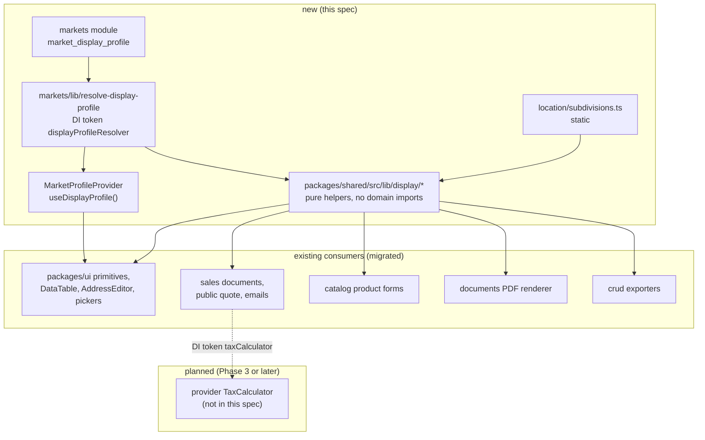

# Market Display Profile With A US Seed

## Currency completion amendment - 2026-09-19

**Status: implementation and the configured validation gate are complete on the fork continuation; code review and live UI verification are pending.** This is the current implementation entry point for the reported currency defect.
The original profile design below remains the foundation, including owner decisions D1-D11 and the resolved answers
A1-A8. Its earlier compliance report describes that design, not proof that every consumer shipped. This amendment
completes its currency scope in the same file, as required by the original PROMPT; it does not restart the original
entity, tax, address, units or onboarding work. The address dropdown follow-up remains independent and unchanged.

### Amendment TLDR and overview

US organizations still see PLN defaults in customer KPI tiles and inconsistent money formatting elsewhere. Complete
profile adoption for every OSS money presentation surface, default new records consistently, and render aggregates
without assigning one currency to unconverted mixed amounts. The expected US happy path is USD records displayed in
US conventions everywhere; changing a display profile cannot turn a stored PLN amount into USD.

### Resolved assumptions (autonomous defaults)

These supplement A1-A8 below. No unresolved Open Questions remain.

| ID | Question | Applied default | Reason and reversibility |
|---|---|---|---|
| C1 | Does selecting US replace every stored currency with USD? | No. Explicit record/transaction currency wins; US supplies presentation and an unbound new-record default. | D2 excludes conversion and invariant 2 preserves stored money. Reversible presentation changes only. A genuinely all-USD view of foreign records requires a separately authorized conversion policy. |
| C2 | Fix only Active Deals or every money surface? | Complete all first-party OSS money consumers, including backend, public/portal, widgets, previews, human-readable exports, emails and PDFs. | The user explicitly requests all other places. This is completion of one profile capability (D1), not a second localization project. |
| C3 | How are mixed-currency KPIs shown? | One subtotal per known currency plus a separate unknown-currency group; never a combined monetary total. | Formatting cannot perform FX. Currency grouping is reversible and preserves amounts. |
| C4 | Can a missing currency on old data be inferred from the current profile? | Only if the owning domain already explicitly defines the value as profile-denominated. Otherwise show an unlabelled number with a translated missing-currency indication. Empty monetary KPI zero may use the profile currency. | A current preference is not historical denomination evidence. No backfill or silent relabelling. |
| C5 | What does “all” exclude? | Currency identifiers in selectors, exchange-rate tools, provider protocols, audit snapshots, machine exports, tests and legitimate foreign-currency records remain codes. Enterprise code is not edited. | These are data contracts or out-of-bounds code, not display defaults. Record exclusions individually in the audit. |

### Problem statement and verified evidence

Code research baseline: [`46b0f6370`](https://github.com/systevio/open-mercato/tree/46b0f6370) (2026-09-19).
Implementation continues the recovered work on the `systevio/open-mercato` fork and targets its `develop` branch.
The market-profile foundation is already present on that fork and is reused rather than rebuilt. This continuation
recovers the saved plan and partial implementation commits from cancelled run `0f20603a-fe83-4586-afce-8250ce4b3084`;
it does not publish to, reset against, or otherwise modify either upstream repository. The independent US-state
dropdown remains outside this amendment.

Source inputs: [original PROMPT](https://github.com/systevio/open-mercato/blob/46b0f6370/.ai/briefs/core-us-display-pack/CORE-us-display-profile.PROMPT.om-spec-writing.md)
and [complete BRIEF](https://github.com/systevio/open-mercato/blob/46b0f6370/.ai/briefs/core-us-display-pack/CORE-us-display-profile.BRIEF.attach.md).
The companion [address correction](https://github.com/systevio/open-mercato/blob/46b0f6370/.ai/specs/2026-09-19-us-state-dropdown-in-address-forms.md)
is source context, not another deliverable in this PR. Line numbers below refer to that revision, not the original brief's
`ab23d45f`. The reported demo URL was not accessible through the web reader; its live record data and deployed build
were not verified. The evidence establishes defects in code, not whether the reported company's deals actually store PLN.

| Evidence | Finding | Required correction |
|---|---|---|
| `customers/components/detail/CompanyKpiBar.tsx:77,130,146` | Chooses API/first-deal currency then hardcoded PLN; neither formatter call receives a profile. The same currency labels Active Deals and LTV. | Resolve profile in this leaf and format each KPI's own currency groups; use profile currency for empty monetary zero. |
| `customers/components/detail/utils.ts:163` | Shared `formatCurrency` forces PLN when missing and always uses zero decimals. | Preserve old signature/legacy behavior for unprofiled external callers; migrate owned call sites through an optional profile-aware bridge with explicit precision. |
| `customers/components/detail/ActiveDealCard.tsx:167` | Calls that formatter without locale or profile. | Pass the profile and the selected deal's actual currency. |
| `customers/api/companies/[id]/route.ts:938-958` | Sums active/won amounts without currency grouping, labels both using the first available deal currency. | Add grouped metrics from the complete scoped deal set; do not reconstruct totals from a paginated detail preview. |
| `customers/backend/customers/deals/pipeline/components/QuickDealDialog.tsx:142-154` | Default selection uses tenant base/first currency/USD, without a market profile. | Apply profile default only to a new, untouched currency field without a stronger document/channel binding. |
| `shared/src/lib/display/money.ts:51-67` | Existing `formatMoney` already takes profile and preserves explicit currency ahead of profile currency. | Reuse this contract; do not reverse precedence to make the screenshot appear fixed. |
| `sales/components/PriceWithCurrency.tsx`, `customers/components/detail/{CompanyCard,DealDetailHeader}.tsx` | Already have profile-aware paths. | Verify and keep them; a search hit is not automatically a defect. |
| `core/src/modules/dashboards/lib/formatters.ts:54-59` | Deliberately avoids inventing a currency for analytics with no denomination. | Preserve this safeguard while adding profile presentation at actual money consumers. |

Paths in the first five rows are relative to `packages/core/src/modules/`; other rows name their package under
`packages/`. Confirm call sites again when implementation starts because the branch may have advanced.

### Research and alternatives

- [Odoo multi-currency](https://www.odoo.com/documentation/18.0/applications/finance/accounting/get_started/multi_currency.html)
  separates transaction and company currency. Adopt denomination fidelity; reject introducing its accounting conversion machinery here.
- [Shopware sales channels](https://docs.shopware.com/en/shopware-6-en/settings/saleschannel) distinguish available and
  default currencies. Adopt a default rather than overwriting explicit selection; keep organization-level presentation.
- [Adobe Commerce currency configuration](https://experienceleague.adobe.com/en/docs/commerce-admin/stores-sales/site-store/currency/currency-configuration)
  separates currency configuration from rates. Adopt explicit precedence; reject adding another settings hierarchy.
- [Shopify local currency pricing](https://help.shopify.com/en/manual/international/pricing) uses exchange rates for
  currency conversion. Reject copying conversion into a formatting helper: D2 explicitly excludes it.

### Design Decisions and architecture

1. **D1/D4 completion:** retain one spec and the original three phases. The steps below complete the money portion of
   Phase 2/3; other long-tail localization is unchanged. A repaired tile alone is not completion.
2. **D2/D3/D5 fidelity:** `formatMoney(amount, explicitCurrency, profile, options)` changes presentation, not meaning.
   Preserve explicit codes, record amounts, minor-unit precision, valid zeroes, negatives and existing rounding policy.
   Profile `currencyDisplay` controls symbol/code/both. US with USD renders `$1,234.56`; explicit PLN remains PLN.
   Unprofiled callers retain their existing formatting and create defaults. Safe grouped KPI rendering applies to all
   organizations, including those without a profile: preserving an incorrect mixed total is not a compatibility goal
   for the new UI. The legacy API scalars remain bridged. Never introduce currency conversion, new rates or seed rewrites.
3. **D6/D11 reuse:** client leaves use the existing `useDisplayProfile` from
   `@open-mercato/ui/backend/markets/MarketProfileProvider`; pure formatters receive a profile parameter. Server consumers
   resolve `displayProfileResolver` soft-optionally from their existing container and the owning record's tenant and
   organization, once per render/job. Do not read a signed-in admin's organization when rendering an anonymous quote,
   email or PDF for another organization. No new dependencies, global singleton or extra profile request per price.
4. **Creation precedence:** explicit user value or domain binding (source document, channel, price list, payment) wins;
   otherwise a supported active profile currency; otherwise the existing domain fallback. A profile default must exist
   in the allowed currency dictionary. If unavailable, preserve valid selection or show the existing required-field
   validation; do not silently create a dictionary entry. Apply once to pristine create forms, never edit forms, clones
   carrying a currency, in-progress user selections or provider payloads. Submission persists the visible selection via
   the existing guarded commands. No API may reinterpret an omitted currency on an existing record.
5. **Aggregation:** normalize valid codes for grouping; keep missing/invalid currency separate. Group active and won
   sets independently using the existing open/won status predicates. Honor current soft-delete, tenant, organization,
   access and company-link filters. Count unknown/invalid amount records, but do not add non-finite values to money totals.
   New UI consumes complete grouped API data; it must not sum a limited `deals` preview or borrow currency from LTV for
   Active Deals. Monetary comparisons/trends are per currency; a deal-count trend can remain explicitly count-based.
6. **No data remediation by profile switch:** investigate stored codes read-only during implementation. If demo values
   are genuinely PLN, report that separately; no mass update, migration, seed rerun or historical amount rewrite is
   authorized by this spec. The product limitation is explicit: an all-USD view of foreign-denominated records is not
   achievable through this display-only feature.

### Data Models and API Contracts

No new entity, migration, event, ACL, DI key or persisted field is needed for currency completion. Existing profile CRUD,
optimistic locking and undo remain intact. The company detail GET remains at `/api/customers/companies/:id`, with existing
request parameters, authorization and error statuses. Add optional fields to its existing `kpis` object:

```ts
type CompanyCurrencySubtotal = {
  currencyCode: string | null
  amount: number
  count: number
  invalidAmountCount: number
}

type CompanyCurrencyKpiExtension = {
  activeDealsByCurrency?: CompanyCurrencySubtotal[]
  wonDealsByCurrency?: CompanyCurrencySubtotal[]
}
```

`currencyCode` is a normalized valid code or `null` for unknown/invalid denomination. `amount` is the sum of finite
numeric amounts in that group; `count` counts its deals, including invalid-amount records; `invalidAmountCount` makes
incomplete subtotals explicit. Sort by currency code, with `null` last. Empty sets produce `[]`. A group containing only
invalid amounts must render an unavailable amount, not a misleading zero. Use the current domain amount parser and
round only when formatting. Return both arrays on all successful new-server responses, including empty cases; they
remain optional in types so older servers are tolerated. Update route OpenAPI and `CompanyOverview` types additively.

Keep `activeDealsValue`, `dealCurrency`, `ltvValue` and other existing members for compatibility. Mark the unsafe scalar
aggregation contract as deprecated, document the grouped replacement in `UPGRADE_NOTES.md`, and preserve it for at least
one minor version. The new UI never uses those scalars for monetary totals when grouped fields exist. With an older API
that lacks groups, render the count and a translated unavailable-total state rather than fabricate a total from partial
records. Do not silently fix legacy response semantics in a purported additive change.

Grouped totals use the API's complete authorized deal rows already loaded for metrics. No additional per-deal queries,
no client-side scan of other companies, and no profile-dependent formatting in numeric API payloads. Existing request
and tenant-scoped caching stays in force; groups need no new cache and depend on the same mutation invalidation as the
existing KPI response. New read fields expose only aggregates of data already authorized for the caller.

### UI/UX and frontend architecture contract

Reuse the existing KPI/card primitives and the current layout. A single-currency tile shows one formatted amount; empty
Active Deals shows zero in the selected profile currency (USD for US), with zero count. No won deals keeps the existing
LTV empty state. For mixed currencies, show a translated “Multiple currencies” label and a visible accessible list of
formatted per-currency subtotals, including ISO codes where symbols would be ambiguous. Unknown groups have a translated
“Currency unavailable” label; incomplete sums have a translated indication and do not masquerade as complete totals.
If the list is long, use the existing expandable/detail affordance with all groups reachable by keyboard and touch.
Do not put essential amounts only in hover content. Preserve tile hide/show, tabs and responsive layout.

| Boundary / client file | Reason / owner | Guardrail |
|---|---|---|
| Existing company detail route and `CompanyKpiBar.tsx` | Route keeps its current boundary; KPI leaf uses profile context and existing hide/show state | No new client page root; API owns full aggregates |
| `ActiveDealCard.tsx`, `DealsSection.tsx`, existing deal pipeline cards/dialogs and deal detail formatters | Existing interactive leaves use context; pure formatter modules stay React-free | No provider or per-card fetch; preserve selected currency across profile refresh |
| Existing sales/catalog/checkout/widgets consumer leaves in audit | Their existing form/table/chart interaction justifies current client boundary | Add optional profile arguments, no new heavy library or top-level browser import |
| Public/server/email/PDF renderers | Existing record authorization and server rendering own the profile | Pass serializable profile/view-model data; no hooks or admin-cookie scope in jobs |
| Existing `MarketProfileProvider` | Already owns profile hydration and update subscription | Reuse unchanged; do not widen bootstrap imports |

The implementation manifest must list each touched client file's exact context/state/effect need. No new unallowlisted
client page roots, no new client leaf above 300 LOC, and no route-specific imports at the provider. Existing large files
may receive only local formatter wiring; extracting unrelated UI is out of scope. Budget: zero extra profile requests
per price, zero new dependencies, no N+1 queries, and no unexplained route bundle growth greater than 5 KiB gzip against
the same build baseline. Provide `yarn check:client-boundaries`, one affected-route build/bundle comparison and hydration
smoke tests for each changed interactive route. Profile switching must update formatting without stale memoized values
or resetting form input; include profile and currency in formatter cache/memo dependencies.

Prototype: [Illustrative company currency states](assets/market-display-currency-completion/mockup-01-company-currency.html).


Visual evidence limits: the local app failed its HTTP readiness check and Playwright navigation could not connect.
The reported screen was not live-verified. The mockup above was rendered with Playwright using synthetic values; it is
not a current-app screenshot or proof of working behavior. Implementation must capture the real company tile with the
deterministic fixtures below.

### Implementation Plan - currency completion

**Phase C1: inventory, contracts and the reported path (original Phase 2 completion).**

1. Before editing, attempt a read-only reproduction and currency provenance for the reported company. When authorized
   access is unavailable, reproduce with deterministic synthetic fixtures and record the reported record as unverified;
   do not block code work or obtain credentials outside the task. Audit tracked OSS
   source using `rg` for `Intl.NumberFormat`, currency-style `toLocaleString`, local `formatCurrency`/`formatAmount`,
   `PLN`/`EUR`/`USD` defaults, hardcoded currency symbols and amount/code concatenation. Follow imports and real call sites,
   including already-migrated helpers. Inspect external official modules if present, but ship any required changes in
   their own repository; never update a submodule pointer here. Store the exhaustive per-file disposition table in this
   spec, replacing the seed inventory below: migrated, already compliant, domain/protocol exemption, or external-owner.
2. Add the optional grouped KPI response fields, OpenAPI schema, types and scoped regression tests atomically. Keep old
   fields and consumers working. Add `UPGRADE_NOTES.md` deprecation guidance for unsafe scalar money totals.
3. Migrate `CompanyKpiBar`, `ActiveDealCard` and every consumer of `customers/components/detail/utils.ts` through the
   profile-aware path, preserving legacy helper calls. Add tests with the consumer changes, including the full-vs-preview
   API case. The reported path works at this checkpoint; all other audited gaps remain tracked, not declared fixed.

**Phase C2: all OSS money consumers (original Phase 3 money completion).**

4. Migrate each non-exempt inventory row, module by module, with its real caller and tests. Reuse existing bridges;
   public formatter signatures get only optional trailing arguments/options. Apply pristine-create defaults consistently
   in deal forms, quick create, sales/catalog entry points and every audited unbound money editor. Preserve domain-bound
   currency and API payload semantics. Resolve profiles by record scope on public/server consumers.
5. Complete money-path coverage of backend, public/portal, widgets, previews, notifications, emails, PDF and human exports.
   Keep machine-readable exports and provider contracts unchanged. Verify human exports identify each currency and
   never concatenate a mixed sum. No opportunistic date/address/tax/measurement work is part of this completion phase.
6. Extend the existing Phase 3 lint guard if available, otherwise add the narrow rule within the existing lint plugin.
   Detect new bespoke money-format constructors, locale-number currency options and literal fallback codes in display
   code. Maintain a reviewed file-level exception list with reasons for legacy bridges/protocols/reference data; do not
   ban all currency strings. Rule fixtures must demonstrate rejected omissions and accepted canonical/legacy paths.
   Re-run the inventory search: zero unexplained OSS monetary display/default call sites is the completion condition.

**Phase C3: acceptance and release evidence.**

7. Run targeted unit/API tests per changed package, self-contained integration scenarios below, i18n checks, client-boundary
   checks and relevant builds through the repository's selected runner and shared Turbo cache. Run `yarn generate` only
   where auto-discovery contracts changed. Record exact file/test coverage and all exclusions. Ship tests in the same
   implementation PR, request manual UI QA and retain the original profile spec path as `Source doc:`.
8. Capture before/after company, deal pipeline, sales and checkout surfaces with synthetic data; verify a US organization
   and an unchanged Polish/legacy organization on the same instance. Reverting rendering/group-consumer changes requires
   no data rollback; leave additive response fields until the compatibility window permits removal. Never roll back by
   rewriting historical currencies. Completion requires every included inventory row closed, not only the first tile.

### Initial currency consumer inventory

This is a bounded research seed, not an exhaustive verification claim. All `core` rows are under
`packages/core/src/modules/`; include callers, not only each utility's implementation. Existing profile-aware paths
must be tested rather than blindly rewritten.

| Family | Concrete audit entry points | Disposition required |
|---|---|---|
| Company detail | `customers/components/detail/{CompanyKpiBar,ActiveDealCard,DealsSection,CompanyCard,utils}.tsx` (utils is `.ts`); `customers/api/companies/[id]/route.ts` | Correct verified fallback and grouping defects; audit annual revenue, LTV, empty tiles and details |
| CRM money and defaults | `customers/components/detail/{AnnualRevenueField,DealWonPopup,DealLostSummaryDialog,DealForm}.tsx`, `detail/create/DealCurrencyField.tsx`, `customers/components/DealsKpiStrip.tsx`, `customers/backend/customers/deals/[id]/hooks/formatters.ts` | Profile, currency provenance and precision; protect existing status predicates |
| Deal pipeline | `customers/backend/customers/deals/pipeline/{page.tsx,components/DealCard.tsx,components/QuickDealDialog.tsx,components/CurrencyFilterPopover.tsx,components/LaneCurrencyBreakdown.tsx,components/CurrencyBreakdownTable.tsx}` | Group labels, popovers, selected/default currency and totals |
| Sales/catalog | `sales/components/PriceWithCurrency.tsx`, `sales/components/documents/{SalesDocumentsTable,PaymentsSection,AdjustmentsSection,LineItemDialog}.tsx`, `sales/components/documents/lineItemUtils.ts`, `sales/widgets/dashboard/shared.ts`; original catalog manifest below | Audit all price consumers, defaults, totals, refunds and precision |
| Analytics | `dashboards/lib/formatters.ts` and its chart/KPI/widget consumers | Apply presentation only to amounts with established denomination; preserve unknown/mixed safeguards |
| Checkout/payment | `packages/checkout/src/modules/checkout/{components/PayPage.tsx,backend/checkout/transactions/page.tsx,backend/checkout/transactions/[id]/page.tsx}`, `payment_gateways/backend/payment-gateways/page.tsx` | Display transaction currency; never change payment requests or provider values |
| Warranty/WMS and remaining OSS | `warranty_claims/backend/components/ClaimsKpiStrip.tsx`, claims pages/widgets, `wms/lib/inventoryDisplayUi.ts`, `wms/components/backend/WmsOperationalDashboardPage.tsx`; repository-wide search remainder | Audit only monetary values; classify non-money numeric hits |
| Previews and server output | `{customers,sales,catalog}/lib/messageObjectPreviews.ts`, `workflows/lib/interpolation-pipeline.ts`, quote/public pages, emails, documents PDF and shared export paths from original manifest | Resolve owning scope; preserve protocol/canonical exports and historical snapshots |
| Shared compatibility | `packages/ui/src/utils/format.ts`, `packages/shared/src/lib/display/money.ts` and all legacy formatter callers | Keep contracts; migrate first-party consumers and explicitly allow legacy bridge code |

### Final currency consumer disposition inventory

The continuation reran repository-wide searches for currency-style `Intl.NumberFormat`, currency-bearing
`toLocaleString`, `toFixed` plus a denomination, literal USD/PLN/EUR fallbacks, symbols, and amount/code
concatenation. It then followed the real callers. The table is the completion record for C1.1 and C2.4-C2.6;
paths are repository-relative, and grouped braces enumerate one audited surface family rather than hiding an
unreviewed remainder.

| Surface | Concrete files / boundaries audited | Final disposition |
|---|---|---|
| Shared money contract | `packages/shared/src/lib/display/money.ts`, `packages/ui/src/utils/format.ts`, `packages/ui/src/backend/markets/MarketProfileProvider.tsx` | **Already compliant / compatibility bridge.** The canonical helper preserves explicit currency; the optional-profile UI bridge retains historical no-profile behavior. Reviewed lint exception. |
| Company KPI API | `customers/api/companies/[id]/route.ts`, its OpenAPI schema, `customers/lib/currencySubtotals.ts`, `customers/components/formConfig.tsx` | **Fixed.** Complete scoped rows are grouped by normalized denomination, unknown is separate, invalid amounts are counted, and deprecated scalars are emitted only for one usable known group. |
| Company/person detail | `customers/components/detail/{CompanyKpiBar,ActiveDealCard,AnnualRevenueField,CompanyCard,DealsSection,DealWonPopup,DealLostSummaryDialog,utils}.tsx` (`utils.ts`) and enriched-person companies route | **Fixed.** Profile presentation reaches each leaf; active and won totals stay independent; mixed, unknown and incomplete totals are explicit. |
| Deal detail, pipeline and linking | `customers/backend/customers/deals/{[id],pipeline}/**`, `customers/components/{DealsKpiStrip,linking/adapters/dealAdapter}.tsx`, `packages/ui/src/ai/records/DealCard.tsx` | **Fixed.** Cards, drag previews, filters, lane breakdowns, bulk selections, detail formatters and AI cards use explicit deal currencies and profile number conventions. |
| Deal create defaults | `customers/components/detail/{DealForm,create/CreateDealForm,create/DealCurrencyField}.tsx`, `customers/backend/customers/deals/pipeline/components/QuickDealDialog.tsx` | **Fixed.** A supported profile currency initializes only pristine creates; edits, explicit initial values and user changes win. Base/available legacy fallbacks remain only when the profile code is unavailable. |
| Customer search and previews | `customers/{search.ts,lib/messageObjectPreviews.ts}`, company/deal linking presenters | **Fixed.** Human labels/previews resolve the owning scope and preserve the record currency; missing denomination is named rather than inferred. Search index data remains raw as a machine representation. |
| Catalog | `catalog/backend/catalog/products/{[id],[productId]/variants/[variantId]}/page.tsx`, `catalog/components/products/ProductsDataTable.tsx`, `catalog/lib/messageObjectPreviews.ts`, `packages/ui/src/ai/records/ProductCard.tsx`, authoring pack | **Fixed.** Product/variant UI, previews and AI cards use profile-aware display. The authoring payload no longer fabricates USD when source currency is absent. Catalog seeds and AI prompt examples remain reference data. |
| Sales forms and backend | `sales/backend/sales/{documents,channels/offers}/**`, `sales/components/{PriceWithCurrency,ShippingMethodsSettings}.tsx`, `sales/components/documents/{SalesDocumentForm,LineItemDialog,PaymentsSection,SalesDocumentsTable,lineItemUtils}.tsx`, channel offer components | **Fixed / reviewed bridges.** Create defaults validate the profile against allowed currencies; bound documents/payments keep their currency. Legacy public formatter signatures remain reviewed lint exceptions. Raw amount inputs and calculation strings are not presentation. |
| Sales widgets, messages and notifications | `sales/widgets/dashboard/{shared,new-orders,new-quotes}/**`, notification renderers, `sales/lib/messageObjectPreviews.ts`, `sales/commands/payments.ts` | **Fixed.** Owning-scope profile formatting covers widgets, previews, notifications and payment human labels without changing command/provider values. |
| Dashboards | `dashboards/lib/formatters.ts` and `{aov-kpi,pipeline-summary,revenue-kpi,revenue-trend,sales-by-region,top-customers,top-products}/widget.client.tsx` | **Fixed.** Known denominations use the profile; missing denominations stay unlabelled/unknown and mixed values are never assigned the profile currency. |
| Checkout and payment gateways | `packages/checkout/src/modules/checkout/{backend,components,emails,workers,widgets}/**`, `checkout/lib/{displayMoney,defaultCurrency}.ts`, `payment_gateways/{backend,lib/displayMoney.ts}` | **Fixed.** Admin/public pages, email worker/templates and notifications use transaction currency plus owner profile. Link/template pristine defaults validate the profile against the currency dictionary. Gateway/provider request payloads remain unchanged data contracts. |
| Documents and human templates | `packages/documents/src/modules/documents/{commands,api/templates/[templateId]/preview,lib/{entityRegistry,templateFill,templateInstantiation,templateSeeds}}.*` | **Fixed.** Additive formatted money tokens carry the owner profile; built-in human templates use them, including legacy built-ins upgraded at render time. Existing raw tokens remain available for custom/machine templates. |
| Staff time tracking and exports | `staff/backend/staff/time-tracking/**`, `staff/lib/time-tracking-ui/**`, `staff/lib/timesheets-reports/{reportExport,pdf}.ts`, export route | **Fixed.** UI and PDF/human-readable export use owner profile and explicit report currency. CSV/XLSX values remain canonical machine data by design; persisted `toFixed` strings are storage precision, not display. |
| Warranty and shipping | `warranty_claims/{backend,frontend,lib/displayMoney.ts,api/stats/route.ts}`, `shipping_carriers/lib/shipment-wizard/components/ConfirmStep.tsx` | **Fixed.** Backend/portal claims, recovery suggestions, grouped recovered totals and shipment price summaries preserve explicit currencies; mixed/unknown recovery totals are separated. Risk/policy decimal normalization remains domain math. |
| Public quote/portal paths | Existing sales public quote renderers plus checkout pay page and warranty portal paths | **Already compliant / fixed at leaves.** Sales public quote already passed record currency and resolved profile; checkout and warranty gaps were migrated. Anonymous rendering never reads an unrelated admin organization. |
| Currency selectors and exchange rates | `currencies/**`, currency dictionaries, `AmountInput`, `DealCurrencyField`, market profile settings | **Data-contract exclusion.** ISO codes, symbols, exchange-rate bases and selector options identify currencies; they must not be replaced by presentation defaults. |
| Machine/provider boundaries | Payment/carrier/tax provider payloads, ORM/API numeric fields, audit/undo snapshots, search-index values, raw CSV/XLSX, import/export interchange | **Data-contract exclusion.** Values stay canonical and lossless. Human renderers at the boundary are covered above. |
| Reference/demo/seed surfaces | `workflows/frontend/checkout-demo/page.tsx`, design-system gallery, example app/payment mocks, docs snippets, seeds and fixtures | **Reference exclusion.** The workflow page deliberately simulates currency selection and FX; examples demonstrate concrete currencies; seeds/fixtures establish data. None determines a production record's display denomination. |
| WMS scan remainder | `wms/lib/inventoryDisplayUi.ts`, operational dashboard/import components | **Already compliant / non-money exclusion.** Search hits are stock quantities, dimensions, weights or counts, not monetary values. |
| Enterprise and official modules | `packages/enterprise/**`; optional `external/official-modules` | **Owner/scope exclusion.** Enterprise is prohibited from this OSS task. The official-modules worktree was not present, so no pointer or external repository was changed. |
| Prevention guard | `packages/eslint-plugin-ds/rules/no-bespoke-money-format.js`, plugin preset/config/tests | **Fixed.** New display code warns on bespoke currency `Intl` constructors and literal currency fallbacks; canonical bridges, tests, seeds/reference data and enterprise have explicit reviewed exclusions. |

### Testing Strategy and acceptance matrix

Use self-contained fixtures created through existing guarded APIs, cleaned in `finally`; no dependency on demo records.
Integration writes/profile switching run in a fresh isolated test database, never the parent shared database. Tests must
assert both formatted output and unchanged stored amounts/codes. Implementation assigns unique test IDs after checking
the current inventory; this table names scenarios rather than colliding with existing `TC-MKT-*` IDs.

| Scenario | Required assertions / paths |
|---|---|
| US empty company | GET company detail groups `[]`; `/backend/customers/companies-v2/:id?tab=files` Active Deals uses USD zero and no PLN fallback; LTV keeps its empty state |
| US USD records | Active/won USD fixtures show `$1,234.56` consistently in company, person/deal detail, list and pipeline; decimals are not dropped; API numbers unchanged |
| Foreign and mixed records | USD active, PLN won, plus EUR/unknown/invalid-amount records; separate group totals, no shared Active/LTV currency, no invalid-value poisoning or combined monetary total |
| Complete aggregation | More linked deals than the detail preview limit; grouped API totals include every authorized record exactly once; client does not recompute from preview |
| Format variants | Symbol/code/both, decimal/group overrides, negative parentheses, zero, null, numeric strings, JPY and three-decimal currency; explicit precision preserved |
| Creation/edit | Profile USD preselects eligible untouched create fields; user-selected PLN survives rerender/profile switch; edits and clones keep stored currency; unavailable USD is not silently inserted into dictionaries |
| Isolation and fallback | Two tenants and two organizations, separate profiles, unauthorized company GET denied; missing/disabled markets and no-profile tenant retain legacy formatting/defaults (grouped KPI safety still applies); no cross-scope cache reuse |
| Public and async output | Public quote, associated email and PDF use record owner's profile despite unrelated viewer/admin context; verify stored currency and values after rendering |
| Remaining families | For every migrated module, cover one real key UI path plus helper edge cases; checkout/refund payment currency and dashboard unknown-currency behavior remain intact |
| API/mutation contracts | GET company detail groups and old fields; existing profile GET/PUT/DELETE conflict and refresh behavior; existing deal/catalog/sales create/edit paths exercised for changed defaults; no new write route |
| Hydration/regression | All affected routes load without hydration errors; profile change updates formatting and leaves user input intact; per-route bundle check and full inventory disposition recorded |

For an organization whose records are USD, no display-only PLN/EUR fallback remains anywhere in the accepted inventory.
A foreign-currency record still shows its true currency; missing denomination is visibly unknown. This distinction is
mandatory acceptance, not a reason to falsify money merely to remove the text “PLN”.

### Migration & Backward Compatibility

No database migration or data backfill in this amendment. The original profile migrations are prerequisites, not work to
rerun. New aggregate fields are additive and optional to clients; existing API fields and imports remain available for
at least one minor version. Any formatter bridge retains old positional signatures and unprofiled behavior. Update
`UPGRADE_NOTES.md` only for the declared scalar deprecation; do not narrow validators or introduce new required fields.
The existing `2026-09-19-us-state-dropdown-in-address-forms.md` correction is retained and unaffected. Enterprise money
consumers require their owner's follow-up and are not certified by this OSS audit. External modules, when present, are
reported with ownership and separate delivery status rather than silently counted as completed.

### Risks & Impact Review

| Severity | Concrete failure / affected area | Mitigation | Residual risk |
|---|---|---|---|
| High | Relabel PLN as USD without conversion | Explicit currency first; stored-value assertions; no data writes on profile switch | All-USD converted reporting remains unavailable by design |
| High | Mixed/partial deals misstate company value | Server groups complete scoped rows; active and won independent; unknown/invalid states | Old consumers still see deprecated scalar fields until migrated |
| High | Public email/PDF resolves viewer profile or crosses tenants | Owning-record scope, soft-optional DI, isolation tests | Provider/scope regressions require integration tests |
| Medium | Default overwrites user selection or payment binding | Apply only to pristine unbound create fields; preserve document/provider currency | Older entry points can be missed until inventory closes |
| Medium | Profile update leaves stale cached/memoized money | Existing scoped provider refresh and profile-dependent memo keys | Refresh failures preserve last known profile; no destructive fallback |
| Medium | Rounding, huge client bundle or per-cell network requests | Preserve explicit precision, minor-unit tests, pure helpers, zero per-price fetches, measured budget | Existing unrelated performance debt remains |
| Medium | Audit mistaken for proof of “all” | Per-file dispositions, module-path tests, regression guard and declared external/enterprise exclusions | Third-party modules cannot be certified here |


## Original profile design (2026-09-18 baseline)

The sections below preserve the original design and historical research. Statements about then-current code and counts
refer to that baseline; the currency amendment above records the verified 2026-09-19 state and takes precedence for money.

## TLDR

**Key Points:**
- Introduce one organization level `market_display_profile` that every display surface reads for dates, times, week
  start, hour cycle, money, address layout, phone, units, paper size and price presentation, and seed it for the United
  States.
- Today the platform renders its Polish and EU origin everywhere: Monday weeks, mixed 12 and 24 hour clocks, net and
  gross columns side by side, "VAT classes", free text "Region / State", Polish building and flat number fields on every
  address, `kg` and `cm` placeholders, A4 PDFs. A US merchant needs `$1,234.56`, `MM/DD/YYYY`, `3:45 PM`, Sunday weeks,
  one price plus a sales tax line, `123 Main St, Suite 200, PLANO TX 75074`, `(214) 555-0100`, `27 ft 6 in`, `12 lb` and
  Letter paper.

**Scope:**
- A new core module `markets` holding the profile entity, its CRUD API, commands with undo, an admin settings page and
  an onboarding market selection step.
- A shared formatting layer in `packages/shared/src/lib/display/` that every migrated surface calls, re-exported through
  `packages/ui`.
- A static US subdivision table, a `us` address layout, US customary unit display helpers, Letter paper, and an `en-US`
  overlay dictionary.
- Display fields that let a quote or an order show a sales tax line, plus a `TaxCalculator` DI interface shipped with a
  stub only.
- Two migration waves: the hackathon happy path first (Phase 2), the long tail plus a lint rule second (Phase 3, may
  land after the hackathon).

**Concerns:**
- This is display only. Nothing here computes tax, validates addresses, converts currencies or calls a provider (D2).
- The surface is wide (about 60 files in wave 1). The mitigation is that every one of them is a consumer of the same
  profile, and that nothing changes for an existing tenant until an admin picks a market: no profile row is backfilled
  (see Resolved assumptions A5).

---

## Resolved assumptions (autonomous defaults)

This spec was written by `om-auto-write-spec` in autonomous mode. The brief's section 1 decisions D1 to D11 are applied
as given and recorded under Design Decisions. The questions the brief left to the spec author (its section 8) and three
further unknowns that surfaced during research are resolved here. Every one of them is reversible and open to override
before merge.

| # | Question | Chosen answer | Rationale |
|---|---|---|---|
| A1 | Collapse the `customers` and `ui` `AddressEditor` twins into one module now, or edit in parallel? | Neither fully. Wave 1 extracts the profile driven decisions into one headless module (`packages/shared/src/lib/display/address.ts` plus a `useAddressLayout()` hook in `packages/ui`) that both twins consume; the collapse itself moves to Phase 3, where the `customers` twin becomes a deprecated re-export of the `ui` one. | The `customers` path is a cross-module contract surface, not an internal file: `packages/core/src/modules/sales/components/documents/AddressesSection.tsx:21` and `SalesDocumentForm.tsx` import `AddressEditor` from `@open-mercato/core/modules/customers/components/AddressEditor`. `BACKWARD_COMPATIBILITY.md` classifies import paths as a contract surface, so removing it in wave 1 would be a breaking change inside a display migration. The twins have also diverged (the `customers` copy carries the `taxId` / `phone` fields from the 2026-08-10 address spec, the `ui` copy carries `AddressTypesAdapter`), so a same-wave collapse is a refactor with its own review surface. Sharing the decision logic gets the US layout into both twins with no duplicated rules and no contract change. |
| A2 | `is_tax_exempt` and friends on `CustomerEntity`, or on `CustomerCompanyProfile` and the person profile? | On `CustomerEntity`. | `sales_orders.customer_entity_id` and `sales_quotes.customer_entity_id` point at `CustomerEntity`, so the totals path already holds that row and needs no second join. `CustomerEntity.kind` covers both people and companies (`packages/core/src/modules/customers/data/entities.ts:30-43`), and a US sole proprietor holding a resale certificate has no `CustomerCompanyProfile` row at all (`customer_companies` is a company only side table, `entities.ts:247-300`). Exemption is a property of the party being invoiced, not of its company facts. |
| A3 | Is `tax-at-checkout` a new price kind display mode, or a derived presentation of `excluding-tax`? | Derived. No new member is added to `CATALOG_PRICE_DISPLAY_MODES`. Under `price_presentation = single_price_plus_tax`, a price kind whose stored mode is `excluding-tax` is presented as a single "Price" with the tax line carried by the document. | `CATALOG_PRICE_DISPLAY_MODES` (`packages/core/src/modules/catalog/data/types.ts:89`) is an exported const plus a derived union type, which `BACKWARD_COMPATIBILITY.md` treats as additive only: a third member widens every exhaustive `switch` in catalog pricing and in any third party module that narrows on it, and it would need a data migration for tenants that want the US presentation on existing kinds. `excluding-tax` already means exactly "the stored price is net"; the presentation is the profile's job, not a third stored state. Reversible: if a genuinely distinct stored semantic appears later, the enum can still be widened. |
| A4 | Is the profile cached, and how does the client hook receive it? | Yes. `resolveDisplayProfile` reads through the DI cache (`container.resolve('cache')`) under key `markets:display-profile:<tenantId>:<organizationId>` with tags `tenant:<id>`, `org:<id>` and `markets:display-profile`, TTL 300s; the profile commands drop those tags with `deleteByTags` in their after-success callbacks, after the write commits and outside `withAtomicFlush`. The client receives it from the root layout through a `MarketProfileProvider` mounted beside `I18nProvider`, exposing `useDisplayProfile()`. | Both are the project's canonical mechanisms (`packages/cache/AGENTS.md` for DI-resolved, tenant-tagged cache; the `I18nProvider` seam in the root layout for a per-request value every client component needs). A per-request database read on a value that changes a few times a year and is needed by nearly every page would be the only alternative, and it would add one query to every render path. |
| A5 | Does the upgrade backfill an `eu` profile row for existing organizations? (raised here; brief section 3.1 proposes a backfill) | No backfill. `resolveDisplayProfile` returns `null` when no row exists, and every helper then falls back to `LEGACY_DISPLAY_DEFAULTS`, a frozen object reproducing today's behavior surface by surface. `eu` and `us` are seed templates an admin or the onboarding step picks; picking one writes the row. | D3 promises that nothing changes for existing tenants until an admin switches. A backfilled `eu` row cannot keep that promise, because today's behavior is not internally consistent and so cannot be encoded in one row: `packages/ui/src/primitives/time-picker.tsx:99,197,915` defaults to `'12h'` while `ScheduleGrid.tsx`, `ScheduleAgenda.tsx` and the staff time tracking page force `hour12: false`. Any single `hour_cycle` value visibly changes one of them for every existing tenant. Absence of a row expresses "no market chosen yet" exactly, removes a write-per-organization data migration, and makes the upgrade a pure no-op. Cost, accepted: the legacy defaults are a second code path that lives until every tenant has a profile; Phase 3 tracks its removal. |
| A6 | Where does the tax breakdown live? (raised here; brief section 3.4 proposes new `tax_breakdown` and `tax_provider_key` columns) | Reuse the existing `tax_info` jsonb and `tax_strategy_key` columns; add them only to the document entities that lack them, and give `tax_info` a zod schema with a `breakdown` array. New columns are limited to `tax_status` and `tax_calculated_at`. | `sales_orders` already has `tax_strategy_key` and `tax_info` (`packages/core/src/modules/sales/data/entities.ts:397,403`) and `sales_quotes` already has `tax_info` (`:888`); both are carried through the document command snapshots and undo payloads (`sales/commands/documents.ts`) and already surface as "Tax details" in the document history widget. Adding parallel columns beside them would give the same fact two homes and two undo paths. This cuts the new column count on the four document entities from sixteen to about ten and reuses an undo path that is already tested. |
| A7 | Is the subdivision list a seeded database entity? (raised here; brief section 3.2 proposes one) | No. It is a static, versioned table at `packages/shared/src/lib/location/subdivisions.ts`, exposed read only through `GET /api/markets/subdivisions`. The field shape (`country_code`, `code`, `name`, `type`) and the name `subdivision` are kept exactly as the brief specifies, so a consumer referencing it by name is unaffected. | The repository already solves the identical problem this way: `packages/shared/src/lib/location/countries.ts` derives `ISO_COUNTRIES` from a static registry with no table, no migration and no per-tenant seed. A read only, organization independent list of 56 rows in a database would add a migration, a seed that must run for every tenant, a drift risk between tenants and a cross-tenant scoping question, and would buy nothing, because nobody may edit it. Reversible: the API shape is the contract, so a table can replace the constant later without touching a single caller. |
| A8 | Which file carries the `en-US` overlay, and under what name? | Each owning module ships `i18n/en-us.json` (lowercase) with only the keys it overrides; `markets` ships its own for its own keys. The profile stores `language_tag = 'en-US'` for `Intl` and normalizes it to `en-us` for every locale lookup. | `loadDictionary` merges module dictionaries in module registration order (`packages/shared/src/lib/i18n/server.ts:100-106`), so a single central overlay would only win over a module's own keys by accident of ordering. Per owning module is the ordering-free form and matches how every other locale ships. Lowercase because `normalizeLocaleCode` lowercases (`packages/shared/src/lib/i18n/locale-set.ts:38-40`) and `loadDictionary` keys `m.translations[locale]` with the normalized token, so `en-US.json` would register a key nothing ever looks up. |

No assumption here carries `NEEDS HUMAN CONFIRMATION`: none of them weakens tenant scoping, encryption or a
`BACKWARD_COMPATIBILITY.md` surface, and A5 makes the upgrade a no-op for every existing tenant.

**Verification note.** The brief cites paths and line numbers verified at `ab23d45f`. Every citation load bearing for
this design was re-verified on this branch. Two drifted by a few lines and are cited here at their current position: the
A4 page rule is `packages/documents/src/modules/documents/lib/pdfHtml.ts:22` (brief: `:21`), and the unit dictionary
seed runs `packages/core/src/modules/catalog/lib/seeds.ts:8-48` (brief: `:21-35`). No cited fact was found to be wrong.

---

## Overview

`markets` is a new core module holding one organization level display profile plus the read only reference data a market
needs. It is market neutral in shape and ships two seed templates, `us` and `eu`. Every surface that renders a date, a
time, an amount, an address, a phone number, a unit or a page size stops deciding for itself and asks the profile.

The target audience is any merchant outside the platform's EU origin, and the immediate consumer is a US merchant
running quotes and orders in USD with sales tax shown as a separate line. The benefit is that switching a market becomes
one admin action instead of a fork.

> **Market Reference.** Four open source and open platform leaders were studied.
>
> **Shopware 6 (sales channel plus snippet set).** Adopted: the idea of one addressable object that bundles language,
> currency and presentation, so an operator changes a market rather than eleven settings. Rejected: binding it to the
> *sales channel*. The backend UI, PDFs and emails of an Open Mercato organization must be internally consistent, and a
> channel scoped binding leaves the admin backend with no owner. The profile is organization scoped instead.
>
> **Magento 2 (store view configuration scopes).** Adopted: the fallback hierarchy, which is what
> `resolveDisplayProfile` reproduces as profile row, then env pin, then `Intl` default. Rejected: `core_config_data`
> style path keyed string configuration and Magento's per store view *address templates*. A template language for
> addresses is a second renderer to maintain; one typed `address_layout` enum plus the existing `line_first` /
> `street_first` values covers the US and the EU without one.
>
> **Shopify Markets.** Adopted: a per country address format with a required subdivision and a postal code pattern, and
> single price plus tax as a market level presentation setting rather than a per product one. Rejected: per market price
> lists and checkout currency conversion, which are out of scope under D2, and vendoring the full worldwide
> `libaddressinput` dataset. This ships one new layout (`us`) and keeps the enum as the extension point.
>
> **Odoo (l10n_us and friends).** Adopted: the notion of a market pack that carries seed data and a paper format as a
> first class setting rather than a hardcoded constant. Rejected: shipping a localization as an installable module. An
> installable module per country multiplies the migration surface and cannot be switched by an admin at runtime; a
> seeded profile plus static reference data can.

## Problem Statement

The evidence below is historical, from the original brief and its 2026-09-18 authoring review. Counts are files, tests excluded.

**Dates, times, calendars.** One shared helper pair (`formatDisplayDate` / `formatDisplayDateTime` in
`packages/ui/src/primitives/date-format.ts`) reads the env pins `NEXT_PUBLIC_OM_DATE_FORMAT` and
`NEXT_PUBLIC_OM_DATE_TIME_FORMAT` and is used by 5 files. Beside it sit 184 bespoke `toLocaleDateString` /
`toLocaleString` call sites in 40 modules, many with no locale argument, and 60 files calling `date-fns format()` or
`Intl.DateTimeFormat` directly with hardcoded patterns. Week start is hardcoded to Monday in two places:
`packages/ui/src/backend/date-range/dateRanges.ts:72-76` and
`packages/core/src/modules/customers/lib/calendar/range.ts:12`. The hour cycle disagrees with itself: `time-picker.tsx`
defaults to `'12h'` while `ScheduleGrid.tsx:44`, `ScheduleAgenda.tsx:44`,
`staff/backend/staff/time-tracking/page.tsx:173` and the AI assistant debug panel force `hour12: false`, and
`warranty_claims/lib/businessHours.ts:69` forces `h23`. Date pickers guess day-first ordering from a hardcoded language
list (`date-format.ts:7-9`). There is no organization time zone: zones exist on delivery windows, warehouses and staff
entities, and no display code passes `timeZone`.

**Money and tax wording.** 36 money formatters exist: `packages/ui/src/utils/format.ts:12` plus 35 module local copies.
All key on the UI language through `Intl`, and `Currency.thousands_separator` / `Currency.decimal_separator`
(`currencies/data/entities.ts:36-39`) are read by nothing. Net and gross render side by side in eight sales components,
backed by 54 labels in `sales/i18n/en.json` and 16 in `catalog/i18n/en.json`. The wording is EU specific: "Maintain VAT
classes applied to catalog pricing", seeded rates `vat-23` and `vat-0` (`sales/lib/seeds.ts:6-9`), tax id types `pl_nip`
and `eu_vat`, and a product form that labels the rate picker "Tax class". Price kind display modes are `including-tax`
and `excluding-tax`, and the seeded kinds are tax inclusive USD (`catalog/lib/seeds.ts:51-54`), which is a contradiction
in itself: a USD price kind that derives a gross amount at catalog time.

**Addresses, phones, units, paper, language.** The address editor and formatter exist twice (`core/customers` and
`packages/ui/src/backend/detail`), with "Region / State" as free text, a free text postal code, and Polish building and
flat number fields shown for every country. There is no US state list, the word "ZIP" appears zero times in `en`, and
the shipment wizard hints at `PL` and `30-624`. Phone validation rejects any value without a leading `+`
(`packages/shared/src/lib/phone.ts:39-41`). Product form placeholders are `kg` and `cm`, and the shipment wizard's
`PackageEditor` names its fields `weightKg`, `lengthCm`, `widthCm`, `heightCm`; the `unit` dictionary already seeds
`lb`, `oz`, `in`, `ft`, `ft2`. Every PDF is A4 (`packages/documents/src/modules/documents/lib/pdfHtml.ts:22`, plus the
puppeteer format and the staff timesheet's `595.28 x 841.89`). `en` carries 92 "cancelled", 12 "organisation", 10
"catalogue"; `en-US` is not selectable because nothing registers it.

The consequence is that a US merchant cannot be onboarded without editing code, and that every new surface added to the
platform makes the problem slightly worse, because there is no helper to reach for that is more convenient than
`toLocaleDateString()`.

## Proposed Solution

One organization scoped `market_display_profile`, one shared formatting layer that takes the profile as an argument, and
a migration of the display surfaces to it in two waves.

The profile is data, not code: an admin picks `United States` or `European Union` at onboarding or on the settings page
and the whole application re-renders in that market's conventions. Helpers are pure given a profile, so they are
testable without a database and safe on both the server and the client. Stored values never change: datetimes stay UTC,
amounts stay numeric with a currency code, phones stay E.164, units stay codes with numeric values, and `region` stays
the text column it is today (D8).

Tax is displayed, never computed (D2). The `TaxCalculator` DI interface exists so that a document can show a tax line
and so that a later provider package has a seam to fill; this spec ships `StubTaxCalculator`, which returns zero and
`estimated`, or zero and `exempt` for an exempt customer.

### Design Decisions

The first eleven are the brief owner's, applied as given.

| Decision | Rationale |
|----------|-----------|
| D1. One spec, not split. Phases carry the delivery order. | Every item is a consumer of the same profile entity and ships no value without it. A split would produce a spec for an entity nobody reads and a spec for readers of an entity that does not exist. |
| D2. Scope is display. | Tax calculation, address validation, carrier integration and currency conversion are each their own problem with their own provider surface. The `TaxCalculator` interface plus a stub is the seam that keeps this spec honest about the boundary. |
| D3. Universal shape, US seed. | The entity is market neutral and market keyed per organization. Existing EU behavior stays in force for existing tenants until an admin switches; see A5 for how that is achieved without a backfill. |
| D4. Minimal for the hackathon happy path. | Wave 1 (Phase 2) migrates only the surfaces on the demo path in section "Acceptance". Wave 2 (Phase 3) is a manifest plus a lint rule and may land afterwards. |
| D5. Additive and backward compatible. | New module, new entity, additive nullable columns, new helpers. The env pins stay as fallbacks, and existing date helpers keep their signatures and gain an optional profile argument. Bridges follow `BACKWARD_COMPATIBILITY.md`. |
| D6. Storage is a new core module `markets` with entity `market_display_profile`, one row per organization, tenant scoped. Not `module_configs`. | `ModuleConfigService` resolves a record by `moduleId`, `name` and `tenantId` only; `organizationId` is written but never read back (`packages/core/src/modules/configs/lib/module-config-service.ts:134-151` against `:182-204`), so two organizations in one tenant could not hold different profiles. |
| D7. Price presentation is a profile setting, not a global rewrite. | `price_presentation` is `dual_net_gross` (today) or `single_price_plus_tax` (US). The same components hide the second column and relabel; the numeric columns in the database do not change. |
| D8. Keep the existing `region` column; add a subdivision list and validate against it when the layout is `us`. | Renaming or migrating a column that is encrypted at rest on two entities and snapshotted on four document entities is a data migration, not a display change. |
| D9. No dimension engine. | Validate unit codes against the existing `unit` dictionary, add display helpers for pounds and for feet and inches, let the profile pick default unit codes. The shipping adapter contract stays `kg` and `cm`; the shipment wizard converts at the display and input boundary. |
| D10. Register `en-US` as an overlay dictionary that only overrides address labels, tax wording and seven UK spellings. | See "Internationalization" for exactly what registering it required, which turned out to be nothing beyond the registration itself. |
| D11. No new external dependencies. | Phone display uses the dial code table already in `PhoneNumberField` plus a per profile national pattern, not `libphonenumber`. |

Decisions A1 to A8 taken by this spec are in "Resolved assumptions" above.

### Alternatives Considered

| Alternative | Why rejected |
|-------------|--------------|
| Put the settings in `module_configs` and skip the new module. | `ModuleConfigService` ignores `organization_id` on read (D6). A multi organization tenant could not hold two markets. |
| Derive everything from the UI language (`en-US` implies US formatting). | Language and market are different axes. A US merchant serving Spanish speaking customers still wants `MM/DD/YYYY` and Letter paper; a Polish merchant reading the UI in English still wants Monday weeks. The platform already has this bug: 36 money formatters key on the UI language. |
| Per user preferences instead of per organization. | Out of scope and a different failure mode: a quote PDF has one correct format, not one per viewer. The 2026-05-18 spec's phase 3 lists a user override as a later layer, and the profile does not block it (the resolver has one more level to gain). |
| Backfill an `eu` row on upgrade. | See A5: today's behavior is not internally consistent, so no single row reproduces it, and the backfill would change the time picker for every existing tenant. |
| A worldwide address format dataset (`libaddressinput`). | D11 and scope. One new layout plus an extension point is what a US seed needs; a worldwide dataset is a dependency, a data refresh obligation and a much larger validation surface. |

## User Stories / Use Cases

- **A US merchant admin** wants to pick "United States" once so that every screen, document, export and email in their
  organization reads in US conventions without touching code.
- **A US sales rep** wants a quote to show one unit price and a separate "Sales tax (estimated)" line so that the
  customer is not asked to read a gross price that includes a tax nobody has calculated.
- **A US warehouse operator** wants a package entered in pounds and inches so that they do not convert in their head,
  while the carrier adapter still receives kilograms and centimeters.
- **A Polish merchant admin on the same instance** wants absolutely nothing to change, because they never picked a
  market.
- **A platform developer** wants one obvious helper to call so that the next new screen does not add a thirty-seventh
  money formatter.

## Architecture

The `markets` module owns the profile and the resolver. Nothing imports `markets` entities across a module boundary:
consumers read a resolved, plain `DisplayProfile` object through the shared helper layer, which is where the coupling
stops.



Takeaway: the profile is resolved once per request and handed down; every display surface depends on the pure helper
layer rather than on the `markets` module, so `markets` can be replaced or extended without a fan-out of imports.

### Module boundaries

- `markets` owns the entity, its API, its commands, its settings page, its seed templates **and the resolver**.
  `resolveDisplayProfile` lives at `packages/core/src/modules/markets/lib/resolve-display-profile.ts` and is registered
  in `markets/di.ts` under the token `displayProfileResolver`.
- `packages/shared/src/lib/display/` owns the pure helpers, the `DisplayProfile` type and `LEGACY_DISPLAY_DEFAULTS`, and
  nothing else. It is the reason the resolver is not here: `packages/shared/AGENTS.md` forbids `shared` from importing
  `@open-mercato/core` or any domain package, and a resolver must read a `markets` entity. The helpers take a resolved,
  plain `DisplayProfile` and never fetch one.
- `packages/ui` re-exports the helpers for client components and owns `MarketProfileProvider` / `useDisplayProfile()`.
- `sales` owns the `TaxCalculator` DI token and its stub. `markets` does not know tax exists; `sales` reads
  `price_presentation` from the resolved profile like any other consumer.
- Cross-module reads of the profile go through the DI token (server) or `useDisplayProfile` (client), never through a
  `markets` entity import. Absent module behavior: a consumer resolves the token soft-optionally in a `try/catch`, and
  when `markets` is not installed the resolver is absent, the profile is `null`, and every helper uses
  `LEGACY_DISPLAY_DEFAULTS`, which is exactly today's rendering. This is the soft-optional pattern from
  `packages/core/AGENTS.md` (Cross-Module Coupling), verified by
  `packages/core/src/__tests__/module-decoupling.test.ts`.

### Commands and Events

Commands follow the `currencies` module pattern (`registerCommand`, `UndoPayload`, `makeCreateRedo`, `withAtomicFlush`,
`emitCrudSideEffects`).

- **Command** `markets.market_display_profile.create` - writes the row from a seed template or explicit values. Undo:
  delete the created row by id (redo via `makeCreateRedo`).
- **Command** `markets.market_display_profile.update` - undo restores the full previous snapshot, which is the whole row
  (about 30 scalar fields, no children).
- **Command** `markets.market_display_profile.delete` - soft delete; undo restores the snapshot. Deleting the row
  returns the organization to `LEGACY_DISPLAY_DEFAULTS`, which is the documented way back out of a market.
- **Event** `markets.market_display_profile.created` / `.updated` / `.deleted`, persistent, with `clientBroadcast: true`
  so an open browser tab picks up a market change over SSE instead of showing yesterday's formats until a reload.

Every command invalidates the cache tags in its after-success callback. No other module subscribes to these events in
this spec; the DOM event bridge consumer lives in `MarketProfileProvider`.

## Data Models

### `MarketDisplayProfile` (module `markets`, table `market_display_profiles`)

One row per organization, tenant scoped. Unique on (`organization_id`, `tenant_id`). Carries `id`, `organization_id`,
`tenant_id`, `created_at`, `updated_at`, `deleted_at`, `is_active` per the common column convention, and `updated_at` is
returned by the API so `CrudForm` derives the optimistic lock header automatically (root `AGENTS.md`, optimistic locking
is default ON).

| Key | Type | Req | US seed | EU seed | Notes |
|---|---|---|---|---|---|
| `code` | text | yes | `us` | `eu` | unique per organization |
| `name` | text | yes | United States | European Union | |
| `language_tag` | text | yes | `en-US` | `en` | drives `Intl` and the overlay dictionary; normalized to lowercase for locale lookup |
| `currency_code` | text | yes | `USD` | `EUR` | default currency for new documents |
| `currency_display` | enum `symbol` \| `code` \| `symbol_and_code` | yes | `symbol` | `symbol` | `$1,234.56` versus `1,234.56 USD` |
| `decimal_separator` | text(1) | no | `.` | `,` | overrides `Intl` when set; null falls back to the `Currency` row, then `Intl` |
| `thousands_separator` | text(1) | no | `,` | ` ` | same fallback chain |
| `negative_style` | enum `minus` \| `parentheses` | yes | `minus` | `minus` | exports may use parentheses |
| `date_format` | text | yes | `MM/dd/yyyy` | `dd.MM.yyyy` | date-fns tokens, the existing convention |
| `date_time_format` | text | yes | `MM/dd/yyyy h:mm a` | `dd.MM.yyyy HH:mm` | |
| `time_format` | text | yes | `h:mm a` | `HH:mm` | |
| `hour_cycle` | enum `h12` \| `h23` | yes | `h12` | `h23` | time picker, schedule grids, agenda |
| `first_day_of_week` | int 0 to 6 | yes | `0` | `1` | 0 is Sunday |
| `time_zone` | text | yes | `America/Chicago` | `Europe/Warsaw` | IANA, validated against `Intl.supportedValuesOf('timeZone')` |
| `address_layout` | enum `line_first` \| `street_first` \| `us` | yes | `us` | `line_first` | supersedes `CustomerSettings.address_format`; the old value is read when no profile row exists |
| `default_country_code` | text(2) | yes | `US` | `PL` | validated against `ISO_COUNTRIES` |
| `subdivision_required` | boolean | yes | `true` | `false` | validates `region` against the subdivision list |
| `postal_code_pattern` | text | no | `^\d{5}(-\d{4})?$` | null | anchored, length capped, see the ReDoS mitigation in Risks |
| `postal_code_label_key` | text | yes | `markets.address.label.zipCode` | `markets.address.label.postalCode` | i18n key, not a literal |
| `subdivision_label_key` | text | yes | `markets.address.label.state` | `markets.address.label.region` | |
| `address_line2_label_key` | text | yes | `markets.address.label.aptSuiteUnit` | `markets.address.label.addressLine2` | |
| `phone_national_pattern` | text | no | `(###) ###-####` | null | display only, storage stays E.164 |
| `phone_default_dial_code` | text | no | `+1` | `+48` | lets `214-555-0100` validate by prepending |
| `measurement_system` | enum `metric` \| `us_customary` | yes | `us_customary` | `metric` | |
| `default_weight_unit` | text | yes | `lb` | `kg` | code from the `unit` dictionary |
| `default_length_unit` | text | yes | `in` | `cm` | code from the `unit` dictionary |
| `length_display` | enum `decimal` \| `feet_inches` | yes | `feet_inches` | `decimal` | `330 in` renders as `27 ft 6 in` |
| `paper_size` | enum `a4` \| `letter` \| `legal` | yes | `letter` | `a4` | |
| `price_presentation` | enum `dual_net_gross` \| `single_price_plus_tax` | yes | `single_price_plus_tax` | `dual_net_gross` | see "Price presentation" |
| `tax_line_label_key` | text | yes | `markets.tax.label.salesTax` | `markets.tax.label.vat` | |
| `tax_note_key` | text | no | `markets.tax.note.calculatedAtOrder` | null | shown when `tax_status` is `estimated` |

No field here is PII, so `markets` ships no `encryption.ts`. Indexes: the unique constraint on (`organization_id`,
`tenant_id`) is also the only access path (a point lookup), so no further index is needed.

### Additive fields on existing entities

All nullable, all displayed and never computed by this spec.

| Entity | Field | Type | Purpose |
|---|---|---|---|
| `CatalogProduct`, `CatalogProductVariant` | `tax_code` | text, nullable | provider tax code, opaque here |
| `CatalogProduct`, `CatalogProductVariant` | `is_taxable` | boolean, default `true` | |
| `CustomerEntity` | `is_tax_exempt` | boolean, default `false` | A2 |
| `CustomerEntity` | `exemption_certificate_number` | text, nullable, **encrypted** | added to `customers/encryption.ts` `defaultEncryptionMaps` under `customers:customer_entity`; read through `findWithDecryption` like the sibling fields already there |
| `CustomerEntity` | `entity_use_code` | text, nullable | provider exemption reason code |
| `SalesQuote`, `SalesOrder`, `SalesInvoice`, `SalesCreditMemo` | `tax_status` | text, nullable, one of `estimated` \| `calculated` \| `exempt` | |
| `SalesQuote`, `SalesOrder`, `SalesInvoice`, `SalesCreditMemo` | `tax_calculated_at` | timestamptz, nullable | |
| `SalesInvoice`, `SalesCreditMemo` | `tax_info` | jsonb, nullable | the two that lack it; order and quote already have it |
| `SalesQuote`, `SalesInvoice`, `SalesCreditMemo` | `tax_strategy_key` | text, nullable | the three that lack it; order already has it |

`tax_total_amount` stays the displayed amount on all four. `tax_info` gains a zod schema rather than a column:

```ts
export const taxBreakdownLineSchema = z.object({
  jurisdictionName: z.string().trim().max(160),
  jurisdictionType: z.enum(['country', 'state', 'county', 'city', 'special']),
  rate: z.number().min(0).max(1),
  taxableAmount: z.string(),
  taxAmount: z.string(),
})

export const taxInfoSchema = z.object({
  breakdown: z.array(taxBreakdownLineSchema).max(50).optional(),
}).passthrough()
```

`passthrough()` is deliberate: `tax_info` is an existing jsonb column carried through document snapshots, and an unknown
key written by an existing strategy must survive a round trip rather than be stripped by a new validator.

### Static reference data

`packages/shared/src/lib/location/subdivisions.ts`, beside the existing `countries.ts`:

```ts
export type Subdivision = {
  countryCode: string
  code: string
  name: string
  type: 'state' | 'district' | 'territory'
}

export const ISO_SUBDIVISIONS: readonly Subdivision[]
export function getSubdivisions(countryCode: string): readonly Subdivision[]
export function isValidSubdivision(countryCode: string, code: string): boolean
```

The US seed is the 50 states, plus DC (`district`), plus PR, GU, VI, AS and MP (`territory`). No other country is
seeded; `getSubdivisions('PL')` returns an empty list and `subdivision_required` is false for `eu`.

## Shared formatting layer

`packages/shared/src/lib/display/` is server safe (no React, no DOM, no env reads inside the helpers) and re-exported
through `packages/ui` for client components. Every helper is pure given a profile, so the whole layer is unit testable
without a database.

```ts
// profile.ts  (packages/shared, no domain imports)
export type DisplayProfile = { /* the entity's fields, camelCase, plus code */ }
export const LEGACY_DISPLAY_DEFAULTS: DisplayProfile   // today's behavior, frozen
export function withProfile(profile?: DisplayProfile | null): DisplayProfile  // profile ?? LEGACY

// packages/core/src/modules/markets/lib/resolve-display-profile.ts, DI token `displayProfileResolver`
export interface DisplayProfileResolver {
  resolve(scope: { organizationId: string; tenantId: string }): Promise<DisplayProfile | null>
}

// money.ts
export function formatMoney(
  amount: string | number | null | undefined,
  currencyCode: string | null | undefined,
  profile?: DisplayProfile | null,
  options?: FormatMoneyOptions,
): string | null

// datetime.ts
export function formatDate(value: Date | string, profile?: DisplayProfile | null): string
export function formatDateTime(value: Date | string, profile?: DisplayProfile | null): string
export function formatTime(value: Date | string, profile?: DisplayProfile | null): string
export function formatDateRange(from: Date | string, to: Date | string, profile?: DisplayProfile | null): string
export function weekStartsOn(profile?: DisplayProfile | null): 0 | 1 | 2 | 3 | 4 | 5 | 6
export function hourCycle(profile?: DisplayProfile | null): 'h12' | 'h23'

// address.ts
export function formatAddress(address: AddressValue, profile?: DisplayProfile | null): { lines: string[]; oneLine: string }
export function resolveAddressLayout(profile?: DisplayProfile | null): AddressLayoutDescriptor

// phone.ts
export function formatPhone(e164: string, profile?: DisplayProfile | null): string
export function normalizePhoneInput(value: string, profile?: DisplayProfile | null): string

// units.ts
export function convertUnit(value: number, from: string, to: string): number | null   // mass and length only
export function formatLength(valueInBaseUnit: number, baseUnit: string, profile?: DisplayProfile | null): string
export function formatWeight(valueInBaseUnit: number, baseUnit: string, profile?: DisplayProfile | null): string

// paper.ts
export function paperSize(profile?: DisplayProfile | null): { css: 'A4' | 'Letter' | 'Legal'; widthPt: number; heightPt: number }
```

Notes that matter for implementation:

- Every helper accepts an **optional** profile argument (money also accepts trailing formatting options), so an unmigrated call site compiles unchanged and
  renders `LEGACY_DISPLAY_DEFAULTS`. This is what lets wave 1 and wave 2 be separate pull requests without a flag.
- `formatDisplayDate` and `formatDisplayDateTime` in `packages/ui/src/primitives/date-format.ts` become thin wrappers
  over `formatDate` / `formatDateTime`, keeping their current signatures and their env pin fallback. Their five existing
  consumers are not touched.
- **`time_zone` is applied, not merely stored.** `formatDateTime` and `formatTime` convert the stored UTC instant into
  `profile.timeZone` before applying the pattern, using `date-fns-tz`, which is already a root dependency
  (`package.json:154`) and which the 2026-05-18 spec's phase 1 added for exactly this. `formatDate` shifts the same way,
  because "the day a quote expires" is a day in the merchant's zone, not in UTC. Two things are deliberately exempt: a
  date-only value that never had a time (an HTML `date` input round trip stays `yyyy-MM-dd`, per that spec's
  architecture note), and anything an API serializes, which stays ISO UTC. Without a profile the helpers use the runtime
  zone, which is today's behavior. `TC-MKT-003` asserts an instant near midnight UTC rendering as the previous day under
  `America/Chicago`, because that is the case a zone-unaware implementation passes by accident.
- The resolver's fallback order is profile row, then the existing env pins, then `Intl` defaults for the UI language,
  exactly as the 2026-05-18 spec's phase 3 specifies. It is the only place in the design that reads `process.env`.
- `convertUnit` uses a small static factor table for `kg, g, lb, oz, m, cm, mm, in, ft, yd` and returns `null` for any
  pair it does not know, rather than guessing. It is not a dimension engine (D9) and it deliberately refuses volume and
  area.
- `formatLength` under `length_display = feet_inches` rounds to the nearest inch and renders `27 ft 6 in`; a value under
  one foot renders `9 in`; zero renders `0 in`.
- `formatAddress` under the `us` layout prints recipient, company, line 1, line 2, then `CITY ST 12345-6789` (city
  uppercased, state code, ZIP), then the country only when it differs from `default_country_code`.

### Price presentation

Under `price_presentation = single_price_plus_tax`:

- Catalog product and variant forms show one "Price" field (the net amount) and hide the gross input and the "including
  tax" wording. The stored `display_mode` is untouched (A3).
- **A price kind still marked `including-tax` is displayed, not silently reinterpreted.** The seeded kinds are tax
  inclusive USD (`catalog/lib/seeds.ts:51-54`), which is already incoherent for a market that shows tax separately.
  Under `single_price_plus_tax` the document always displays the **net** amount as the single price, whatever the kind's
  stored mode says, because the tax line is separate and displaying a gross amount beside it would double count. The
  price kind settings page shows an `<Alert variant="warning">` on any kind still marked `including-tax`, naming the
  kind and recommending the switch; nothing is rewritten automatically, because a stored display mode is the admin's
  data. The `us` seed template creates price kinds as `excluding-tax` for organizations that are new, which is the only
  case where seeding applies at all (A5).
- Document line tables show Unit price, Quantity, Total. Document totals show Subtotal, Shipping, Sales tax, Total.
- Every `(net)` and `(gross)` label resolves to a neutral key. The mechanism is a key mapping in the `markets` helper
  (`resolvePriceLabelKey(baseKey, profile)`), not 54 edits to `sales/i18n/en.json`: the EU labels stay exactly as they
  are for `dual_net_gross`.

Under `dual_net_gross`, and with no profile at all, nothing changes.

### `TaxCalculator`

```ts
// packages/core/src/modules/sales/lib/tax/types.ts
export type TaxCalculationInput = {
  lines: Array<{ id: string; netAmount: string; taxCode?: string | null; isTaxable: boolean }>
  shipTo: AddressValue | null
  customer: { isTaxExempt: boolean; entityUseCode?: string | null } | null
  currencyCode: string
}
export type TaxCalculationResult = {
  taxTotalAmount: string
  taxStatus: 'estimated' | 'calculated' | 'exempt'
  breakdown: TaxBreakdownLine[]
  providerKey: string | null
}
export interface TaxCalculator {
  calculate(input: TaxCalculationInput): Promise<TaxCalculationResult>
}
```

Registered in `sales/di.ts` under the token `taxCalculator`, defaulting to `StubTaxCalculator`, which returns `{
taxTotalAmount: '0', taxStatus: 'exempt', breakdown: [], providerKey: null }` when the customer is exempt and `{ '0',
'estimated', [], null }` otherwise. It is called by the document totals path only when the resolved profile says
`single_price_plus_tax`, so the tax line appears on documents, the public quote page, emails and PDFs with one call site
rather than six. A provider package replaces the registration; nothing else changes.

## API Contracts

All routes are in `markets/api/`, export `metadata` with per method `requireAuth` and `requireFeatures`, and export
`openApi`. The CRUD surface uses `makeCrudRoute` from `@open-mercato/shared/lib/crud/factory` with `indexer: {
entityType: 'markets:market_display_profile' }`, so it inherits zod validation, tenant scoping, optimistic locking and
the mutation guard registry.

### `GET /api/markets/display-profile`

Returns the resolved row for the caller's organization, or `204` semantics expressed as `{ "item": null }` when no
market has been picked.

- Request: no parameters. Scope comes from the authenticated session, never from the query string.
- Response `200`: `{ "item": { "id": "...", "code": "us", "name": "United States", ..., "updatedAt":
  "2026-09-18T12:00:00.000Z" } | null }`
- Features: `markets.view`.

### `PUT /api/markets/display-profile`

Creates or updates the single row for the organization. Body is the profile field set; `code` is required, everything
else falls back to the named seed template so the settings form can post a partial change. Honors the optimistic lock
header derived from `updatedAt` and answers `409` with the standard conflict body when the row moved.

- Errors: `400` zod validation with field level messages; `403` missing `markets.manage`; `409` optimistic lock
  conflict.
- Features: `markets.manage`.

### `DELETE /api/markets/display-profile`

Soft deletes the row, returning the organization to `LEGACY_DISPLAY_DEFAULTS`. Features: `markets.manage`.

### `GET /api/markets/subdivisions?countryCode=US`

Read only, served from the static table, no database access.

- Request: `countryCode`, two letters, validated against `ISO_COUNTRIES`.
- Response `200`: `{ "items": [{ "countryCode": "US", "code": "TX", "name": "Texas", "type": "state" }, ...] }`
- Cardinality: at most 56 rows for the one seeded country, so no pagination; the route documents `pageSize` as not
  applicable rather than inventing one.
- Features: `markets.view`. Cached with `Cache-Control: public, max-age=86400` because the payload is a build time
  constant.

### Access control

`markets/acl.ts` declares two features:

- `markets.view` - read the profile and the subdivision list. Granted to every role that can open a backend page, seeded
  in `setup.ts`.
- `markets.manage` - write the profile. Seeded to the administrator role only.

Page guards are declarative (`requireFeatures: ['markets.manage']` in the settings page metadata), never `requireRoles`.

## Internationalization

New keys live under `markets.*` in `packages/core/src/modules/markets/i18n/{en,pl,de,es,ko}.json`: the settings page and
its preview, the three address label keys, the two tax label keys and the tax note, plus the market names. Nothing is
hardcoded; the profile stores i18n **keys**, not literals, which is why `postal_code_label_key` and friends exist at
all.

### The `en-US` overlay (D10)

Registering `en-US` required no change to the locale folding rules. The reason, verified on this branch:

1. `registerLocales(['en-US'])` normalizes to `en-us` and validates only the **base** subtag against ISO 639-1
   (`packages/shared/src/lib/i18n/locale-registry.ts:56`), so a region subtag registers cleanly today.
2. `resolveSupportedLocale` tries an exact match against the supported set **before** folding a region subtag to its
   base (`packages/shared/src/lib/i18n/locale.ts:27-34`). Once `en-us` is in the set, it resolves to itself; while it is
   not, `en-US` still folds to `en` exactly as before. No existing tenant is affected either way.
3. `loadDictionary` layers the default locale dictionary underneath any locale outside the shipped baseline
   (`packages/shared/src/lib/i18n/server.ts:93-96`). `en-us` is outside the baseline, so it inherits the whole of `en`
   and the overlay only needs the keys it changes. This is the overlay mechanism the brief asks for, already built.

So the work is: call `registerLocales(['en-US'])` from the `markets` module registration, and ship `i18n/en-us.json`
files carrying only the overrides. Per A8 those files live in the module that **owns** each key, because
`loadDictionary` merges modules in registration order and a central overlay would win only by accident:

- `customers/i18n/en-us.json` - address labels (ZIP code, State, Apt, suite, unit) and the address field help text.
- `sales/i18n/en-us.json` - "Sales tax", "Tax rates" in place of "VAT classes", "Tax code".
- `catalog/i18n/en-us.json` - "Tax code", the unit price presentation label.
- `markets/i18n/en-us.json` - the seven spellings that appear in `markets` copy, plus its own keys.
- `packages/ui` and other modules carrying any of the seven spellings in a user-facing string: canceled, organization,
  catalog, behavior, color, fulfill, customize.

`en` keeps its current spellings for every other tenant (invariant 7). One consequence to state plainly: `en-US` is
selectable through the market profile's `language_tag`, **not** through the locale settings screen, which cannot offer
region subtags today (open question 2 of `.ai/specs/2026-09-03-extensible-locale-set.md`). That is deliberate and within
D10's "do not touch the folding rules beyond what registering requires".

`yarn i18n:check-sync` compares locale files key by key. An `en-us.json` that intentionally holds a subset will trip it
unless the script treats region-subtag overlays as partial; Phase 1 adds that exemption to `scripts/i18n-check-sync.ts`
and a test for it.

## UI/UX

### Market display settings page

`markets/backend/settings/markets/page.tsx`, reached from the second level of the settings sidebar under "Market
display". It edits the single row with `<CrudForm>` (`@open-mercato/ui/backend/CrudForm`) and `updateCrud` /
`deleteCrud`, so the optimistic lock header is derived from `initialValues.updatedAt` with no bespoke code.

Layout: a `<SectionHeader>` per group (Language and currency, Dates and times, Addresses, Units, Documents, Prices and
tax), each field in a `<FormField label error>`, and a sticky live preview panel on the right rendering, from the
current form values rather than from the saved row:

- a date, a date and time, and a time
- an amount in the chosen currency
- a full address in the chosen layout
- a phone number, a length and a weight

A market template picker at the top (`United States`, `European Union`) fills every field from the seed template; the
admin may then change any of them. Changing the template is a form-level action with a `useConfirmDialog()`
confirmation, because it overwrites fields the admin may have tuned.

Design system: semantic tokens only (`text-status-warning-text` for the legacy-value warning badge,
`text-muted-foreground` for preview captions), the Tailwind text scale, lucide-react icons, `aria-label` on the
icon-only preview refresh control, and `Cmd/Ctrl+Enter` submit plus `Escape` cancel on the template confirmation dialog.
No `dark:` overrides on status tokens.

The existing address format control in `customers/components/AddressFormatSettings.tsx` (mounted inside
`CustomersConfigurationSections`) is replaced by a short `<Alert variant="info">` pointing at the new page, and keeps
rendering its radio group only while no profile row exists, so an organization that has not picked a market keeps its
current control.

### Address editor under the `us` layout

Both `AddressEditor` twins call `resolveAddressLayout(profile)` and render from the descriptor it returns (A1):

- Labels come from the profile's key fields, so "Region / State" becomes "State" and "Postal code" becomes "ZIP code".
- `region` becomes a `<select>` over `getSubdivisions(country)` when `subdivision_required`, and stays a text input
  otherwise.
- `postal_code` is validated against `postal_code_pattern` on blur and on submit.
- Building number and flat number inputs are hidden.
- Country defaults to `default_country_code`.
- The phone field runs `normalizePhoneInput` before validation, so `214-555-0100` is accepted and stored as
  `+12145550100`.

A legacy row whose `region` is not in the list, or whose postal code does not match, renders with a `<StatusBadge>`
warning and stays editable and saveable (invariant 5). It is never a hard error: a display setting must not make
existing data unreachable.

### Shipment wizard

`AddressFields.tsx` placeholders and hints read the profile instead of naming `PL` and `30-624`. `PackageEditor.tsx`
labels and inputs show pounds and inches under `us_customary` and convert on submit, because `PackageDimension` is `{
weightKg, lengthCm, widthCm, heightCm }` and the carrier adapter contract stays metric (D9). The conversion is at the
input boundary only, one `convertUnit` call per field.

Prototype: none. This spec ships no interactive prototype; the settings page and the address editor changes are
described above and rendered as static mockups on the pull request.

## Configuration

No new environment variables. The existing `NEXT_PUBLIC_OM_DATE_FORMAT` and `NEXT_PUBLIC_OM_DATE_TIME_FORMAT` pins keep
working as the second level of the fallback chain (D5), and `NEXT_PUBLIC_DATE_FORMAT` keeps its legacy alias status.

Onboarding gains one market selection step: a single select (`United States` / `European Union`) defaulted from the
browser locale, carried in the onboarding payload and consumed by the `markets` module's `setup.seedDefaults` hook,
which runs through the existing best-effort provisioning step runner. If the step is skipped, no row is written and the
organization keeps `LEGACY_DISPLAY_DEFAULTS`.

## Frontend Architecture Contract

Required because this spec mounts a shared provider in the root layout and touches backend shell UI
(`.ai/skills/om-spec-writing/references/frontend-architecture-contract.md`).

### Server / client boundary map

| Route / surface | Server root | Client islands | Data owner | Notes |
|---|---|---|---|---|
| `apps/mercato/src/app/layout.tsx` | unchanged server component | `MarketProfileProvider` | server-resolved profile passed as a prop, exactly like the locale | No page-root `"use client"` added; the layout stays a server component and renders one more provider element |
| `/backend/settings/markets` | `page.tsx` (server, metadata and guards) | `MarketProfileForm` | `GET`/`PUT /api/markets/display-profile` through `apiCall` | The form and its live preview are the only client code |
| Migrated display surfaces (wave 1) | unchanged | unchanged | unchanged | They call pure helper functions with a value from `useDisplayProfile()`; no component changes side of the boundary |

### `"use client"` ledger

| File | Reason | Imported by | Heavy deps? | Cleanup / hydration risk | Alternative rejected |
|---|---|---|---|---|---|
| `packages/ui/src/backend/markets/MarketProfileProvider.tsx` | React context plus one `useAppEvent` subscription so an open tab picks up a market change over SSE | root layout | No. Context and one effect | The effect unsubscribes on unmount; the initial value is server rendered, so first paint matches the server and cannot hydrate-mismatch | Reading the profile per component through a client fetch: one request per component and a visible format flash on every page |
| `packages/core/src/modules/markets/components/MarketProfileForm.tsx` | Stateful form with a live preview that must re-render on each keystroke | the settings page | No. `CrudForm` and existing primitives | Local state only | A server-rendered preview behind a save: the admin could not see what a setting does before committing it |

### Client blob guardrail

`MarketProfileForm.tsx` renders about 30 fields and a preview panel and will exceed 300 LOC. It is split into
`MarketProfileForm.tsx` (composition and submit), `MarketProfileSections.tsx` (the six field groups) and
`MarketProfilePreview.tsx` (the preview), each under the limit. `MarketProfileProvider.tsx` stays small by construction:
it holds a context and an effect and imports no table, editor, calendar, chart or browser SDK.

### Budgets

| Budget | Default target | This spec |
|---|---|---|
| New unallowlisted page-root `"use client"` | 0 | 0 |
| Touched client page/root files over 300 LOC | 0 unless justified | 0 after the three-file split above |
| Heavy browser libraries at page or provider root | 0 | 0. No new dependency at all (D11) |
| Per-route hydration smoke test | required for each changed interactive route | `TC-MKT-001` loads the settings page; `TC-MKT-003` loads the migrated quote detail |
| Performance evidence | static check plus one runtime signal | `yarn check:client-boundaries` before and after, plus the `yarn build:app` route size table for `/backend/settings/markets` and the migrated sales document route |

### Provider and bootstrap scope

| Provider / bootstrap | Global? | Scope | Why | Exit criteria to narrow |
|---|---|---|---|---|
| `MarketProfileProvider` | Yes, root layout | Whole application | The profile is read by backend pages, portal pages, PDFs and exports; a route-scoped provider would leave the portal and the public quote page without one, which is exactly where a US merchant's customers look | None proposed. If a future market becomes route scoped rather than organization scoped, the provider moves down with it |
| `markets` DI registration (`displayProfileResolver`) | Server side, module level | Resolved per request | The resolver needs the request scope and the DI cache | None; it is already the narrowest server scope available |

### Test and evidence plan

Hydration and interaction: `TC-MKT-001` (settings page load, edit, save, conflict) and `TC-MKT-003` (migrated quote
detail renders in US conventions). Static check: `yarn check:client-boundaries` must not report a new violation. Build
evidence: the `yarn build:app` route size for the two routes above, recorded on the implementation pull request.

## Rules and Invariants

1. At most one active profile per organization. New organizations get one only if onboarding picks a market; absence
   means "no market chosen" and resolves to `LEGACY_DISPLAY_DEFAULTS`.
2. Stored values never change with the profile: UTC datetimes, numeric amounts with a currency code, E.164 phones, unit
   codes with numeric values, and the `region` text.
3. Every helper is pure given a profile. No helper reads `process.env` or a global locale internally; the only place the
   fallback chain lives is `resolveDisplayProfile`.
4. Under `single_price_plus_tax`, a document with no `tax_status` renders the tax line as `0.00` with the note and the
   status `estimated`. Converting a quote to an order copies `tax_status`, `tax_info`, `tax_strategy_key` and
   `tax_calculated_at` unchanged.
5. The `us` layout requires `region` to be a code from the subdivision list and `postal_code` to match the pattern at
   validation time. Legacy rows that fail render with a warning badge, never an error, and stay editable and saveable.
6. In wave 1, week start and hour cycle come from the profile in every calendar, picker, grid and agenda on the happy
   path; the two Monday constants and the four forced hour cycles on those surfaces are replaced by
   `weekStartsOn(profile)` and `hourCycle(profile)`, which return today's values when no profile exists.
7. The `en-US` overlay changes only the listed keys. `en` keeps its current spellings for every other tenant.
8. Nothing in this spec computes a tax amount, validates an address against an authority, converts a currency or calls
   an external service.

## Migration and Compatibility

### Database

Additive only. One `CREATE TABLE market_display_profiles`, and nullable column additions on `catalog_products`,
`catalog_product_variants`, `customer_entities` and the four sales document tables. No column is renamed, dropped or
retyped, and no data backfill runs (A5). Every migration is re-runnable and every one of them can be rolled back by
dropping what it added, because nothing reads the new columns until a profile row exists.

Generated with `yarn db:generate` per module, reviewing the emitted SQL and the module's
`migrations/.snapshot-open-mercato.json`. Unrelated migrations the generator emits are deleted, per the coding-agent
exception in root `AGENTS.md`.

### Contract surfaces touched (`BACKWARD_COMPATIBILITY.md`)

| Surface | Change | Classification | Bridge |
|---|---|---|---|
| `formatDisplayDate` / `formatDisplayDateTime` signatures | Gain an optional trailing profile argument | Additive | Existing five callers compile and render unchanged |
| `packages/ui/src/utils/format.ts` `formatCurrency` | Kept, marked `@deprecated` in favor of `formatMoney` | Deprecated, not removed | Re-exported for at least one minor version per the deprecation protocol |
| `@open-mercato/core/modules/customers/components/AddressEditor` import path | Unchanged in this spec | Frozen, honored | Phase 3 turns it into a deprecated re-export of the `packages/ui` twin, not a removal (A1) |
| `CATALOG_PRICE_DISPLAY_MODES` | Unchanged | Frozen, honored | A3 rejects the third member |
| `REFERENCE_UNIT_CODES` | Gains `lb`, `oz`, `fl_oz`, `ft2` | Additive only | The derived union widens; the five call sites (`catalog/data/validators.ts:124`, `sales/data/validators.ts:372`, `sales/lib/makeSalesLineRoute.ts:95`, `catalog/components/products/ProductUomSection.tsx:54`, `unitCodes.ts`) accept a superset |
| `CustomerSettings.address_format` | Superseded, not removed | Deprecated | Read when no profile row exists; removal is out of scope here |
| `unit` dictionary | `mi` and `yd` added only if the seed edit stays trivial | Additive | `lb`, `oz`, `in`, `ft`, `ft2` already exist |
| New module `markets`, new features `markets.view` / `markets.manage`, new events | New surfaces | Additive | Nothing to bridge |

No breaking change is proposed. `UPGRADE_NOTES.md` gains one entry: the `formatCurrency` deprecation and the new "Market
display" settings page, both stated as "no action required" because an organization without a profile row renders
exactly as before.

### Relationship to pending specs

- **`.ai/specs/2026-05-18-date-locale-settings.md`.** This spec delivers its phases 3 (settings contract), 4 (admin
  settings UI) and 5 (consumer migration) through the profile entity instead of the `DateLocaleSettings` payload it
  sketched, and answers its three open questions: Q1, the tenant setting wins and the env pins become the fallback; Q2,
  a user level override is deferred and the resolver keeps a level free for it; Q3, date-fns tokens, because
  `normalizeDateFormatPattern` already normalizes legacy tokens and the existing helpers speak them. Its phases 1 and 2
  (the dependency baseline and the audit) are already done and are the source of this spec's problem statement counts. A
  changelog entry is added there pointing here.
- **`.ai/specs/2026-08-10-address-contact-and-tax-fields.md`.** Its `phone`, `taxId` and `taxIdType` fields on
  `AddressValue` are shipped. This spec adds the `us` layout and the subdivision validation it deferred, and adds
  `us_ein` to the `taxIdType` vocabulary (additive only, as that spec's design decision guarantees). It also takes on
  that spec's explicitly deferred item "collapsing the two `addressFormat.tsx` copies into one module", scheduled here
  as Phase 3 with a deprecated re-export rather than a removal.
- **`.ai/specs/2026-09-03-extensible-locale-set.md`.** The `en-US` overlay uses its registry exactly as built and needs
  no change to it. This spec does not resolve that spec's open question 2 (whether `isValidIso639` should accept region
  subtags for the settings screen); it routes around it, because the market profile selects the locale rather than the
  settings screen. See "Internationalization" for what registering the overlay required.
- **`.ai/specs/2026-06-11-catalog-compliance-and-commercial-product-fields.md`.** `tax_classification_code` stays as the
  Polish compliance field. The new `tax_code` is the provider tax code and is a different fact; the two are not merged
  and neither is derived from the other.
- **SPEC-034 units of measure.** No dimension engine is introduced. This spec adds unit code validation against the
  existing `unit` dictionary, profile defaults, and display helpers for pounds and for feet and inches, and nothing
  else.

## Phasing

| Phase | Name | Independently shippable because | May land after the hackathon |
|---|---|---|---|
| 1 | Entity, seed, resolver and helpers | It adds a module, a helper layer and a settings page and migrates no consumer, so the application renders identically before and after | No. Everything else depends on it |
| 2 | Wave 1, the hackathon happy path | Every helper falls back to today's behavior without a profile, so each step can merge on its own and the acceptance scenario passes at the end | No |
| 3 | Wave 2, the long tail plus the lint rule | It migrates surfaces that are not on the demo path and collapses the address twins behind a deprecated re-export | Yes, explicitly (D4) |

## Implementation Plan

Three phases. Phase 1 is the whole foundation and ships without changing a single rendered pixel. Phase 2 is wave 1, the
hackathon happy path. Phase 3 is wave 2, the long tail, and may land after the hackathon (D4).

### Phase 1: Entity, seed, resolver and helpers

Ships the module and the helper layer with no consumer migrated. Nothing changes on screen.

1. Create the `markets` module skeleton: `index.ts`, `acl.ts` (`markets.view`, `markets.manage`), `data/entities.ts`
   (`MarketDisplayProfile`), `data/validators.ts` (zod create, update and delete schemas), `di.ts`. Run `yarn generate`.
2. Generate the migration with `yarn db:generate`; review the SQL and the module snapshot.
3. Add `packages/shared/src/lib/location/subdivisions.ts` with the US seed and the three accessors, plus unit tests for
   `isValidSubdivision` and the empty-country case.
4. Add `packages/shared/src/lib/display/`: `profile.ts` (the `DisplayProfile` type, `LEGACY_DISPLAY_DEFAULTS`,
   `withProfile`), `money.ts`, `datetime.ts`, `address.ts`, `phone.ts`, `units.ts`, `paper.ts`. Unit tests per helper,
   including the US and EU profiles and the no-profile path. No file here imports a domain package.
4b. Add `markets/lib/resolve-display-profile.ts` with the DI-cached resolver and register it in `markets/di.ts` under
`displayProfileResolver`.
5. Re-export the helper layer from `packages/ui`, add `MarketProfileProvider` and `useDisplayProfile()`, and mount the
   provider in the root layout beside `I18nProvider`. Mirror the layout change into the create-app template (`yarn
   template:sync:fix`).
6. Add `markets/commands/display-profile.ts` with create, update and delete, each with its undo snapshot and cache tag
   invalidation, following the `currencies` command pattern. Add `markets/events.ts` with the three events,
   `clientBroadcast: true`.
7. Add the CRUD API (`makeCrudRoute`, `metadata`, `openApi`) and the read only subdivisions route.
8. Add `markets/setup.ts`: seed the two profile templates as constants, sync the two ACL features to roles, and the
   `seedDefaults` hook that writes the row for a market chosen at onboarding.
9. Register `en-US` with `registerLocales`, add `markets/i18n/{en,pl,de,es,ko}.json` and `markets/i18n/en-us.json`, and
   add the region-subtag-overlay exemption to `scripts/i18n-check-sync.ts` with a test.
10. Add the settings page with `CrudForm`, the section groups, the live preview and the template picker; guard it with
    `requireFeatures: ['markets.manage']`.
11. Add the onboarding market selection step and wire its value into the provisioning payload.
12. Turn the `customers` address format control into an info alert pointing at the new page, shown only when a profile
    row exists.

**Exit criterion:** an admin can pick a market and see the live preview change, and nothing else in the application
renders differently.

### Phase 2: Wave 1, the hackathon happy path

Exactly the manifest from the brief's section 5.1. Each step leaves the application working, because every helper falls
back to today's behavior when no profile exists.

1. `packages/ui` primitives and shells: `date-format`, `date-picker`, `date-range-picker`, `time-picker`, `calendar`,
   `backend/date-range/dateRanges.ts`, `backend/schedule/{ScheduleGrid,ScheduleAgenda,ScheduleCalendar}.tsx`,
   `backend/DataTable.tsx`, `backend/FilterOverlay.tsx`, `backend/detail/InlineEditors.tsx`, `utils/format.ts`. Week
   start, hour cycle and patterns come from the profile.
2. The address layer: `packages/shared/src/lib/display/address.ts` descriptor consumed by
   `packages/ui/src/backend/detail/{AddressEditor,AddressTiles,AddressesSection,addressFormat}.tsx` and by
   `customers/components/AddressEditor.tsx`, `AddressTiles.tsx`, `detail/AddressesSection.tsx`,
   `utils/addressFormat.tsx`. State select, ZIP validation, hidden building and flat inputs, phone normalization.
3. Customers surfaces: `customers/backend/customers/{people,companies,deals}/page.tsx`,
   `components/detail/{CompanyCard,DealDetailHeader,utils}.tsx`, `formConfig.tsx` for phone, and the three exemption
   fields on the company detail.
4. CRM calendar: `customers/lib/calendar/range.ts`, `components/calendar/{MonthGrid,AgendaList}.tsx`,
   `api/interactions/conflicts/route.ts`.
5. The tax display fields and the `TaxCalculator`: the additive columns on the four document entities and on
   `CustomerEntity` and the catalog entities, their migrations, the `exemption_certificate_number` entry in
   `customers/encryption.ts`, `taxInfoSchema`, the DI token and `StubTaxCalculator`, and the single call site in the
   document totals path. This lands **before** the document rendering step, so that step has a tax line to render.
6. Sales documents: `sales/backend/sales/documents/[id]/page.tsx` and
   `sales/components/documents/{ItemsSection,LineItemDialog,ReturnsSection,SalesOrderDraftLines,SalesDocumentsTable,SalesDocumentForm,PaymentsSection,AddressesSection,lineItemUtils,PriceWithCurrency}.tsx`.
   Money and dates through the helpers, the price presentation switch, the tax line, the US address print.
7. Public quote page and quote emails: `sales/frontend/quote/[token]/page.tsx`,
   `sales/emails/{QuoteSentEmail,QuoteAcceptedAdminEmail}.tsx`, the latter through a server built preformatted view
   model rather than formatting inside the template.
8. Catalog: `catalog/backend/catalog/products/{create,[id]}/page.tsx`,
   `components/products/{VariantBuilder,ProductUomSection}.tsx` and the price kind settings. Single price field, unit
   placeholders and validation, `tax_code` and `is_taxable`.
9. Tax rates wording: `sales/components/TaxRatesSettings.tsx` and `sales/i18n/en.json`, "Tax rates" in place of "VAT
   classes". The US template seeds no rate rows.
10. Sales channel and WMS warehouse address forms pick up the shared layout:
    `sales/backend/sales/channels/[channelId]/edit/page.tsx` and the WMS warehouse form.
11. Shipment wizard: `shipping_carriers/lib/shipment-wizard/components/{AddressFields,PackageEditor}.tsx`.
12. Documents PDF: `packages/documents/src/modules/documents/lib/{pdfHtml,pdfRenderer}.ts` read `paperSize(profile)`
    into the `@page` rule and the puppeteer format.
13. CSV export: `packages/shared/src/lib/crud/exporters.ts` takes the profile for dates, amounts and negative style.
14. Portal profile page dates: `portal/frontend/[orgSlug]/portal/profile/page.tsx`.

**Exit criterion:** the acceptance scenario below passes end to end on a US tenant, and a Polish tenant on the same
instance is byte identical to before.

### Phase 3: Wave 2, the long tail

May land after the hackathon (D4).

1. Add the ESLint rule `no-bespoke-display-format` to `packages/eslint-plugin-ds` (a new
   `rules/no-bespoke-display-format.js` plus its `index.js` entry and a case in `tests/rules.test.js`), flagging
   `toLocaleDateString`, `toLocaleString`, `toLocaleTimeString`, `Intl.NumberFormat(...currency...)` and `format(date,
   '...')` outside `packages/shared/src/lib/display`. Ship it as a warning.
2. Migrate the remaining 179 `toLocale*` sites, 55 `date-fns` / `Intl.DateTimeFormat` sites and 30 local money
   formatters, module by module, driven by the rule's warnings: checkout pay page and transactions, warranty claims
   backend and portal, workflows work inbox and portal tasks, staff pages and the timesheet PDF, dashboards formatters,
   eudr, inbox_ops, data_sync, integrations, payment_gateways, push_notifications, devices, api_keys, directory,
   currencies pages, the public messages view, notification and payment emails, the design system gallery copy with its
   PLN budgets, the IANA hint text, and the nine `toFixed()` sites.
3. Collapse the address twins: `packages/ui/src/backend/detail/AddressEditor.tsx` becomes the single implementation, and
   `customers/components/AddressEditor.tsx` becomes a deprecated re-export with a `@deprecated` JSDoc and an
   `UPGRADE_NOTES.md` entry. Same for the two `addressFormat.tsx` copies (A1, and the deferred item from the 2026-08-10
   spec).
4. Raise the lint rule from warning to error once the count reaches zero, and remove `LEGACY_DISPLAY_DEFAULTS` only when
   a later spec decides every tenant must hold a profile row. That removal is explicitly not part of this spec.

### File Manifest

Phase 1, new files:

| File | Action | Purpose |
|------|--------|---------|
| `packages/core/src/modules/markets/{index,acl,di,events,setup}.ts` | Create | Module registration, features, DI, events, seeds |
| `packages/core/src/modules/markets/data/{entities,validators}.ts` | Create | `MarketDisplayProfile` and its zod schemas |
| `packages/core/src/modules/markets/commands/display-profile.ts` | Create | Create, update, delete with undo |
| `packages/core/src/modules/markets/api/{route,subdivisions/route,openapi}.ts` | Create | CRUD route and the read only subdivision list |
| `packages/core/src/modules/markets/backend/settings/markets/page.tsx` | Create | The settings page |
| `packages/core/src/modules/markets/components/MarketProfileForm.tsx` | Create | Form body and live preview |
| `packages/core/src/modules/markets/i18n/{en,pl,de,es,ko,en-us}.json` | Create | Module keys and the overlay |
| `packages/core/src/modules/markets/migrations/*` | Create | One additive table |
| `packages/shared/src/lib/location/subdivisions.ts` | Create | Static US subdivision table |
| `packages/shared/src/lib/display/{profile,money,datetime,address,phone,units,paper}.ts` | Create | The pure helper layer, no domain imports |
| `packages/core/src/modules/markets/lib/resolve-display-profile.ts` | Create | DI-cached resolver behind the `displayProfileResolver` token |
| `packages/ui/src/backend/markets/MarketProfileProvider.tsx` | Create | Client provider and `useDisplayProfile()` |
| `apps/mercato/src/app/layout.tsx` (and the create-app template mirror) | Modify | Mount the provider beside `I18nProvider` |
| `scripts/i18n-check-sync.ts` | Modify | Treat region-subtag overlays as intentional subsets |
| `packages/onboarding/src/modules/onboarding/frontend/onboarding/OnboardingPageClient.tsx` | Modify | Market selection step |

Phase 2 modifies the files listed step by step above (about 60 files across `packages/ui`, `customers`, `sales`,
`catalog`, `shipping_carriers`, `documents`, `portal` and `packages/shared`), plus additive migrations on `catalog`,
`customers` and `sales`, plus `customers/encryption.ts` for `exemption_certificate_number` and `sales/lib/tax/*` for the
calculator seam.

Phase 3 adds `packages/eslint-plugin-ds/rules/no-bespoke-display-format.js` and modifies the long tail inventory.

### Testing Strategy

Unit tests (Jest, per package, run with `--filter`):

- Each display helper against the US profile, the EU profile and no profile: money with all three `currency_display`
  values and both negative styles, dates and times with both hour cycles and with a `time_zone` that moves the rendered
  day across midnight, `formatLength` at `330 in`, `11 in` and `0 in`, `convertUnit` for every supported pair plus an
  unsupported one, `formatAddress` for the three layouts including the country-suppression rule, `formatPhone` and
  `normalizePhoneInput` for `214-555-0100` and an already-E.164 value.
- The resolver's fallback chain: row present, row absent with env pins set, row absent with nothing set, cache hit and
  cache miss, and the resolver token absent entirely (the `markets`-not-installed path).
- `isValidSubdivision` for a state, a territory, a lowercase input and an unknown country.
- `taxInfoSchema` round trip preserving an unknown key.
- The command undo payloads: update then undo restores every field; delete then undo restores the row.

Integration tests (`packages/core/src/modules/markets/__integration__/`, plus additions to the `sales` and `customers`
suites). Each is self-contained: it creates its own organization, profile and records through the API and cleans them up
in teardown, per `.ai/qa/AGENTS.md`.

| Id | Covers |
|---|---|
| `TC-MKT-001` | `GET`, `PUT` and `DELETE /api/markets/display-profile`, including the `409` optimistic lock path and the `403` for a role without `markets.manage` |
| `TC-MKT-002` | `GET /api/markets/subdivisions` for `US` and for a country with no list |
| `TC-MKT-003` | The acceptance scenario below, end to end on a US tenant |
| `TC-MKT-004` | A Polish tenant with no profile row on the same instance renders the identical output before and after the change, for a quote detail, the CRM calendar and a PDF |
| `TC-MKT-005` | Address validation under the `us` layout: a bad ZIP and an unknown state are rejected on create, and an existing legacy row with both still loads, renders a warning and saves |
| `TC-MKT-006` | The public quote page and the quote email view model under `single_price_plus_tax` |
| `TC-MKT-007` | Letter paper reaches the generated PDF, and A4 still does for a tenant with no profile |
| `TC-MKT-008` | CSV export dates and amounts follow the profile |
| `TC-MKT-009` | Shipment wizard package entered in pounds and inches arrives at the adapter in kilograms and centimeters |

### Acceptance

On a tenant with the US profile, a sales quote for a Texas facility shows:

- `$48,250.00` as the total
- `Sales tax (estimated) $0.00` with the note "Sales tax will be calculated at order."
- `Valid until 10/18/2026`
- ship to `Ridgeview Collision, 1200 Industrial Blvd, Suite 4, PLANO TX 75074-2210`
- phone `(214) 555-0100`
- a product weight of `1,240 lb` and a height of `27 ft 6 in`

The same values render on the public quote page and in the quote email, and the PDF is Letter. The CRM calendar and the
dashboard "this week" preset start on Sunday. The time picker and the schedule grid show `3:45 PM`. A Polish tenant on
the same instance is unchanged.

## Risks and Impact Review

### Data Integrity Failures

The only write path is a single-row upsert inside one command, flushed atomically through `withAtomicFlush`, so there is
no partial write to leave behind. Concurrent edits are resolved by the optimistic lock header derived from `updated_at`,
answering `409` rather than silently overwriting. Nothing references the profile by foreign key, so deleting it cannot
dangle: it degrades the organization to `LEGACY_DISPLAY_DEFAULTS`.

### Cascading Failures and Side Effects

Every display surface depends on the profile, so a resolver failure is wide. It is also fail-safe by construction: the
resolver returns `null` on any error after logging through `createLogger` and reporting through `reportError`, and every
helper accepts `null`. The worst case is that the application renders in its pre-2026-09-18 style. The three events are
informational; a failing subscriber cannot block the write, because side effects run in `afterSuccessCallbacks` which
are caught and logged.

### Tenant and Data Isolation Risks

The isolation boundary is the unique (`organization_id`, `tenant_id`) pair, enforced in the entity, in every command's
`where` clause built from the request scope, and in the cache key and tags. The cache is the one shared resource: a key
that omitted the organization would serve one tenant's market to another. Mitigation: the key is
`markets:display-profile:<tenantId>:<organizationId>` and the tags include both, and `TC-MKT-004` reads two
organizations in sequence within one process to catch a regression. The subdivision list is a build time constant with
no tenant dimension at all.

### Migration and Deployment Risks

Every migration is additive and every new column is nullable, so old and new application versions can run against the
same schema during a rolling deploy. No backfill runs (A5), so there is no long-running data job and nothing to resume.
Rollback is dropping the added columns and the one table; because no existing code reads them, a rollback loses only
profiles that were created after the deploy.

### Operational Risks

Blast radius is the rendering of one organization, bounded by the fail-safe above. Detection: the resolver's error path
reports through the existing error reporting facade, and a profile whose `time_zone` or unit codes stop validating is
surfaced on the settings page rather than thrown at render time. No bulk operation, no event storm, no unbounded growth:
the table holds one row per organization and the largest jsonb this spec writes is a 50 entry tax breakdown, capped in
the schema.

### Risk Register

#### A market switch changes the meaning of existing documents
- **Scenario**: an organization on `dual_net_gross` with gross-derived catalog prices switches to
  `single_price_plus_tax`. Existing quotes keep their stored net and gross amounts, but the document now shows the net
  amount as "Price" and a separate `$0.00` sales tax line, so a customer comparing an old PDF with a new one sees two
  different totals for the same quote.
- **Severity**: High
- **Affected area**: `sales` document rendering, the public quote page, quote emails, PDFs.
- **Mitigation**: the switch is an explicit admin action behind `markets.manage`, the settings page states the
  consequence beside the `price_presentation` control, and issued documents keep their stored amounts so nothing is
  recomputed. `tax_status = estimated` plus the note makes the zero line self explanatory rather than a claim that tax
  is zero.
- **Residual risk**: accepted. A document rendered before and after a switch can differ in presentation. Freezing
  presentation per document would mean storing the profile on every document, which is a snapshot design this spec
  deliberately does not take on; it is the natural follow-up if an audit requirement appears.

#### A user supplied `postal_code_pattern` is a regular expression denial of service
- **Scenario**: an admin with `markets.manage` saves a catastrophically backtracking pattern, and every address
  validation on the server then burns CPU.
- **Severity**: Medium
- **Affected area**: any request validating an address.
- **Mitigation**: the zod validator caps the pattern at 120 characters, requires it to be anchored with `^` and `$`,
  rejects nested quantifiers with a static check, and compiles it once at save time inside a try/catch so an invalid
  pattern is a field error rather than a runtime throw. Validation runs against inputs already capped at the column
  length.
- **Residual risk**: low and bounded to an authenticated administrator of the affected organization, who can already
  change how every screen renders.

#### Wave 1 misses a surface and the demo shows mixed conventions
- **Scenario**: a screen on the happy path still calls `toLocaleDateString()` and shows `18/09/2026` beside
  `09/18/2026`.
- **Severity**: Medium
- **Affected area**: any wave 1 surface.
- **Mitigation**: the manifest in Phase 2 is the brief's verified inventory rather than a guess, `TC-MKT-003` walks the
  whole acceptance path, and the Phase 3 lint rule makes the remainder visible rather than merely known.
- **Residual risk**: accepted for wave 2 surfaces by design (D4). They are listed, not hidden.

#### The `en-US` overlay drifts from `en`
- **Scenario**: a key is renamed in `en` and the stale override in `en-us.json` keeps rendering the old string, or
  `i18n:check-sync` starts failing because the overlay is intentionally partial.
- **Severity**: Low
- **Affected area**: US tenants only.
- **Mitigation**: the Phase 1 change to `scripts/i18n-check-sync.ts` makes the partial overlay legitimate and, in the
  same pass, reports an overlay key that no longer exists in the base locale.
- **Residual risk**: low. The failure mode is an American spelling reverting to a British one, not a missing string,
  because `loadDictionary` layers `en` underneath.

#### Two code paths for display defaults live indefinitely
- **Scenario**: `LEGACY_DISPLAY_DEFAULTS` and the profile path both stay forever, and a new surface is written against
  the wrong one.
- **Severity**: Low
- **Affected area**: the helper layer.
- **Mitigation**: `LEGACY_DISPLAY_DEFAULTS` is one frozen constant of the same `DisplayProfile` shape, not a second code
  path through the helpers: every helper has exactly one implementation and differs only in the values it is handed.
- **Residual risk**: accepted and explicitly scoped. Removing it means requiring a profile row for every organization,
  which is a later decision, not this spec's.

## Final Compliance Report - 2026-09-18

### AGENTS.md Files Reviewed

- `AGENTS.md` (root), including the Task Router rows for module development, API routes, module setup, events, access
  control, encryption, cache, design system and i18n
- `packages/core/AGENTS.md`
- `packages/ui/AGENTS.md` and `packages/ui/src/backend/AGENTS.md`
- `packages/shared/AGENTS.md`
- `packages/cache/AGENTS.md`
- `packages/events/AGENTS.md`
- `.ai/specs/AGENTS.md`
- `BACKWARD_COMPATIBILITY.md` (contract surface classification)
- `.ai/ds-rules.md` and `.ai/ui-components.md` (via the checklist's design system MUST list)
- `.ai/qa/AGENTS.md` (integration coverage and self-contained fixtures)

Not read in full, and therefore not asserted on: `packages/documents`, `packages/onboarding` and the module level guides
for `customers`, `sales`, `catalog` and `shipping_carriers`. This spec changes rendering inside those modules rather
than their contracts, but their local rules should be re-checked at implementation time, per phase.

### Compliance Matrix

| Rule Source | Rule | Status | Notes |
|---|---|---|---|
| root AGENTS.md | No direct ORM relationships between modules | Compliant | Consumers receive a plain `DisplayProfile` object; no entity crosses a module boundary |
| root AGENTS.md | Filter by `organization_id` for tenant-scoped entities; never expose cross-tenant data | Compliant | Unique (`organization_id`, `tenant_id`), scope built from the request in every command, both ids in the cache key and tags |
| root AGENTS.md | Modules plural snake_case; entities, commands and events singular; event id `module.entity.action` | Compliant | Module `markets`, entity `market_display_profile`, events `markets.market_display_profile.{created,updated,deleted}` |
| root AGENTS.md | Optimistic locking is default ON for every new user-editable entity: `updated_at` column, `updatedAt` in API responses, `CrudForm` derives the header | Compliant | Declared in Data Models and in the `PUT` contract, with the `409` path covered by `TC-MKT-001` |
| root AGENTS.md | Undoability is the default for state changes | Compliant | Three commands, each with an undo snapshot; `Commands and Events` |
| root AGENTS.md | Zod validation for all API inputs; validators in `data/validators.ts` | Compliant | Create, update, delete schemas plus `taxInfoSchema` |
| root AGENTS.md | MUST NOT add code directly under `apps/mercato/src/` | Compliant with note | No new file is added there. `app/layout.tsx` is modified to mount one provider, and the change is mirrored into the create-app template with `yarn template:sync:fix`, which the Task Router requires in the same task |
| root AGENTS.md | Do not touch `packages/enterprise/` | Compliant | Untouched. Its 7 bespoke date call sites are listed in the wave 2 inventory and left to the enterprise owner |
| root AGENTS.md | Run `yarn generate` after adding module files that rely on auto-discovery | Compliant | Phase 1 steps 1 and 9 |
| packages/core/AGENTS.md | All API route files MUST export an `openApi` object | Compliant | Stated for all four routes |
| packages/core/AGENTS.md | API route files export `metadata` with per-method `requireAuth` / `requireFeatures` | Compliant | `API Contracts` and `Access control` |
| packages/core/AGENTS.md | CRUD routes use `makeCrudRoute` with `indexer: { entityType }` | Compliant | `indexer: { entityType: 'markets:market_display_profile' }` |
| packages/core/AGENTS.md | Never run raw `em.find` between scalar mutations and `em.flush()` without `withAtomicFlush` | Compliant | Commands follow the `currencies` pattern, which wraps the write |
| packages/core/AGENTS.md (Encryption) | Sensitive fields declared in `<module>/encryption.ts` and read via `findWithDecryption`; no hand-rolled crypto | Compliant | `exemption_certificate_number` joins the existing `customers:customer_entity` map. The profile itself holds no PII, so `markets` ships no map |
| packages/core/AGENTS.md (Access Control) | Feature based guards from `acl.ts`, never `requireRoles` | Compliant | `markets.view` / `markets.manage`, declarative page guards |
| packages/core/AGENTS.md (Cross-Module Coupling) | Optional peers resolved soft-optionally, degrading when absent | Compliant | The `displayProfileResolver` token is resolved in a `try/catch`; absent `markets` renders today's output |
| packages/shared/AGENTS.md | `shared` MUST NOT import `@open-mercato/core` or any domain package | Compliant | The resolver was moved into `markets` for exactly this reason; `lib/display/*` is pure and domain free |
| packages/shared/AGENTS.md | No `any`; check for existing utilities before adding new ones | Compliant | Typed throughout; `parseLocaleNumber`, `canonicalizeUnitCode`, `ISO_COUNTRIES` and the existing dial code table are reused rather than re-implemented |
| packages/cache/AGENTS.md | Cache resolved via DI, tenant-scoped keys, tag-based invalidation with `deleteByTags`, fired after commit and outside `withAtomicFlush` | Compliant | A4 and `Commands and Events` |
| packages/events/AGENTS.md | Events declared with `createModuleEvents` in the emitting module; `yarn generate` after | Compliant | `markets/events.ts`. This spec adds no subscriber, so the subscriber `metadata` and idempotency rules are N/A |
| packages/ui/AGENTS.md | Backend forms use `CrudForm`; no raw `fetch`; no hardcoded user-facing strings; no `window.confirm` | Compliant | `CrudForm` plus `updateCrud`/`deleteCrud`, `apiCall`, `useT()`, `useConfirmDialog()` |
| packages/ui/src/backend/AGENTS.md | `LoadingMessage` / `ErrorMessage` for async states | Compliant | Settings page async states named in UI/UX |
| root AGENTS.md (Design System) | Semantic status tokens, the Tailwind text scale, shared primitives, lucide-react icons, dialog `Cmd/Ctrl+Enter` and `Escape`, `aria-label` on icon-only buttons | Compliant | UI/UX names each one. The spec contains no `className` snippet with a hardcoded shade or an arbitrary value |
| root AGENTS.md (i18n) | No hard-coded user-facing strings; `useT()` client, `resolveTranslations()` server | Compliant | The profile stores i18n keys rather than literals, which is why the four `*_label_key` fields exist |
| root AGENTS.md | Keep `pageSize` at or below 100 | N/A with note | The one list route returns a 56 row build time constant and documents that it is unpaginated rather than inventing a page size |
| `.ai/specs/AGENTS.md` | `{date}-{title}.md` in `.ai/specs/`, no `SPEC-*` prefix, OSS scope only | Compliant | `.ai/specs/2026-09-18-market-display-profile.md` |
| `.ai/qa/AGENTS.md` | Integration coverage for all affected API paths and key UI paths, shipping in the same change; self-contained fixtures | Compliant | Nine `TC-MKT-*` cases, each creating and cleaning up its own fixtures |
| BACKWARD_COMPATIBILITY.md | Every contract surface change flagged with a migration or deprecation path | Compliant | `Contract surfaces touched`; no breaking change proposed, two deprecations with bridges |
| om-spec-writing (repo local) heuristic 9 | Frontend Architecture Contract required when a spec touches `app/**` or a shared provider | Compliant | `Frontend Architecture Contract` |

### Internal Consistency Check

| Check | Status | Notes |
|---|---|---|
| Data models match API contracts | Pass | The `PUT` body is the entity field set; `updatedAt` is returned because the optimistic lock needs it |
| API contracts match the UI/UX section | Pass | The settings page edits the one row through the `PUT`; the address editor reads the subdivisions route |
| Risks cover all write operations | Pass | The single upsert path, its concurrency, its migration and its ReDoS surface each have a register entry |
| Commands defined for all mutations | Pass | Create, update, delete, each with undo |
| Cache strategy covers all read APIs | Pass | The profile read is cached and tag-invalidated; the subdivisions route is a constant served with an HTTP cache header and needs no server cache |
| Phases independently shippable | Pass | Phase 1 changes no rendering, Phase 2 is the demo path, Phase 3 is explicitly allowed to land later (D4) |
| Every brief owner decision D1 to D11 recorded | Pass | Design Decisions table |
| Every brief section 8 question answered | Pass | A1 to A4; A5 to A8 are the unknowns this spec raised and resolved |

### Non-Compliant Items

None outstanding. One item was found and corrected during this review rather than carried forward:

- **Rule**: "`packages/shared` MUST NOT import from `@open-mercato/core` or any domain package."
- **Source**: `packages/shared/AGENTS.md`
- **Gap**: the brief places `resolveDisplayProfile` in `packages/shared`, where it would have had to import the
  `markets` entity.
- **Correction applied**: the resolver moved to `packages/core/src/modules/markets/lib/resolve-display-profile.ts`
  behind the DI token `displayProfileResolver`; `packages/shared/src/lib/display/` keeps only the pure helpers, the
  `DisplayProfile` type and `LEGACY_DISPLAY_DEFAULTS`.

### Verdict

**Fully compliant. Approved for implementation**, starting at Phase 1. The eight assumptions in "Resolved assumptions"
were taken autonomously and are open to override; none of them blocks a phase, and none carries a human confirmation
gate.

## Final Compliance Report - 2026-09-19 currency amendment

Reviewed the root task router, spec rules, core and customers guides, shared rules, UI and backend rules, QA integration
rules, `BACKWARD_COMPATIBILITY.md`, the installed autonomous spec-writing workflow and the repository checklist/compliance
and frontend-contract references. This report covers the new currency amendment, not a fresh certification of every
historical localization phase or every long-tail module. Implementation must load each audited module's local guide
before changing it.

| Requirement | Assessment | Evidence / limit |
|---|---|---|
| Cohesion and owner decisions | Pass | One existing profile's money completion; D1-D11 retained; C1-C5 resolved without FX or persisted rewrites |
| Tenant isolation and encryption | Pass in design | Existing authorized complete metrics rows; owning-record scope for output; no new PII or encryption map changes |
| Commands and mutation guards | Pass in design | Creation still uses existing guarded commands; no new write endpoint or profile-switch data rewrite |
| API/schema compatibility | Pass in design | Optional grouped fields, retained scalar bridge, OpenAPI and upgrade note requirements |
| UI/i18n/frontend boundaries | Pass in design | Existing leaves/provider, translated states and reusable primitives; module-level ledger and performance evidence required at implementation |
| Data/API/UI consistency | Pass in design | Unknown and invalid amounts explicit; full grouped response, independent Active/LTV groups; no preview-based aggregate fallback |
| Cache/performance | Pass in design | Existing scoped invalidation; zero per-cell queries/profile fetches; profile-sensitive memo keys and measured budget |
| Tests and operational safety | Planned, not executed | Self-contained fixture matrix and isolated DB for mutation tests; no production write or migration in this authoring run |
| Evidence and publication | Partial visual evidence | Playwright-rendered illustrative mockup inspected; current app HTTP/readiness and browser connection failed |
| Independent scope review | Pass after corrections | Fresh-context reviewer found no split needed; clarified no-profile grouping safety and synthetic reproduction fallback |

**Verdict:** Ready for design review and implementation planning. No unresolved high-stakes autonomous assumption.
This is not implementation approval, a runtime test result, or certification that all OSS consumers are already fixed.
The mandatory implementation inventory and acceptance matrix are completion gates, not claims of authoring-run coverage.
Local authoring checks: `git diff --check`, exact output path, source-link/section checks and rendered PNG inspection.
Runtime builds and integration tests are not run for the documentation-only change.

## Changelog

### Currency amendment review - 2026-09-19

- Reviewer: author plus independent fresh-context scope reviewer. Security, performance, cache, command and risk designs
  reviewed; implementation verification remains pending. Verdict: ready for design review.
- Corrected two review findings: denomination-safe grouping applies even without a profile (legacy formatting/defaults
  remain), and inaccessible reported data can be replaced by deterministic reproduction fixtures with the gap recorded.
- Included a rendered synthetic mockup; no current-app screenshot could be captured because the local app did not respond.
- Published as documentation only against upstream develop, carrying the original single spec as baseline context without
  its unrelated runtime commits. Source-code citations explicitly name the research baseline.

### 2026-09-19

- Added the currency completion amendment at the original PROMPT's exact output path. It records verified company KPI
  fallback/grouping defects, profile default precedence, additive grouped response contracts, the OSS money inventory,
  complete-path tests and data-preservation requirements. Historical design sections remain as context, not proof of
  implementation. C1-C5 were resolved autonomously under owner decisions D1-D11.

- The address editors' subdivision list is re-keyed from the profile's home country to the address's own country, and
  the sales channel and tax provider ship-from forms are wired to it, by
  [`2026-09-19-us-state-dropdown-in-address-forms.md`](https://github.com/systevio/open-mercato/blob/46b0f6370/.ai/specs/2026-09-19-us-state-dropdown-in-address-forms.md). Invariants 2
  and 5 here are unchanged; `resolveAddressLayout` gains an optional trailing `options` argument.

### 2026-09-18

- Initial specification, written autonomously by `om-auto-write-spec` from
  `.ai/briefs/core-us-display-pack/CORE-us-display-profile.BRIEF.attach.md` and its `om-spec-writing` prompt. Owner
  decisions D1 to D11 applied as given.
- Eight open questions resolved and recorded under "Resolved assumptions": the four the brief delegated (address twins,
  exemption field placement, `tax-at-checkout`, caching and the client seam) and four raised during research (no `eu`
  backfill, reuse of `tax_info` and `tax_strategy_key`, a static subdivision table, per-module lowercase `en-us.json`).
- Design corrections against the brief, each with its evidence: no profile row is backfilled on upgrade, because today's
  behavior is not internally consistent and a backfill would change the time picker for every existing tenant;
  `CATALOG_PRICE_DISPLAY_MODES` gains no third member; the subdivision list is a static table beside `ISO_COUNTRIES`
  rather than a seeded entity; the tax breakdown reuses the existing `tax_info` jsonb rather than adding a parallel
  column; and the resolver lives in `markets` rather than in `packages/shared`, which may not import a domain package.
- Scope cohesion reviewed by a fresh-context reader given only this file, per the checklist's section 1 procedure:
  verdict COHESIVE, on the ground that no part functions without the profile and the dependency runs one way. Three
  defects it found are fixed here: `time_zone` was write-only and is now applied by the date and time helpers with a
  midnight-crossing test; Phase 2 rendered the tax line one step before the columns existed, so the two steps are
  swapped; and the seeded tax-inclusive USD price kinds had no stated presentation under `single_price_plus_tax`, which
  is now the net amount plus a warning on the price kind settings page.
- Every repository claim load bearing for the design re-verified on this branch. Two line references had drifted since
  `ab23d45f` and are cited at their current position (`pdfHtml.ts:22`, `catalog/lib/seeds.ts:8-48`); no cited fact was
  found to be wrong.
