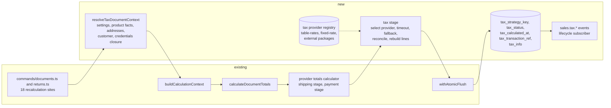

# Pluggable Tax Providers for Sales Documents

Status: proposed (design only; implementation ships on its own PR).
Scope: `packages/core/src/modules/sales/{lib/providers/*,lib/calculations.ts,lib/types.ts,commands/documents.ts,commands/returns.ts,commands/settings.ts,data/entities.ts,data/validators.ts,api/*,components/*,events.ts,i18n/*}`, `packages/core/src/modules/customers/{data/entities.ts,data/validators.ts,encryption.ts}`, `packages/shared/src/modules/integrations/types.ts`, `apps/docs/docs/**`.
Verified against: `systevio/open-mercato` branch `develop` at `e4ab32cac` (2026-09-19). The brief cited line numbers at `78df61346`; `git diff --stat 78df61346 origin/develop -- . ':!.ai/briefs'` is empty, so every cited line below is unchanged and was re-read at `e4ab32cac`. Symbols and command ids beside each line are the durable identifiers.

## Amendment — 2026-09-19, tax provider selection UI

Applies to the built-in provider list only; the contract, the calculation stage, the settings API and the schema below are unchanged.

- The second built-in provider `fixed-rate` is **removed from the product**. Every reference to it below (the "one built in second provider" decision, the Phase 1 and Phase 4 implementation notes, the i18n key list, the acceptance table) is historical. Its implementation survives as `lib/providers/integrationTestTaxProvider.ts` under the key `integration-test-rate`, registered only when `OM_INTEGRATION_TEST` is set, so the acceptance specs keep a second provider to select while no instance lists one.
- `table-rates` keeps its key and its `NULL`-means-default semantics but is presented as **Default (Tax rates)**, described as using the rates from the Tax rates section. The `sales.providers.tax.fixedRate.*` keys are gone.
- The configuration page shows the **Tax provider** picker only when a provider other than the default is registered, and the ship-from address and timeout only when an external provider is selected. The default provider hosts the **Tax rates** table in that slot instead.

## TLDR

**Key Points:**
- Tax calculation becomes a provider slot in `packages/core/src/modules/sales/lib/providers/`, shaped like the shipping and payment providers that already live there (`registry.ts:11`, `types.ts:97`), with a built in default provider `table-rates` that reproduces today's per line table rate math to the cent.
- A merchant selects the provider per organization on the Sales configuration page; when nothing is selected the default runs, so existing tenants see no change in any amount.
- A provider receives the whole document (kind, date, currency, ship from, ship to and bill to addresses, customer identity and exemption facts, every line with product tax facts, order level charges) and returns per line tax, a per jurisdiction breakdown, a status and a transaction reference. The result is persisted on quotes, orders, invoices and credit memos and exposed by their APIs.
- Vendor packages (the first one is an Avalara AvaTax official module) declare secrets through the integrations module (`hub: 'tax_providers'`) and non secret options through provider settings; core never ships vendor code and never calls a vendor.

**Scope:**
- Provider contract, registry and default provider (Phase 1)
- Persistence, API exposure and detail page breakdown (Phase 2)
- Per organization selection, settings UI, credentials, timeout, fallback and admin visibility (Phase 3)
- Customer exemption facts (Phase 4)
- Commit, adjust and void lifecycle for external providers (Phase 5)
- Documentation, compatibility notes and the reference shape of an external provider package (Phase 6)

**Concerns:**
- `tax_strategy_key` and `tax_info` already exist on orders and quotes and are accepted as caller input (`data/validators.ts:703-705`). This spec gives them core owned semantics; see the ⚠ row in Resolved assumptions.
- The provider runs on every document recalculation (18 call sites across `commands/documents.ts` and `commands/returns.ts`). A slow provider slows every write; the timeout and fallback are therefore part of the contract, not an option.
- Invoices and credit memos do not recalculate today (`commands/documents.ts:9091`, `:9676` take caller supplied totals). The spec inherits the order result onto them; recording a fresh invoice level transaction with a provider is deferred to Phase 5 and stays optional.

## Resolved assumptions (autonomous defaults)

The brief's twelve questions plus the mandatory split check were resolved without a human in the loop. Each default is the most reversible answer that still ships a working slice; correct any row before implementation.

| # | Question | Applied default | Why | Confirm? |
|---|----------|-----------------|-----|----------|
| Q1 | Contract placement and shape | Extend `sales/lib/providers/` with `registerTaxProvider`, `getTaxProvider`, `listTaxProviders` and a `TaxProvider` type (`key`, `label`, `description`, `settings`, `integrationId`, `calculate`, optional `commit`, `adjust`, `void`). `taxCalculationService` stays as the unit amount seam. | One registry file, one settings renderer and one docs page already exist for shipping and payment; a second registry style (`globalThis` keyed, as `shipping_carriers/lib/adapter-registry.ts:3`) would give external packages two patterns to learn. | reversible |
| Q2 | Selection per organization | Four columns on `sales_settings` (`tax_provider_key`, `tax_provider_settings`, `tax_provider_timeout_ms`, `ship_from_address`), a `GET/PUT /api/sales/settings/tax-provider` route and a `TaxProviderSettings` section on `/backend/config/sales`, guarded by `sales.settings.manage`. | `SalesSettings` (`data/entities.ts:753`) is the per organization row every other sales setting uses; the settings route pattern exists at `api/settings/order-editing/route.ts`. | reversible |
| Q3 | Calculate input | A `TaxCalculationRequest` assembled in the command layer from the document entity, the persisted line snapshots, catalog product facts, the address snapshots and the customer snapshot; provider specific extras travel in `metadata`. | Covers every field in brief section 3.1 and 3.2 without naming a vendor; the assembly is data only so the calculation hook stays pure. | reversible |
| Q4 | Calculate result | `TaxProviderCalculateResult` with `status`, per line and per charge amounts, a document total, a jurisdiction breakdown, a transaction reference, messages and `calculatedAt`; rounded to 4 decimals with `round()` from `lib/calculations.ts:25`; per line amounts overwrite `SalesLineCalculationResult.taxAmount` before totals are rebuilt. | Matches what the engine already sums (`lib/calculations.ts:221`) and what brief section 3.3 needs to persist. | reversible |
| Q5 | Where the provider runs | A third stage of the existing provider totals calculator (`lib/providers/totals.ts:183`), after shipping and payment adjustments, fed by a `tax` block that `buildCalculationContext` (`commands/documents.ts:2952`) now requires. Exactly one provider call per `calculateDocumentTotals`, before `withAtomicFlush` opens the transaction. | The totals hook is the only place that sees all lines and the shipping adjustment at once; making the context parameter required turns a missed call site into a type error. | reversible |
| Q6 | Customer exemption facts | Phase 4 adds `is_tax_exempt`, `tax_exemption_code` and `tax_exemption_certificate` (encrypted) to `customer_entities`; `resolveCustomerSnapshot` (`commands/documents.ts:732`) copies them into `customer_snapshot.customer.taxExemption`. Tax id comes from the billing address snapshot (`taxId`, `taxIdType`) as the pending address spec defines. | Smallest additive change on the customer master that the contract needs; the address spec already owns the identifier. | reversible |
| Q7 | Persistence | Reuse `tax_strategy_key` as the provider key and `tax_info` as the versioned result document; add `tax_status`, `tax_calculated_at`, `tax_transaction_ref` on all four document tables, `tax_strategy_key` where missing (quotes, invoices, credit memos) and `tax_info` where missing (invoices, credit memos). Core overwrites these columns whenever a calculation runs. | The columns already exist, already travel through command snapshots and undo (`commands/documents.ts:352`, `:4011-4013`) and are unused by any API or UI today. | confirmed by the owner on 2026-09-19: core owns `tax_strategy_key` and `tax_info` and overwrites them with the calculation result on every recalculation. The alternative (new `tax_provider_key` and `tax_calculation` columns) stays under Alternatives Considered as rejected. |
| Q8 | Failure behavior | Any throw, timeout, disabled integration or invalid result falls back to the default provider's amounts, sets `tax_status = 'fallback'`, records the sanitized failure in `tax_info.failure`, reports the error through `reportError`, emits `sales.tax.calculation.failed`, and never fails the API call. The document detail shows a warning banner with a Recalculate action. Invoices and credit memos never call a provider in core, so they cannot fail. | The brief forbids a silent zero and forbids failing the write; an estimate with a visible status is the only answer that satisfies both. | reversible |
| Q9 | Lifecycle | Core emits `sales.tax.transaction.commit_requested`, `adjust_requested` and `void_requested` with the persisted tax block; a core persistent subscriber calls the selected provider's optional `commit`, `adjust` or `void` and writes the returned state back with `sales.tax_transaction.record`. Existing `sales.order.confirmed`, `sales.order.cancelled` payloads gain an optional `tax` block. Optional methods are typed now and honored in Phase 5. | Events keep vendor calls out of the command transaction and retryable; typing the methods now means a package written against Phase 1 needs no change later. | reversible |
| Q10 | Credentials | A tax provider package declares an `IntegrationDefinition` with `hub: 'tax_providers'` and `category: 'tax'` for secrets and health check; the `TaxProvider` names it through `integrationId`. Core resolves credentials with `integrationCredentialsService.resolve` (`integrations/lib/credentials-service.ts:268`) at calculation time and hands them to `calculate` through a closure, never through serializable context. Provider `settings` may not declare `secret` fields. | Only the integrations module encrypts at rest and masks in the admin UI; shipping method rows store Stripe secrets in plain `metadata.providerSettings` today and this spec does not repeat that. | reversible |
| Q11 | Undo after a provider call | Replay: undo restores the stored tax columns from the command snapshot (`restoreQuoteGraph`, `applyOrderSnapshot`) and never calls the provider. When an undo moves an order out of `confirmed` while the stored transaction is `committed`, Phase 5 emits `void_requested`. | Every undo handler in `commands/documents.ts` already restores a graph snapshot without recalculating; the provider transaction is an external side effect and is reversed through the lifecycle path like any other. | reversible |
| Q12 | Rounding reconciliation | Per line amounts are rounded to 4 decimals; when their sum differs from the provider's document total by more than 0.00005 the difference is added to the line with the largest taxable amount and the adjustment is recorded in `tax_info.reconciliation`. `tax_total_amount` is always the reconciled sum of lines and charges. | Mirrors the largest remainder rule Shopify and commercetools apply and keeps the stored header total equal to the sum of stored line taxes, which the read model tests already assert. | reversible |
| Q13 | Split check: one spec or several? | One spec, six independently shippable phases. Customer exemption fields (Phase 4) and the lifecycle (Phase 5) would function as separate specs, but the contract in Phase 1 fixes the shape of the customer block and of the optional methods, so splitting would freeze incomplete types first. | The phases below are what a split would have bought; each ends with the application working. | reversible |

All rows are confirmed; the ⚠ row was decided by the owner on 2026-09-19 (see Q7).

## Overview

Open Mercato calculates tax on a sales line from the rate stored on that line (`lib/calculations.ts:120`), and derives a unit price's missing side through `taxCalculationService.calculateUnitAmounts` (`services/taxCalculationService.ts:24`). Both are table driven: a `sales_tax_rates` row, or a raw percentage, and one amount. Nothing in the pipeline knows where the goods ship, who buys them or what the product is, so a real tax engine cannot be plugged in even though the documentation promises it (`apps/docs/docs/user-guide/taxes.mdx`, "Swapping DI services entirely", names Avalara).

Shipping and payment already solved the same problem for their domain: a registry, a provider shape with `key`, `label`, `settings` and `calculate`, selection stored on the method row, and a totals calculator that runs the selected provider during `calculateDocumentTotals` (`lib/providers/totals.ts:183`). This spec gives tax the same treatment, selected per organization rather than per method because tax is a property of the seller, not of a shipping option.

The audience is any deployment that sells into jurisdictions where table rates are not enough (United States sales tax, EU OSS destination rates, Canadian provincial layering) and any partner writing a tax engine adapter. The first adapter is an Avalara AvaTax official module that will consume this contract without touching core.

> **Market Reference**
>
> | Platform | Adopted | Rejected |
> |---|---|---|
> | [Shopify tax apps and `tax_lines`](https://shopify.dev/docs/api/admin-graphql/latest/objects/TaxLine) (`title`, `rate`, `price`, per line and per shipping line; `taxes_included` on the order) | Per line and per shipping charge tax lines with a title and a rate; an explicit tax included flag per line. | A single boolean for the whole order: Open Mercato lines already carry their own net and gross, so the flag is per line. |
> | [Medusa tax providers and tax regions](https://docs.medusajs.com/resources/references/tax/provider) (`ITaxProvider.getTaxLines(itemLines, shippingLines, context)` returning `ItemTaxLineDTO` and `ShippingTaxLineDTO` with `rate`, `code`, `name`, `provider_id`) | Provider receives item lines and shipping lines separately with their rates and returns line scoped tax lines carrying the provider id; a `system` default provider that reproduces table rates. | Tax regions as a core entity: `sales_tax_rates` already scopes by country, region, postal code and city (`data/entities.ts:258-290`), so a second region model would duplicate it. |
> | [Saleor tax apps](https://docs.saleor.io/developer/app-store/apps/taxes) (`CALCULATE_TAXES` sync webhook over a `TaxableObject` with `address`, `channel`, `currency`, `pricesEnteredWithTax`, `lines[]` with `productSku`, `chargeTaxes`, `unitPrice`, `totalPrice`, and a response with `shipping_tax_rate`, `lines[].tax_rate`, `total_gross_amount`) | The taxable object idea: one immutable request document built by core; `pricesEnteredWithTax` per document; the SKU and product facts on each line. | Synchronous webhook delivery and app level identity: providers here are in process registrations, and credentials are per organization rows. |
> | [commercetools external tax rates](https://docs.commercetools.com/api/projects/carts#taxedprice) (`TaxMode: External`, `ExternalTaxRateDraft` per line with `subRates[]`, `TaxedPrice` with `taxPortions[]` of `name`, `rate`, `amount`; a cart whose tax became stale drops `taxedPrice` and must be recalculated) | `taxPortions` as the breakdown shape (jurisdiction name, rate, amount) and the rule that a stale result is marked and recalculated, never silently reused. | Whole cart tax modes: the persisted status here is per document and per calculation, and the pending external amounts spec owns the case where a caller is authoritative. |

## Problem Statement

1. **The only extension seam sees one amount.** `TaxCalculationService.calculateUnitAmounts` (`services/taxCalculationService.ts:24-26`) receives `amount`, `mode`, `organizationId`, `tenantId`, `taxRateId`, `taxRate`. Its four callers (`catalog/commands/prices.ts:350`, `:619`; `commands/documents.ts:7185`, `:7692`) have no address, no customer and no sibling lines. Overriding the DI token (`packages/shared/src/lib/di/container.ts:291-299` for the app level `src/di.ts`, or any module `di.ts`) replaces the implementation but not the input.
2. **Document totals derive tax from the line's own rate.** `buildBaseLineResult` (`lib/calculations.ts:120-186`) multiplies `netSubtotal` by `line.taxRate` unless the line carries an explicit `taxAmount`; `buildBaseDocumentResult` sums those (`:221`). `SalesCalculationContext` (`lib/types.ts:160-166`) carries `tenantId`, `organizationId`, `currencyCode`, `metadata` and `resolve`; no addresses, no customer, no document date.
3. **The result has no provenance.** `sales_orders` has `tax_strategy_key` (`data/entities.ts:397`) and `tax_info` (`:403`), `sales_quotes` has `tax_info` (`:888`); invoices (`:1383`) and credit memos (`:1550`) have only `tax_total_amount`. Nothing records whether an amount is an estimate, a provider result or an exemption, when it was calculated, or which provider transaction it belongs to. No API route or UI reads `tax_info` today (searched `api/`, `components/`, `backend/` under `sales`).
4. **Recalculation is spread across eighteen sites.** Fourteen `calculateDocumentTotals` calls in `commands/documents.ts` (`:4932` create quote, `:5351` update quote, `:5617` update order, `:6006` create order, `:7360` and `:7542` order line upsert and delete, `:7858` and `:8012` quote line upsert and delete, `:8243` and `:8292` order adjustment upsert, `:8458` order adjustment delete, `:8702` and `:8750` quote adjustment upsert, `:8915` quote adjustment delete) and four in `commands/returns.ts` (`:203`, `:388`, `:538`, `:724`). The brief counted eleven; the three quote adjustment sites and the four return sites were added to the inventory during verification. Every site builds its context through `buildCalculationContext` (`:2952`), which is the lever this spec uses.
5. **Product and customer facts exist but do not reach the calculation.** `catalog_products` carries `tax_rate_id`, `tax_rate`, `tax_classification_code` and `hs_code` (`catalog/data/entities.ts:106-109`, `:174-178`); variants carry `tax_rate_id` (`:618`). The line's `catalog_snapshot` (`data/entities.ts:586`) is caller supplied (`commands/documents.ts:7315-7317`), so core cannot rely on it containing those facts. Customers have no exemption fields at all (grep `tax_exempt`, `exemption` in `customers/` returns nothing).
6. **Credentials have a home that tax does not use.** The integrations module stores encrypted credential blobs per integration and scope (`integrations/lib/credentials-service.ts:277-303`) and masks secrets in the admin UI; `IntegrationHubId` (`shared/src/modules/integrations/types.ts:29-36`) has hubs for payment gateways and shipping carriers but none for tax. Shipping and payment provider `settings` allow `type: 'secret'` fields (`lib/providers/types.ts:16`) that are stored in plain `metadata.providerSettings` on the method row (`defaultProviders.ts:105-107`).

## Proposed Solution

Add a tax provider slot beside the shipping and payment slots and run the selected provider once per recalculation, inside the existing totals pipeline, on a request assembled from everything the document already knows. Persist the answer on the document, expose it, and let external packages commit, adjust and void through events. The default provider reproduces the current math exactly, so a tenant that never opens the settings page keeps every amount it has today.



Takeaway: the only new step on the write path is the tax stage inside the hook that already exists; everything else is data assembly before the call and persistence after it.

### Design Decisions

| Decision | Rationale |
|----------|-----------|
| Same registry file and provider shape as shipping and payment | `registry.ts` gains a third map and `normalizeProviderSettings` gains the `'tax'` kind (`registry.ts:4`, `:49`); the settings section reuses `renderProviderFieldInput` (`components/ProviderFieldInput.tsx:15`). An external package learns one pattern. |
| Selection per organization, not per channel or per method | Tax is a property of the seller's registration, not of the shipping option. `sales_settings` is unique per `(organizationId, tenantId)` (`data/entities.ts:754`). Per channel overrides can be layered later as an additive column. |
| The default provider is an identity over the engine's line math | `table-rates` returns exactly the `taxAmount` that `buildBaseLineResult` computed for each line (including the explicit `taxAmount` and the gross delta heuristic at `lib/calculations.ts:164-180`) and the `taxPortion` of each adjustment. This is the only way to guarantee that a tenant without a selection does not change by one cent. |
| Provider runs in the totals hook, after shipping and payment | Shipping surcharges are taxable in most US states; the tax stage must see the shipping adjustment that the shipping stage just appended (`totals.ts:242`). Running as a third stage of the same hook keeps ordering explicit and the call count at one. |
| Context assembly is async and lives in the command layer; the hook is pure | Totals hooks receive only `context` (`lib/types.ts:151-158`). Doing settings, product and credentials lookups before `calculateDocumentTotals` keeps the calculation registry free of database access and keeps every lookup batched. |
| Credentials reach the provider through a closure, never through serializable context | `context` is part of the `sales.document.calculate.before` payload (`lib/calculations.ts:413-423`). A `resolveCredentials()` function in `context.metadata.tax` survives the hook and vanishes in `JSON.stringify`, so no subscriber or log can see a secret. |
| Provider `settings` reject `type: 'secret'` for tax providers | Secrets belong to the integrations module (encrypted blob, masked UI, per user scoping). `registerTaxProvider` drops such fields with a logged warning. |
| The persisted `tax_info` never contains addresses or customer identity | Only amounts, rates, jurisdictions, references, messages and the failure record are stored. The request is not echoed. This is what keeps `tax_info` out of the encryption maps while the customer snapshot and address snapshots stay encrypted (`sales/encryption.ts:7-9`). |
| Failure degrades to the default provider with a visible status | Never a zero, never a failed write. The status column is what the detail page and the acceptance tests key on. |
| Lifecycle through events plus optional provider methods | A vendor call never runs inside `withAtomicFlush`. The subscriber is persistent, so a commit that fails because the vendor is down is retried. |
| One built in second provider, `fixed-rate` | A single rate with an optional second jurisdiction is a real provider for single state sellers and is also the test double every acceptance scenario needs. Its `simulateFailure` setting exists only to exercise the fallback path and is labelled as such. |

### Alternatives Considered

| Alternative | Why Rejected |
|-------------|-------------|
| Widen `TaxCalculationService` with a document level method and keep DI override as the only slot | Keeps one token but no selection surface: a deployment with two organizations that use different engines would need two apps. The DI override path stays supported for unit amounts and is documented as such. |
| A `globalThis` keyed registry like `shipping_carriers/lib/adapter-registry.ts` | The shipping and payment registries are module scoped maps and external packages register into them today (`apps/docs/docs/framework/modules/sales-providers.mdx`). Two registry styles in one folder is worse than one. |
| A line calculator hook (`registerSalesLineCalculator`) | Line calculators run per line without the other lines (`lib/calculations.ts:375`); an engine needs the whole document for jurisdiction and threshold logic, and shipping tax needs the shipping adjustment. |
| New columns `tax_provider_key` and `tax_calculation` instead of reusing `tax_strategy_key` and `tax_info` | Zero semantic change to two caller writable fields, at the cost of two near duplicates on four tables. Listed as the fallback if the ⚠ row in Resolved assumptions is rejected; the rest of the design is unchanged. |
| Provider selected per shipping method row (as shipping and payment providers are) | Tax does not depend on the carrier. Storing it on `sales_shipping_methods` would leave quotes without a method unselected. |
| Calling the provider inside the transaction | A network call would hold a Postgres transaction open for its whole duration and a timeout would abort the write. The provider runs before `withAtomicFlush` and the write commits with the fallback status if it fails. |
| Storing the full request in `tax_info` for audit | It would embed the customer's tax id, exemption certificate and both addresses in a column no encryption map covers. Audit belongs to the provider's transaction reference. |
| Recording invoices with a provider (`intent: 'record'`) in core now | Invoices take caller totals today (`commands/documents.ts:9088-9095`) and no UI creates them from an order; inheriting the order result satisfies R6 and acceptance 2. Recording is designed (Phase 5, optional `recordInvoice` is not added; `commit` on `sales.invoice.created` is) and can be enabled per provider. |

## User Stories / Use Cases

- A **merchant admin** wants to **select Avalara for organization A and keep table rates for organization B** so that US orders get jurisdiction accurate tax while the EU entity keeps its VAT classes.
- A **tax engine package author** wants to **register a provider from `di.ts` and declare credentials and a health check** so that the adapter ships as an official module without a core change.
- A **sales operator** wants to **see on an order why the tax total is what it is and whether it is an estimate** so that a provider outage does not become a mispriced invoice.
- An **accountant** wants to **find the provider transaction reference on the invoice** so that a void or refund can be reconciled in the engine.
- A **third party module author** who **never selects a provider** wants **every document total to stay byte identical** so that an upgrade is risk free.
- A **customer service agent** wants to **mark a customer as exempt with a certificate number** so that the engine stops charging tax on that customer's documents.

## Architecture

Primary module: `sales`. Reused: the provider registry and totals hook (`lib/providers/*`), the calculation engine (`lib/calculations.ts`), command snapshots and undo (`commands/documents.ts`), the settings route pattern (`api/settings/order-editing/route.ts`), the provider field renderer (`components/ProviderFieldInput.tsx`), the integrations credentials and state services (`integrations/lib/*`), the events module. Touched modules: `customers` (Phase 4, additive columns and snapshot fields), `shared` (two additive union members on integration types).

Cross module touchpoints and their sanctioned mechanism:

| Touchpoint | Mechanism | Owner of the glue | Behavior when the peer is absent |
|---|---|---|---|
| Sales reads catalog product tax facts | FK id lookup in the command layer (`sales` already declares `requires: ['catalog', 'customers', 'dictionaries']`, `index.ts:12`) | `sales` | n/a (hard dependency already) |
| Sales reads customer exemption facts | FK id plus `customer_snapshot` copy at document write (`resolveCustomerSnapshot`) | `sales` | n/a (hard dependency already) |
| Sales resolves provider credentials | Soft optional `tryResolve('integrationCredentialsService')` and `tryResolve('integrationStateService')` inside `try/catch` | `sales` | Provider with an `integrationId` is treated as unavailable; fallback status with message `integrations_unavailable` |
| External package registers a provider | `registerTaxProvider` import from `@open-mercato/core/modules/sales/lib/providers` | the package | Core lists only built in providers |
| External package commits, adjusts, voids | Core emits `sales.tax.transaction.*_requested`; core subscriber calls the provider's optional methods | `sales` | No method on the provider: the subscriber records `state: 'not_supported'` and stops |
| Workflows and notifications on failure | `sales.tax.calculation.failed` (triggerable) | consumers | n/a |

### Provider contract

All types live in `packages/core/src/modules/sales/lib/providers/types.ts` and are re-exported from `lib/providers/index.ts`, beside `ShippingProvider` and `PaymentProvider`.

**Registration** (`lib/providers/registry.ts`):

```ts
export function registerTaxProvider(provider: TaxProvider): () => void
export function getTaxProvider(key: string | null | undefined): TaxProvider | null
export function listTaxProviders(): TaxProvider[]
export function normalizeProviderSettings(kind: 'shipping' | 'payment' | 'tax', providerKey, settings)
```

The private `ProviderKind` union (`registry.ts:4`, today `'shipping' | 'payment'`) gains `'tax'`, and a third module scoped `Map<string, TaxProvider>` sits beside the shipping and payment maps (`:6-7`). `registerTaxProvider` trims the key, overwrites an existing key (idempotent like the other two), strips any `settings.fields` entry with `type: 'secret'` with a `logger.warn('tax provider settings must not declare secret fields', { key, field })`, and returns an unregister function. Registration is a module load side effect from the package's `index.ts` (isomorphic, matching `sales/index.ts:2`) or from its `di.ts` (server only); the admin UI lists providers through `GET /api/sales/tax-providers`, so either works.

**Provider shape:**

| Field | Type | Required | Meaning |
|---|---|---|---|
| `key` | `string` | yes | Stable kebab case identifier persisted in `tax_strategy_key` (`table-rates`, `fixed-rate`, `avalara`) |
| `label` | `string` | yes | Display name in the settings select |
| `description` | `string` | no | One line shown under the select |
| `settings` | `ProviderSettingsDefinition` | no | Non secret options rendered by `renderProviderFieldInput` and validated by `settings.schema`; `secret` fields are rejected |
| `integrationId` | `string` | no | The `IntegrationDefinition.id` whose credentials core resolves and passes to `calculate`; when set, the provider is skipped with `integration_disabled` while `integrationStateService.isEnabled` is false |
| `capabilities` | `{ commit?: boolean; adjust?: boolean; void?: boolean; recordsInvoices?: boolean }` | no | Declares what the lifecycle subscriber may call; `recordsInvoices` opts the provider into `commit_requested` on `sales.invoice.created` |
| `calculate` | `(input: TaxProviderCalculateInput) => Promise<TaxProviderCalculateResult \| null>` | yes | Returns `null` to decline (core treats it as `unsupported`) |
| `commit` | `(input: TaxTransactionLifecycleInput) => Promise<TaxTransactionState>` | no | Phase 5 |
| `adjust` | `(input: TaxTransactionLifecycleInput) => Promise<TaxTransactionState>` | no | Phase 5 |
| `void` | `(input: TaxTransactionLifecycleInput) => Promise<TaxTransactionState>` | no | Phase 5 |

**`TaxProviderCalculateInput`:**

| Field | Type | Meaning |
|---|---|---|
| `request` | `TaxCalculationRequest` | The document as assembled below |
| `settings` | `Record<string, unknown>` | Normalized provider settings from `sales_settings.tax_provider_settings` |
| `credentials` | `Record<string, unknown>` | Decrypted credentials for `integrationId`, `{}` when none |
| `context` | `SalesCalculationContext` | The engine context (tenant, organization, currency) |
| `signal` | `AbortSignal` | Aborted at the timeout; providers pass it to their HTTP client |

**`TaxCalculationRequest`** (document level):

| Field | Type | Source |
|---|---|---|
| `documentKind` | `'quote' \| 'order' \| 'invoice' \| 'credit_memo'` | the command |
| `documentId` | `string \| null` | entity id, `null` before the first insert of a create command |
| `documentNumber` | `string \| null` | `quote_number` / `order_number` |
| `documentDate` | ISO date string | `placedAt ?? validFrom ?? createdAt ?? now` |
| `intent` | `'estimate' \| 'record'` | `estimate` for quotes and orders, `record` for invoices and credit memos (Phase 5 only) |
| `currencyCode` | `string` | entity `currency_code` |
| `organizationId`, `tenantId` | `string` | entity scope |
| `channelId` | `string \| null` | entity `channel_id` |
| `customer` | `TaxCustomer \| null` | `customer_snapshot` plus the billing address snapshot |
| `addresses` | `{ shipFrom, shipTo, billTo }` each `TaxAddress \| null` | `sales_settings.ship_from_address` (Phase 3; `null` before), `shipping_address_snapshot`, `billing_address_snapshot` |
| `lines` | `TaxRequestLine[]` | `SalesLineCalculationResult[]` after the base line math |
| `charges` | `TaxRequestCharge[]` | order scoped adjustments of kind `shipping`, `surcharge`, `discount`, `custom` present after the payment stage |
| `totals` | `{ subtotalNetAmount, discountTotalAmount, shippingNetAmount }` | `current.totals` after the payment stage |
| `metadata` | `Record<string, unknown>` | `context.metadata.tax.metadata`; free bag for provider specific inputs (purchase order number, reference code) |

**`TaxCustomer`:**

| Field | Type | Source |
|---|---|---|
| `id` | `string` | `customer_snapshot.customer.id` |
| `kind` | `'person' \| 'company'` | `customer_snapshot.customer.kind` |
| `code` | `string` | the customer id (engines need a stable customer code) |
| `displayName` | `string \| null` | `customer_snapshot.customer.displayName` |
| `taxId`, `taxIdType` | `string \| null` | `billing_address_snapshot.taxId` / `.taxIdType` (pending spec `2026-08-10-address-contact-and-tax-fields.md`); `null` until it lands |
| `exemption` | `{ isExempt: boolean; code: string \| null; certificateNumber: string \| null } \| null` | `customer_snapshot.customer.taxExemption` (Phase 4); `null` before |

**`TaxAddress`:** `line1` (`addressLine1`), `line2` (`addressLine2`), `buildingNumber`, `flatNumber`, `city`, `region`, `postalCode`, `country`, `latitude`, `longitude`; all `string | number | null`, mapped from the snapshot keys `resolveAddressSnapshot` writes (`commands/documents.ts:809-825`).

**`TaxRequestLine`:**

| Field | Type | Source |
|---|---|---|
| `id` | `string` | line id (the create path assigns ids before calculation; `randomUUID()` at `commands/documents.ts:7213` is the precedent) |
| `lineNumber` | `number` | snapshot |
| `kind` | `SalesLineKind` | snapshot |
| `productId`, `productVariantId` | `string \| null` | snapshot |
| `sku` | `string \| null` | `catalog_snapshot.sku`, else `catalog_products.sku` / `catalog_product_variants.sku` (batched) |
| `name`, `description` | `string \| null` | snapshot |
| `quantity` | `number` | snapshot `normalizedQuantity ?? quantity` |
| `unitPriceNet` | `number` | snapshot |
| `amountNet` | `number` | `SalesLineCalculationResult.netAmount` (extended, after discount) |
| `discountAmount` | `number` | `SalesLineCalculationResult.discountAmount` |
| `taxIncluded` | `boolean` | `metadata.priceMode === 'gross'` (`commands/documents.ts:7209`) |
| `taxRateId` | `string \| null` | `catalog_snapshot.taxRateId`, else variant `tax_rate_id`, else product `tax_rate_id` |
| `taxRate` | `number \| null` | snapshot `taxRate` (the table rate the engine used) |
| `taxClassificationCode` | `string \| null` | `catalog_snapshot.taxClassificationCode`, else `catalog_products.tax_classification_code` (the Polish compliance code) |
| `taxCode` | `string \| null` | `catalog_snapshot.taxCode`, else variant `tax_code`, else product `tax_code`; the provider tax code, such as an Avalara tax code |
| `isTaxable` | `boolean` | `catalog_snapshot.isTaxable`, else variant `is_taxable`, else product `is_taxable`, else `true`; `false` means the catalog marks the product as not taxable |
| `hsCode` | `string \| null` | `catalog_snapshot.hsCode`, else `catalog_products.hs_code` |
| `shipTo` | `TaxAddress \| null` | `null` in this spec (per line addresses are reserved; `metadata` carries them until a core feature needs them) |
| `metadata` | `Record<string, unknown>` | `line.metadata` |

**`TaxRequestCharge`:** `id` (adjustment id or `calculatorKey`), `kind` (`shipping` \| `surcharge` \| `discount` \| `custom`), `code`, `label`, `amountNet`, `taxRate` (from `extractAdjustmentTaxRate`, `lib/calculations.ts:35`), `calculatorKey`.

**`TaxProviderCalculateResult`:**

| Field | Type | Meaning |
|---|---|---|
| `status` | `'calculated' \| 'exempt' \| 'unsupported'` | `unsupported` means "not my jurisdiction"; core falls back to the default provider and stores `tax_status = 'fallback'` with message `unsupported` |
| `lines` | `Array<{ lineId, taxAmount, taxableAmount, exemptAmount, rate, details: TaxJurisdictionAmount[] }>` | One entry per request line; a missing line is treated as `taxAmount: 0` with a `line_missing` message |
| `charges` | `Array<{ chargeId, taxAmount, taxableAmount, rate, details }>` | One entry per request charge; missing entries mean no tax |
| `totals` | `{ taxTotal, taxableTotal, exemptTotal }` | The provider's own document figures, used for reconciliation |
| `breakdown` | `TaxJurisdictionAmount[]` | Document level per jurisdiction summary |
| `transaction` | `{ reference: string \| null; state: 'estimate' \| 'recorded' \| 'committed' \| 'voided' \| 'not_supported'; externalUrl?: string \| null }` | Provider transaction identity |
| `messages` | `Array<{ level: 'info' \| 'warning' \| 'error'; code: string; text: string }>` | Surfaced on the detail page |
| `calculatedAt` | ISO string | Defaults to now when omitted |
| `metadata` | `Record<string, unknown>` | Provider specific extras, stored verbatim (must not contain secrets or addresses; documented rule) |

**`TaxJurisdictionAmount`:** `jurisdictionCode`, `jurisdictionName`, `jurisdictionType` (`country` \| `state` \| `county` \| `city` \| `special` \| `other`), `taxName`, `rate`, `taxableAmount`, `taxAmount`, `exemptAmount`.

**Persisted status values** (`tax_status`): `calculated` (provider amounts), `exempt` (provider said fully exempt, amounts are zero), `fallback` (provider failed or declined, default amounts, an estimate), `external` (pending external amounts mode is on for the document; no provider ran). `NULL` on rows written before this spec and on rows whose write never recalculated.

### Data assembled for a calculation

`resolveTaxDocumentContext` (`lib/providers/taxContext.ts`, async, called by the command before `buildCalculationContext`) produces `TaxDocumentContext`:

```ts
type TaxDocumentContext = {
  document: { kind; id; number; date; channelId; intent }
  customer: TaxCustomer | null
  addresses: { shipFrom: TaxAddress | null; shipTo: TaxAddress | null; billTo: TaxAddress | null }
  productFacts: Record<string, TaxProductFacts>   // by productId and by variantId
  selection: { providerKey: string; settings: Record<string, unknown>; integrationId: string | null; integrationEnabled: boolean }
  resolveCredentials: () => Promise<Record<string, unknown>>   // closure; not enumerable in JSON
  timeoutMs: number
  totalsMode: 'computed' | 'external'
  metadata: Record<string, unknown>
}
```

**`TaxProductFacts`** is the per product block those two catalog reads produce, keyed by both product id and variant id:

```ts
type TaxProductFacts = {
  sku: string | null
  taxRateId: string | null
  taxClassificationCode: string | null   // the Polish compliance code
  taxCode: string | null                 // the provider tax code, such as an Avalara tax code
  isTaxable: boolean                     // false only when the catalog says so
  hsCode: string | null
}
```

A variant value wins over its parent product's, for every field the variant carries; `taxClassificationCode` has no variant column, so the product always owns it. `isTaxable` distinguishes "the catalog said `false`" from "the catalog said nothing": only an explicit value overrides, so a variant that says nothing inherits its product's flag and a product that says nothing is taxable. That matches the column default on `catalog_products.is_taxable` and `catalog_product_variants.is_taxable`, which is `true`.

Queries per calculation: one `sales_settings` point read (cached, see Configuration), at most one `catalog_products` and one `catalog_product_variants` batched `id IN (...)` read for lines whose `catalog_snapshot` lacks the facts, and one credentials read only when the selected provider has an `integrationId` and `calculate` is actually invoked (the closure is lazy). All reads filter by `organization_id` and `tenant_id`.

Whether the two catalog reads happen at all is the provider's call: `TaxProvider.needsProductFacts` declares it. `true` loads them, `false` keeps the document on the cheap path, and an undeclared provider gets them, which is how the contract behaved before providers could say. The built in `table-rates` provider declares `false` because every figure it returns is one the engine already computed, so a document that never selects a provider still adds no catalog query to any write.

`buildCalculationContext` gains a required `tax: TaxDocumentContext` parameter and places it under `context.metadata.tax`; the four `returns.ts` sites build their context through the same helper. A unit test asserts that every `calculateDocumentTotals(` call in `commands/` passes a context whose metadata carries `tax` (a source scan, like the existing `registration.test.ts` style checks).

### Where the provider runs and the transactional boundary

`ensureProviderTotalsCalculator` (`lib/providers/totals.ts:179`) gains a third stage after the payment stage:

1. Skip when `context.metadata.tax` is absent (third party callers of `calculateDocumentTotals`, `seed/examples.ts:1344`, `:1562`) or when `totalsMode === 'external'`; the result is unchanged and, for the external case, `metadata.tax.status = 'external'`.
2. Resolve the provider by `selection.providerKey` with `getTaxProvider`; an unknown key (package removed) falls back to `table-rates` with message `provider_missing`.
3. Build `TaxCalculationRequest` from `working.lines`, `working.adjustments` and the context.
4. Run `provider.calculate` under `Promise.race` with a timer that aborts `signal` after `timeoutMs`; catch everything.
5. Validate the result with `taxProviderResultSchema` (zod); invalid results count as failures.
6. On `calculated` or `exempt`: reconcile (see below), write `taxAmount` on each `SalesLineCalculationResult`, set `amountGross = amountNet + taxAmount` and `metadata.taxRate` on each taxed charge adjustment, then `rebuildDocumentResult` so `taxTotalAmount` is the sum of the new figures (`lib/calculations.ts:221`, `:246`).
7. On failure, timeout, `unsupported` or `null`: keep the engine's figures (which are the `table-rates` figures) and mark `fallback`.
8. Place the full `TaxInfo` document (below) in `working.metadata.tax`, and emit `sales.tax.adjustments.apply.before` and `.after` with `setResult` and `setDocument` like the shipping stage (`totals.ts:228-277`).

The command then persists inside `withAtomicFlush(em, [...], { transaction: true })` exactly as today (`commands/documents.ts:4948`): `applyQuoteTotals` and its siblings copy `calculation.metadata.tax` to the five columns. The provider call therefore happens before the transaction opens; no Postgres transaction is held during network I/O, and a timeout never aborts the write. `emitTotalsCalculated` (`:3019`) adds `tax: { providerKey, status, transactionRef, calculatedAt }` to its payload.

Default timeout: 8000 ms, overridable per organization by the core level setting `timeoutMs` in the tax provider settings form (bounded 1000 to 30000) and by the env `OM_SALES_TAX_PROVIDER_TIMEOUT_MS` for the instance default.

### Selection per organization

`sales_settings` gains `tax_provider_key text NULL` (`NULL` means `table-rates`), `tax_provider_settings jsonb NULL`, `tax_provider_timeout_ms integer NULL` and `ship_from_address jsonb NULL` (an `AddressValue` shaped record, encrypted through the sales encryption map because it is an address). The settings route `GET/PUT /api/sales/settings/tax-provider` and the command `sales.settings.save_tax_provider` (with undo restoring the previous three values) follow `api/settings/order-editing/route.ts` and `commands/settings.ts:19` exactly: `sales.settings.manage`, `withScopedPayload`, mutation guard with `resourceKind: 'sales.settings'`, `openApi` export. Saving invalidates the settings cache tags.

### Credentials and settings

A provider package declares:

```ts
export const integration: IntegrationDefinition = {
  id: 'tax_avalara',
  title: 'Avalara AvaTax',
  category: 'tax',
  hub: 'tax_providers',
  providerKey: 'avalara',
  credentials: { fields: [
    { key: 'environment', label: 'Environment', type: 'select', options: [{ value: 'sandbox', label: 'Sandbox' }, { value: 'production', label: 'Production' }], required: true },
    { key: 'accountId', label: 'Account id', type: 'text', required: true },
    { key: 'licenseKey', label: 'License key', type: 'secret', required: true },
    { key: 'companyCode', label: 'Company code', type: 'text', required: true },
  ] },
  healthCheck: { service: 'taxAvalaraHealthCheck' },
}
```

and a provider with `integrationId: 'tax_avalara'` whose `settings.fields` carry the non secret options (commit on confirmation, default tax code, address validation on or off). `IntegrationHubId` gains the named member `'tax_providers'` and `IntegrationCategory` gains `'tax'` (both additive to open unions, `shared/src/modules/integrations/types.ts:20-36`). The integrations marketplace renders the hub label through `formatTypeLabel` (`integrations/backend/integrations/[id]/page.tsx:1123`), so no hub registry entry is needed.

At calculation time core resolves `integrationStateService.isEnabled(integrationId, scope)` (disabled: fallback with `integration_disabled`) and `integrationCredentialsService.resolve(integrationId, scope)` (`credentials-service.ts:268`, decrypts the blob, falls through to a bundle). Both services are resolved through a local `tryResolve` in `try/catch`; when the integrations module is absent the provider is unavailable and the document falls back. Credentials are never logged (`createLogger('sales')` calls in the tax stage log `providerKey`, `documentKind`, `documentId`, `code` and a message only) and never stored.

### Failure and fallback

| Trigger | What core does | `tax_status` | `tax_info.failure.code` | What the admin sees |
|---|---|---|---|---|
| `calculate` throws | log warn, `reportError` with `code: 'sales.tax_provider_failed'`, fallback | `fallback` | `provider_error` | Warning banner "Tax is an estimate" with provider label, time, sanitized message and a Recalculate button |
| Timeout | abort signal, same as above | `fallback` | `timeout` | same |
| Result fails zod validation | same | `fallback` | `invalid_result` | same |
| `status: 'unsupported'` or `null` | fallback, no error report (expected outcome) | `fallback` | `unsupported` | Info banner "Provider declined; table rates applied" |
| Integration disabled or credentials missing | fallback, no vendor call | `fallback` | `integration_disabled` / `credentials_missing` | Warning banner with a link to the integration page |
| Provider key not registered | fallback | `fallback` | `provider_missing` | Warning banner with a link to Sales settings |
| Integrations module absent | fallback | `fallback` | `integrations_unavailable` | Warning banner |

Every fallback emits `sales.tax.calculation.failed` (`category: 'lifecycle'`, triggerable, payload `{ id: documentId, documentKind, documentId, organizationId, tenantId, providerKey, code, message }`), so a workflow or notification can alert the merchant. The banner's Recalculate action calls `POST /api/sales/documents/{kind}/{id}/recalculate-tax`, which executes `sales.documents.recalculate_tax` (a thin command that loads the document, rebuilds the snapshots through the existing helpers and runs the same recalculation path; undo restores the graph snapshot). Quotes and orders whose status guards forbid edits are still recalculable because no line or header field changes.

### Rounding reconciliation

1. Every provider amount is passed through `round()` (4 decimals).
2. `lineSum = sum of lines.taxAmount plus sum of charges.taxAmount`.
3. If `|lineSum - totals.taxTotal| > 0.00005`, the difference is added to the line with the largest `taxableAmount` (ties: lowest `lineNumber`), and `tax_info.reconciliation = { providerTotal, lineSum, delta, appliedToLineId }`.
4. `tax_total_amount` is the reconciled sum; it never carries a value that its lines do not add up to. The tolerance is the same half minor unit `NET_RECONCILIATION_TOLERANCE` reasoning uses (`lib/calculations.ts:33`).

### Lifecycle: commit, adjust, void (Phase 5)

| Moment | Event | Payload (in addition to `id`, `organizationId`, `tenantId`) | Subscriber action |
|---|---|---|---|
| `sales.order.confirmed` (`commands/documents.ts:963`) with `tax_status in ('calculated','exempt')` and a non default provider | `sales.tax.transaction.commit_requested` | `documentKind: 'order'`, `documentId`, `documentNumber`, `providerKey`, `transactionRef`, `tax` (the `TaxInfo` document) | call `provider.commit` when declared |
| `sales.invoice.created` and the provider has `capabilities.recordsInvoices` | `sales.tax.transaction.commit_requested` | as above with `documentKind: 'invoice'` and the inherited `tax` | call `provider.commit` |
| `sales.order.cancelled` (`:981`), invoice deleted, undo that leaves `confirmed` with a `committed` transaction | `sales.tax.transaction.void_requested` | as above | call `provider.void` |
| `sales.credit_memo.created` | `sales.tax.transaction.adjust_requested` | as above plus `sourceInvoiceId`, `sourceOrderId` | call `provider.adjust` |

The subscriber `subscribers/tax-transaction-lifecycle.ts` is persistent (`{ persistent: true, id: 'sales-tax-transaction-lifecycle' }`), idempotent (it re-reads the document and skips when `tax_info.transaction.state` already equals the target), resolves settings and credentials the same way the tax stage does, calls the provider method with `TaxTransactionLifecycleInput = { request: TaxCalculationRequest (rebuilt from the stored document), tax: TaxInfo, settings, credentials, signal }`, and writes the result through `sales.tax_transaction.record` (input `{ documentKind, documentId, transaction: TaxTransactionState, messages }`, undo restores the previous `transaction` block). The write updates `tax_transaction_ref` and `tax_info.transaction` and emits `sales.tax.transaction.updated` (`clientBroadcast: true` so the detail page refreshes). The optional `tax` block (`{ providerKey, status, transactionRef, calculatedAt }`) that Phase 2 adds to `sales.order.confirmed` and `sales.order.cancelled` gives a package that prefers its own subscriber what it needs.

### Undo

Undo replays: every undo handler in `commands/documents.ts` restores a graph snapshot (`applyOrderSnapshot`, `:3984-4020`; `restoreQuoteGraph`, `:5228`) and the snapshot types gain the new columns (`OrderGraphSnapshot.order`, `:350-352`, and the quote, invoice and credit memo `before`/`after` payloads at `:247`, `:1701`, `:1990`, `:4100`, `:4415`, `:9423`, `:9971`). No undo calls a provider. The only external side effect, a committed transaction, is reversed through `void_requested` in Phase 5.

### Reference shape of an external provider package

```
packages/tax-avalara/                       (official module: @open-mercato/tax-avalara, module id tax_avalara)
├── package.json                            peer: @open-mercato/core, @open-mercato/shared; dep: avatax
└── src/modules/tax_avalara/
    ├── index.ts                            metadata; import './provider' (registers at module load)
    ├── integration.ts                      IntegrationDefinition { hub: 'tax_providers', category: 'tax', providerKey: 'avalara', credentials, healthCheck }
    ├── provider.ts                         registerTaxProvider({ key: 'avalara', integrationId: 'tax_avalara', settings, capabilities, calculate, commit, adjust, void })
    ├── di.ts                               registers 'taxAvalaraHealthCheck' (check(credentials, scope) -> ping)
    ├── setup.ts                            env preconfiguration helper (credentials from env, idempotent), defaultRoleFeatures
    ├── lib/
    │   ├── client.ts                       builds the vendor client from credentials + settings (environment, timeout from signal)
    │   ├── mapRequest.ts                   TaxCalculationRequest -> vendor transaction model (lines, addresses, customerCode, exemption, taxIncluded)
    │   ├── mapResult.ts                    vendor response -> TaxProviderCalculateResult (lines, summary -> breakdown, id -> transaction.reference)
    │   └── health.ts
    ├── i18n/en.json                        labels for settings fields and messages
    └── __tests__/                          mapping golden tests against recorded vendor payloads
```

The package touches no core file. Everything it needs is exported from `@open-mercato/core/modules/sales/lib/providers` (types and registry) and `@open-mercato/shared/modules/integrations/types` (integration definition).

### Commands & Events

- **Command**: `sales.settings.save_tax_provider` (undoable: restores the previous key, settings, timeout and ship from address)
- **Command**: `sales.documents.recalculate_tax` (undoable: restores the graph snapshot)
- **Command**: `sales.tax_transaction.record` (undoable: restores the previous `transaction` block and `tax_transaction_ref`)
- **Command** (Phase 4): existing `customers.people.update` and `customers.companies.update` accept the three exemption fields; their undo already restores `before` snapshots
- **Event**: `sales.tax.adjustments.apply.before`, `sales.tax.adjustments.apply.after` (lifecycle, `excludeFromTriggers`)
- **Event**: `sales.tax.calculation.failed` (lifecycle, triggerable)
- **Event**: `sales.tax.transaction.commit_requested`, `sales.tax.transaction.adjust_requested`, `sales.tax.transaction.void_requested` (lifecycle, `excludeFromTriggers`), `sales.tax.transaction.updated` (lifecycle, triggerable, `clientBroadcast: true`)
- **Payload additions** (optional fields): `sales.document.totals.calculated`, `sales.order.confirmed`, `sales.order.cancelled` gain `tax`

## Data Models

### SalesSettings (`sales_settings`, existing, additive)

- `tax_provider_key`: text, nullable (`NULL` = `table-rates`)
- `tax_provider_settings`: jsonb, nullable (validated by the selected provider's `settings.schema`; never contains secrets)
- `tax_provider_timeout_ms`: integer, nullable (`NULL` = instance default from `OM_SALES_TAX_PROVIDER_TIMEOUT_MS`; bounded 1000 to 30000 by the validator)
- `ship_from_address`: jsonb, nullable (`AddressValue` shape; added to `sales/encryption.ts` under `sales:sales_settings`)

### Tax columns on `sales_orders`, `sales_quotes`, `sales_invoices`, `sales_credit_memos` (additive; existing columns marked)

| Column | Type | orders | quotes | invoices | credit memos | Meaning |
|---|---|---|---|---|---|---|
| `tax_strategy_key` | text NULL | exists (`:397`) | new | new | new | Provider key that produced the stored amounts |
| `tax_info` | jsonb NULL | exists (`:403`) | exists (`:888`) | new | new | `TaxInfo` v1 document (below) |
| `tax_status` | text NULL | new | new | new | new | `calculated` \| `exempt` \| `fallback` \| `external` |
| `tax_calculated_at` | timestamptz NULL | new | new | new | new | When the stored result was produced |
| `tax_transaction_ref` | text NULL | new | new | new | new | Provider transaction reference; indexed `(organization_id, tenant_id, tax_transaction_ref)` partial `WHERE tax_transaction_ref IS NOT NULL` for lifecycle lookups |

`tax_total_amount` stays the displayed amount on every table. Line tables are unchanged: `tax_rate` and `tax_amount` (`:640-643`, `:1077-1080`, `:1527-1530`, `:1679-1682`) receive the provider's per line rate and amount; jurisdiction detail per line lives in `tax_info.lines`. No backfill: rows written before this spec keep `NULL` in the new columns and the detail page shows "No tax provenance recorded".

### `TaxInfo` v1 (zod `taxInfoSchema` in `lib/providers/taxInfo.ts`)

```ts
{
  version: 1,
  providerKey: string,
  status: 'calculated' | 'exempt' | 'fallback' | 'external',
  calculatedAt: string,
  intent: 'estimate' | 'record',
  totals: { taxTotal: number; taxableTotal: number; exemptTotal: number },
  breakdown: TaxJurisdictionAmount[],
  lines: Array<{ lineId: string; taxAmount: number; taxableAmount: number; exemptAmount: number; rate: number | null; details: TaxJurisdictionAmount[] }>,
  charges: Array<{ chargeId: string; kind: string; taxAmount: number; taxableAmount: number; rate: number | null; details: TaxJurisdictionAmount[] }>,
  transaction: { reference: string | null; state: 'estimate' | 'recorded' | 'committed' | 'voided' | 'not_supported'; externalUrl?: string | null; updatedAt?: string },
  reconciliation: { providerTotal: number; lineSum: number; delta: number; appliedToLineId: string | null } | null,
  messages: Array<{ level: 'info' | 'warning' | 'error'; code: string; text: string }>,
  failure: { code: string; message: string; at: string; providerKey: string } | null,
  metadata: Record<string, unknown>
}
```

The schema has no address, customer or credential field by construction; `metadata` is documented as "no personal data, no secrets" and the built in providers write nothing there. Invoices and credit memos created with `orderId` (or `invoiceId`) and no explicit tax columns receive a copy of the source document's five columns with `intent` unchanged and `messages` appended with `{ level: 'info', code: 'inherited', text: 'Inherited from order {number}' }`.

### CustomerEntity (`customer_entities`, Phase 4, additive)

- `is_tax_exempt`: boolean NOT NULL DEFAULT false
- `tax_exemption_code`: text NULL (entity use or reason code as the engine expects it)
- `tax_exemption_certificate`: text NULL, declared in `customers/encryption.ts` under `customers:customer_entity` (a certificate number identifies a person or business)

`resolveCustomerSnapshot` adds `customer.taxExemption = { isExempt, code, certificateNumber }`; the customer snapshot is already encrypted at rest (`sales/encryption.ts:7`).

## API Contracts

### `GET /api/sales/tax-providers`
- `metadata`: `GET: { requireAuth: true, requireFeatures: ['sales.settings.view'] }`
- Response: `{ items: Array<{ key, label, description, integrationId, capabilities, fields: ProviderSettingField[] }> }` (settings fields only, never values)
- `openApi` exported.

### `GET|PUT /api/sales/settings/tax-provider`
- `metadata`: both methods `requireFeatures: ['sales.settings.manage']`
- GET response: `{ providerKey: string, providerSettings: Record<string, unknown> | null, shipFromAddress: AddressValue | null, timeoutMs: number, providers: [...as above] }`; `providerKey` is `'table-rates'` when the column is `NULL`.
- PUT request (zod `salesTaxProviderSettingsSchema`): `{ providerKey: string (must be registered), providerSettings?: Record<string, unknown> (validated by the provider's `settings.schema`; any key matching a rejected secret field is a 400), shipFromAddress?: AddressValue | null, timeoutMs?: number (1000..30000) }`
- PUT runs the mutation guard (`resourceKind: 'sales.settings'`, `operation: 'update'`), executes `sales.settings.save_tax_provider`, returns the GET shape.
- Errors: 401 unauthorized, 400 unknown provider / invalid settings / missing scope, 409 from the optimistic lock on `sales_settings.updated_at`.

### `POST /api/sales/documents/{kind}/{id}/recalculate-tax`
- `metadata`: `POST: { requireAuth: true, requireFeatures: ['sales.orders.manage'] }` for orders, `sales.quotes.manage` for quotes (resolved from `kind`)
- Custom write route: wires `runMutationGuards` (operation `update`, `bridgeLegacyGuard`), executes `sales.documents.recalculate_tax`, returns `{ documentId, taxStatus, taxCalculatedAt }`.
- 404 when the document is outside the caller's organization scope; 400 for invoices and credit memos (they inherit, they do not recalculate).

### Existing document APIs (additive response fields)
- `GET /api/sales/documents` (factory `api/documents/factory.ts`): `taxStrategyKey`, `taxStatus`, `taxCalculatedAt`, `taxTransactionRef` on list and detail; `taxInfo` on detail only (added to `detailOnlyProjectionFields`, `:456`, the same trimming `customer_snapshot` uses) and serialized as `null` in grid listings so the OpenAPI schema stays stable.
- `GET /api/sales/invoices`, `GET /api/sales/credit-memos`: the same five fields; `POST` accepts `taxInfo`, `taxStrategyKey`, `taxStatus`, `taxCalculatedAt`, `taxTransactionRef` only when `orderId`/`invoiceId` is absent (a caller mirroring an external system); with a source document they are ignored and inherited.
- `POST|PUT /api/sales/orders`, `/quotes`: `taxStrategyKey` and `taxInfo` stay accepted (`data/validators.ts:703-705`) and are stored only when `totals_mode = 'external'` (pending spec) or when no recalculation runs on that write; otherwise the calculation result replaces them (the ⚠ row).

### Customers (Phase 4)
- `POST|PUT /api/customers/people` and `/companies`: `isTaxExempt?: boolean`, `taxExemptionCode?: string | null`, `taxExemptionCertificate?: string | null`; responses return the same, with the certificate decrypted through the existing `findWithDecryption` path.

All routes export `openApi`; list routes keep `pageSize <= 100`.

## Internationalization (i18n)

Keys added in `sales/i18n/{en,pl,de,es,ko}.json`:
- `sales.config.taxProvider.title`, `.description`, `.providerLabel`, `.providerSettings`, `.shipFrom`, `.timeoutMs`, `.actions.save`, `.actions.refresh`, `.saved`, `.errors.unknownProvider`, `.errors.secretField`
- `sales.providers.tax.tableRates.label`, `.description`; `sales.providers.tax.fixedRate.label`, `.description`, `.fields.rate`, `.fields.jurisdictionName`, `.fields.secondaryRate`, `.fields.secondaryJurisdictionName`, `.fields.simulateFailure`
- `sales.documents.detail.tax.title`, `.provider`, `.status.calculated`, `.status.exempt`, `.status.fallback`, `.status.external`, `.status.none`, `.calculatedAt`, `.transactionRef`, `.breakdown`, `.jurisdiction`, `.rate`, `.taxable`, `.amount`, `.estimateBanner`, `.declinedBanner`, `.recalculate`, `.recalculating`, `.failure.provider_error`, `.failure.timeout`, `.failure.invalid_result`, `.failure.unsupported`, `.failure.integration_disabled`, `.failure.credentials_missing`, `.failure.provider_missing`, `.failure.integrations_unavailable`
- `sales.errors.taxProviderUnknown`, `sales.errors.taxRecalculateUnsupportedKind`
- Phase 4 under `customers.*`: `customers.people.form.isTaxExempt`, `.taxExemptionCode`, `.taxExemptionCertificate` (and the companies twins)

Provider `label` and `description` strings of built in providers are resolved through `t()` in the settings component using the keys above; external packages supply their own locale files. `yarn i18n:check-sync` and `yarn i18n:check-usage` are part of the gate.

## UI/UX

Mockups: skipped in this run - no `om-prepare-test-env` descriptor exists in the repository (`.ai/qa/` holds no test-env file), so no browser capture was possible. The two screens below are described in text; they use standard sections and primitives only.

**Sales configuration, new `TaxProviderSettings` section** (`components/TaxProviderSettings.tsx`, mounted in `backend/config/sales/page.tsx` between `TaxRatesSettings` and `OrderEditingSettings`):
- `SectionHeader` with title and description; a `Select` of providers loaded from `GET /api/sales/tax-providers`; under it the selected provider's `settings.fields` rendered with `renderProviderFieldInput` inside `FormField` wrappers; a `timeoutMs` number field; an `AddressEditor` for the ship from address; Save and Refresh buttons. Writes go through `useGuardedMutation(...).runMutation(...)` with `retryLastMutation` in the injection context, exactly as `OrderEditingSettings.tsx:52-59`. Success and errors through `flash()`. No dialog.
- When the selected provider has an `integrationId`, an `Alert variant="info"` links to `/backend/integrations/{integrationId}` for credentials and health, and shows the integration's enabled state.

**Document detail, totals panel** (`backend/sales/documents/[id]/page.tsx`, the `taxTotalAmount` row at `:2852`):
- The "Tax total" row gains a `StatusBadge` (`calculated` success, `exempt` info, `fallback` warning, `external` neutral, none muted) and the provider label.
- A `CollapsibleSection` "Tax breakdown" lists `tax_info.breakdown` rows (jurisdiction, tax name, rate, taxable, amount) and, per line, the details; empty state through `EmptyState` when `tax_info` is `NULL`.
- On `fallback`, an `Alert variant="warning"` above the totals: the failure text from the i18n `failure.*` keys, the timestamp, and a Recalculate `Button` (icon `RefreshCw` from lucide-react with `aria-label`) that calls the recalculate route through `apiCall` inside `runMutation`; on `unsupported` the alert is `info`.
- Transaction reference and state render as text with an external link when `externalUrl` is present.
- Boy Scout rule applies to the touched totals block (semantic tokens only).

Accessibility: every icon only button carries `aria-label`; the collapsible uses the shared primitive's keyboard handling; no new dialog.

## Configuration

- `OM_SALES_TAX_PROVIDER_TIMEOUT_MS` (instance default, 8000). Per organization `timeoutMs` overrides it.
- Cache: `sales_settings` tax selection is read through the DI cache (`container.resolve('cache')`) under key `sales:tax-provider:{tenantId}:{organizationId}`, TTL 300 s, tags `tenant:{tenantId}`, `org:{organizationId}`, `sales:settings`. `sales.settings.save_tax_provider` and `sales.settings.save` invalidate `sales:settings` after the write commits. Cache miss falls through to the point query. Cache keys always carry both scope ids, so no cross tenant leakage is possible.
- Provider settings and credentials are never cached.

## Migration & Backward Compatibility

This spec is the reference `BACKWARD_COMPATIBILITY.md` requires for the surfaces it touches.

| Surface | Change | Classification |
|---|---|---|
| Type interfaces | New exported types `TaxProvider`, `TaxProviderCalculateInput`, `TaxProviderCalculateResult`, `TaxCalculationRequest`, `TaxCustomer`, `TaxAddress`, `TaxRequestLine`, `TaxRequestCharge`, `TaxJurisdictionAmount`, `TaxInfo`, `TaxTransactionState`, `TaxTransactionLifecycleInput`, `TaxDocumentContext`; `ProviderKind` gains `'tax'`; `SalesCalculationContext` unchanged (`metadata.tax` is an optional bag entry) | ✓ ADDITIVE |
| Function signatures | New `registerTaxProvider`, `getTaxProvider`, `listTaxProviders`; `normalizeProviderSettings` accepts `'tax'` (widened union); `buildCalculationContext` is module private, its new required parameter is internal | ✓ ADDITIVE |
| `TaxCalculationService` | Unchanged; `taxCalculationService` DI token unchanged; `DefaultTaxCalculationService` unchanged | ✓ No change |
| `salesCalculationService` and `calculateDocumentTotals` | Unchanged signatures; a caller that passes no `metadata.tax` gets byte identical results | ✓ No change |
| Event IDs | Seven new events; optional `tax` field on three existing payloads | ✓ ADDITIVE |
| DI names | `salesTaxProviderStage` is not registered (the stage is a registry hook); no new required registrations | ✓ No change |
| Database schema | Nullable columns on `sales_settings`, `sales_orders`, `sales_quotes`, `sales_invoices`, `sales_credit_memos`, one partial index per document table; Phase 4 columns on `customer_entities` (`is_tax_exempt` with default) | ✓ ADDITIVE (NULL default / boolean default; no backfill; re-runnable, deployable without downtime) |
| API routes | Three new routes; new optional response fields; new optional request fields on invoices, credit memos and customers | ✓ ADDITIVE |
| **API request semantics** | `taxStrategyKey` and `taxInfo` on order and quote writes are replaced by the calculation result whenever that write recalculates | ⚠ value semantics change on two accepted fields, flagged in Resolved assumptions; no caller in this repository sets them (searched `packages/`, `apps/`) |
| ACL feature IDs | None added; `sales.settings.view`, `sales.settings.manage`, `sales.orders.manage`, `sales.quotes.manage` reused | ✓ No change |
| Integration types | `IntegrationHubId` gains `'tax_providers'`, `IntegrationCategory` gains `'tax'` (open unions that already accept any string) | ✓ ADDITIVE |
| Generated files | `yarn generate` picks up the new events, subscriber, route and component; no manual edit | ✓ No change |

`UPGRADE_NOTES.md` gets one entry: "Sales tax providers: no action required; organizations keep table rates until a provider is selected. Callers that write `taxStrategyKey` or `taxInfo` on orders or quotes should stop, because core now owns those columns on every recalculating write; use `totals_mode = 'external'` (spec 2026-09-07) when mirroring an externally taxed document."

Rollback: dropping the selection (`tax_provider_key = NULL`) returns every organization to table rates on its next recalculation; the added columns can stay (soft deprecation rule); a package removal degrades to `fallback` with `provider_missing` rather than an error.

Interaction with pending specs: `2026-09-07-sales-external-amounts-mode.md` (the tax stage no-ops with `external` status when the document is external) and `2026-08-10-address-contact-and-tax-fields.md` (the bill to `taxId`/`taxIdType` flow into `TaxCustomer` as soon as the snapshot carries them; nothing here depends on that spec landing first).

## Phasing

- **Phase 1 - Contract and default provider (no schema change):** registry, types, `table-rates` and `fixed-rate` providers, tax stage in the totals hook, context assembly, timeout and fallback in memory; result available in `calculation.metadata.tax`. Totals unchanged for every tenant.
- **Phase 2 - Persistence and exposure:** columns and migrations on the four document tables, `TaxInfo` schema, snapshots and undo, invoice and credit memo inheritance, API fields, detail page breakdown and banner, recalculate route.
- **Phase 3 - Selection, settings and credentials:** `sales_settings` columns, route, command, settings UI section, providers list route, integrations hub and credentials resolution, `sales.tax.calculation.failed`, cache.
- **Phase 4 - Customer exemption facts:** customer columns, validators, forms, snapshot propagation.
- **Phase 5 - Lifecycle (DEFERRED, owner decision 2026-09-19):** transaction events, subscriber, `sales.tax_transaction.record`, payload additions, undo void. Not part of the MVP; it stays on the roadmap and is implemented only if time allows during the hackathon. Phases 1 to 4 and 6 are the MVP scope: tax calculation, persistence, provider selection, exemption facts and documentation.
- **Phase 6 - Documentation and compatibility notes:** docs pages, `BACKWARD_COMPATIBILITY.md` entry, `UPGRADE_NOTES.md`, the building guide for provider packages.

Each phase leaves the application working and every earlier acceptance test green.

## Implementation Plan

### Phase 1: Contract and default provider

1. Add `TaxProvider` and the request/result types to `lib/providers/types.ts`; add the tax map, `registerTaxProvider`, `getTaxProvider`, `listTaxProviders` and the `'tax'` kind to `registry.ts`; export from `index.ts`. Unit test: registration, overwrite, unregister, secret field rejection with a logged warning.
2. Add `lib/providers/taxInfo.ts` with `taxInfoSchema`, `taxProviderResultSchema` and `round`-based normalization helpers. Unit test: the schema accepts the documented shape, strips unknown top level keys, and rejects a `failure` record without a code.
3. Add `lib/providers/taxContext.ts` with `resolveTaxDocumentContext` (selection fixed to `table-rates` in this phase, product facts batching, address and customer mapping with `addresses.shipFrom = null` until Phase 3, lazy credentials closure returning `{}` until Phase 3). Unit test: one product query for N lines, snapshot facts win over catalog facts, closure absent from `JSON.stringify(context)`.
4. Add the `table-rates` and `fixed-rate` providers in `lib/providers/defaultProviders.ts`, registered by `registerDefaultSalesProviders`. Unit test: `table-rates` reproduces `calculations.test.ts` golden totals line by line, including explicit `taxAmount` lines and the gross delta case; `fixed-rate` produces a two jurisdiction breakdown and honors `simulateFailure`.
5. Add the tax stage to `ensureProviderTotalsCalculator` in `lib/providers/totals.ts` with timeout, validation, reconciliation, line and charge rewrite, `rebuildDocumentResult`, `metadata.tax`, and the two new events in `events.ts`. Unit test: stage skipped without `metadata.tax`; stage runs after shipping (shipping charge is in the request); timeout produces `fallback` within `timeoutMs + 50 ms`; throw produces `fallback` with engine amounts; reconciliation delta lands on the largest line; external mode no-ops.
6. Extend `buildCalculationContext` (`commands/documents.ts:2952`) with the required `tax` parameter and call `resolveTaxDocumentContext` at all fourteen sites; do the same at the four `commands/returns.ts` sites. Unit test: source scan asserts every `calculateDocumentTotals(` in `commands/` receives a context built with a `tax` block; existing `documents.*.test.ts` and `returns.*.test.ts` stay green (totals unchanged).
7. Extend `emitTotalsCalculated` payload and the `totalsCalculatedPayloadSchema` in `events.ts` with the optional `tax` object.

| File | Action | Purpose |
|------|--------|---------|
| `packages/core/src/modules/sales/lib/providers/types.ts` | Modify | Tax provider, request, result, lifecycle types |
| `packages/core/src/modules/sales/lib/providers/registry.ts` | Modify | Tax map, register/get/list, `'tax'` kind |
| `packages/core/src/modules/sales/lib/providers/index.ts` | Modify | Exports |
| `packages/core/src/modules/sales/lib/providers/taxInfo.ts` | Create | `TaxInfo` v1 and result zod schemas, normalization |
| `packages/core/src/modules/sales/lib/providers/taxContext.ts` | Create | `resolveTaxDocumentContext`, address and customer mapping, product facts batching |
| `packages/core/src/modules/sales/lib/providers/defaultProviders.ts` | Modify | `table-rates`, `fixed-rate` |
| `packages/core/src/modules/sales/lib/providers/totals.ts` | Modify | Tax stage, timeout, fallback, reconciliation |
| `packages/core/src/modules/sales/events.ts` | Modify | `sales.tax.adjustments.apply.before/after`, `tax` on totals payload |
| `packages/core/src/modules/sales/commands/documents.ts` | Modify | `buildCalculationContext` tax parameter, 14 call sites, `emitTotalsCalculated` |
| `packages/core/src/modules/sales/commands/returns.ts` | Modify | 4 call sites through the shared helper |
| `packages/core/src/modules/sales/lib/__tests__/taxProviders.registry.test.ts` | Create | Registry tests |
| `packages/core/src/modules/sales/lib/__tests__/taxProviders.stage.test.ts` | Create | Stage, timeout, fallback, reconciliation, ordering |
| `packages/core/src/modules/sales/lib/__tests__/taxProviders.defaultProvider.test.ts` | Create | Golden equality with engine math |
| `packages/core/src/modules/sales/lib/__tests__/taxContext.test.ts` | Create | Assembly and batching |
| `packages/core/src/modules/sales/commands/__tests__/documents.tax-context-coverage.test.ts` | Create | Source scan of call sites |

### Phase 2: Persistence and exposure

1. Add the five columns to `SalesInvoice` and `SalesCreditMemo`, the four missing ones to `SalesQuote` (`tax_info` exists) and the three missing ones to `SalesOrder` in `data/entities.ts`; `yarn db:generate`, keep only the sales migration, update `.snapshot-open-mercato.json`.
2. `emitOrderLifecycleEvent` (`commands/documents.ts:938`) adds the optional `tax` block (`{ providerKey, status, transactionRef, calculatedAt }`) to `sales.order.confirmed` and `sales.order.cancelled` payloads from the stored columns.
3. Persist `calculation.metadata.tax` in `applyQuoteTotals`, `applyOrderTotals` and the line writers (`tax_rate`, `tax_amount` per line already flow through `replaceQuoteLines` / `replaceOrderLines`).
4. Extend the graph snapshot types, `applyOrderSnapshot`, `restoreQuoteGraph`, the invoice and credit memo `before`/`after` payloads and the quote to order conversion (`:6512-6516` copies the five columns instead of resetting `taxStrategyKey`). Unit test: `documents.undo.test.ts` gains cases proving the tax columns round trip through undo without a provider call (a spy provider asserts zero calls during undo).
5. Inheritance on invoice and credit memo create (`:9077`, `:9660` region): copy from `orderId` / `invoiceId` when present and no explicit columns were supplied; validators accept the five fields.
6. Expose the fields in `api/documents/factory.ts` (detail only projection for `tax_info`), `api/invoices/route.ts`, `api/credit-memos/route.ts`, and their `openApi` schemas.
7. Add the recalculate command `sales.documents.recalculate_tax` and route `api/documents/[kind]/[id]/recalculate-tax/route.ts` with mutation guards.
8. Detail page: badge, breakdown section, fallback banner, Recalculate action; i18n keys in five locales.

| File | Action | Purpose |
|------|--------|---------|
| `packages/core/src/modules/sales/data/entities.ts` | Modify | Tax columns on four document entities |
| `packages/core/src/modules/sales/migrations/Migration2026XXXXXXXXXX_sales_document_tax_columns.ts` | Create | Additive columns and partial indexes |
| `packages/core/src/modules/sales/migrations/.snapshot-open-mercato.json` | Modify | Post change schema |
| `packages/core/src/modules/sales/data/validators.ts` | Modify | `taxStatus`, `taxCalculatedAt`, `taxTransactionRef` inputs on invoices and credit memos; `taxInfoSchema` on `taxInfo` |
| `packages/core/src/modules/sales/commands/documents.ts` | Modify | Persist, snapshots, undo, conversion copy, inheritance, recalculate command |
| `packages/core/src/modules/sales/api/documents/factory.ts` | Modify | Response fields, detail only `tax_info` |
| `packages/core/src/modules/sales/api/invoices/route.ts`, `api/credit-memos/route.ts` | Modify | Response and request fields, `openApi` |
| `packages/core/src/modules/sales/api/documents/[kind]/[id]/recalculate-tax/route.ts` | Create | Recalculate action route |
| `packages/core/src/modules/sales/backend/sales/documents/[id]/page.tsx` | Modify | Badge, breakdown, banner, action |
| `packages/core/src/modules/sales/components/documents/TaxBreakdownSection.tsx` | Create | Collapsible breakdown |
| `packages/core/src/modules/sales/i18n/{en,pl,de,es,ko}.json` | Modify | Detail keys |
| `packages/core/src/modules/sales/commands/__tests__/documents.undo.test.ts` | Modify | Tax columns through undo |
| `packages/core/src/modules/sales/commands/__tests__/documents.tax-inheritance.test.ts` | Create | Invoice and credit memo inheritance |
| `packages/core/src/modules/sales/api/__tests__/documents.factory.test.ts` | Modify | Projection of tax fields |
| `packages/core/src/modules/sales/__integration__/TC-SALES-TAX-001.spec.ts` | Create | Acceptance 1 (default provider, provenance, one breakdown entry per line, amounts unchanged) |

### Phase 3: Selection, settings and credentials

1. Add `tax_provider_key`, `tax_provider_settings`, `tax_provider_timeout_ms`, `ship_from_address` to `SalesSettings`; migration and snapshot; encryption map entry for `ship_from_address`.
2. `salesTaxProviderSettingsSchema` in `data/validators.ts`; command `sales.settings.save_tax_provider` with undo in `commands/settings.ts`; cache read and invalidation.
3. Routes `api/tax-providers/route.ts` and `api/settings/tax-provider/route.ts` with `openApi`.
4. `TaxProviderSettings.tsx` section on the Sales configuration page; i18n keys.
5. `resolveTaxDocumentContext` reads the selection from the cache, resolves `integrationStateService` and `integrationCredentialsService` through `tryResolve`, builds the lazy credentials closure; `IntegrationHubId` and `IntegrationCategory` additions in `shared`.
6. `sales.tax.calculation.failed` event and `reportError` in the stage; failure record in `tax_info.failure`.
7. Unit tests: command and undo; route validation rejects unknown providers and secret keys; credentials closure is called only when `calculate` runs and its value never appears in `JSON.stringify(context)`, in the `sales.document.calculate.before` payload, or in logger output (spy on `createLogger('sales')`); disabled integration produces `integration_disabled`.

| File | Action | Purpose |
|------|--------|---------|
| `packages/core/src/modules/sales/data/entities.ts` | Modify | `SalesSettings` columns |
| `packages/core/src/modules/sales/migrations/Migration2026XXXXXXXXXX_sales_settings_tax_provider.ts`, `.snapshot-open-mercato.json` | Create / Modify | Settings columns |
| `packages/core/src/modules/sales/encryption.ts` | Modify | `sales:sales_settings.ship_from_address` |
| `packages/core/src/modules/sales/data/validators.ts` | Modify | Settings schema |
| `packages/core/src/modules/sales/commands/settings.ts` | Modify | `sales.settings.save_tax_provider`, cache invalidation |
| `packages/core/src/modules/sales/api/tax-providers/route.ts` | Create | Provider list |
| `packages/core/src/modules/sales/api/settings/tax-provider/route.ts` | Create | Selection read and write |
| `packages/core/src/modules/sales/components/TaxProviderSettings.tsx` | Create | Settings section |
| `packages/core/src/modules/sales/backend/config/sales/page.tsx` | Modify | Mount the section |
| `packages/core/src/modules/sales/lib/providers/taxContext.ts` | Modify | Selection, integration state, credentials closure |
| `packages/core/src/modules/sales/lib/providers/totals.ts` | Modify | Failure event and error report |
| `packages/core/src/modules/sales/events.ts` | Modify | `sales.tax.calculation.failed` |
| `packages/shared/src/modules/integrations/types.ts` | Modify | `'tax_providers'`, `'tax'` |
| `packages/core/src/modules/sales/i18n/{en,pl,de,es,ko}.json` | Modify | Settings keys |
| `packages/core/src/modules/sales/commands/__tests__/settings.tax-provider.test.ts` | Create | Command, undo, cache |
| `packages/core/src/modules/sales/api/__tests__/tax-provider.routes.test.ts` | Create | Route validation and masking |
| `packages/core/src/modules/sales/lib/__tests__/taxContext.credentials.test.ts` | Create | Secret hygiene |
| `packages/core/src/modules/sales/__integration__/TC-SALES-TAX-002.spec.ts` | Create | Acceptance 2 (`fixed-rate` selected for organization A) |
| `packages/core/src/modules/sales/__integration__/TC-SALES-TAX-003.spec.ts` | Create | Acceptance 3 (`simulateFailure`, fallback, banner state via API fields, no API error) |
| `packages/core/src/modules/sales/__integration__/TC-SALES-TAX-004.spec.ts` | Create | Acceptance 4 (organization B untouched while A uses `fixed-rate`) |
| `packages/core/src/modules/sales/__integration__/TC-SALES-TAX-005.spec.ts` | Create | Acceptance 5 (settings route never returns credentials; secret field rejected) |

### Phase 4: Customer exemption facts

1. Columns on `CustomerEntity`; migration and snapshot in `customers`; encryption map entry for the certificate.
2. Validators and commands for people and companies accept the three fields; `CrudForm` fields on both edit forms; i18n in five locales.
3. `resolveCustomerSnapshot` copies `taxExemption`; `TaxCustomer.exemption` populated.
4. Tests: customers command round trip with decryption; snapshot contains the block; `fixed-rate` returns `exempt` for an exempt customer (built in behavior: zero tax with `exemptAmount = taxableAmount`).

| File | Action | Purpose |
|------|--------|---------|
| `packages/core/src/modules/customers/data/entities.ts` | Modify | Three columns |
| `packages/core/src/modules/customers/migrations/*`, `.snapshot-open-mercato.json` | Create / Modify | Additive migration |
| `packages/core/src/modules/customers/encryption.ts` | Modify | `tax_exemption_certificate` |
| `packages/core/src/modules/customers/data/validators.ts` | Modify | Fields |
| `packages/core/src/modules/customers/commands/people.ts`, `companies.ts` | Modify | Persist fields |
| `packages/core/src/modules/customers/backend/**/form fields` | Modify | `CrudForm` fields |
| `packages/core/src/modules/customers/i18n/*.json` | Modify | Labels |
| `packages/core/src/modules/sales/commands/documents.ts` | Modify | `resolveCustomerSnapshot` |
| `packages/core/src/modules/sales/lib/providers/defaultProviders.ts` | Modify | `fixed-rate` honors exemption |
| `packages/core/src/modules/customers/__integration__/TC-CRM-TAX-EXEMPT-001.spec.ts` | Create | Form round trip |
| `packages/core/src/modules/sales/__integration__/TC-SALES-TAX-006.spec.ts` | Create | Exempt customer document shows `exempt` status |

### Phase 5: Lifecycle (deferred; roadmap, not MVP)

1. Events `sales.tax.transaction.commit_requested`, `adjust_requested`, `void_requested`, `updated` in `events.ts` (the `tax` block on `sales.order.confirmed` and `sales.order.cancelled` already ships in Phase 2).
2. Emit the requests from the confirm and cancel transition (`:954`), from invoice create and credit memo create side effects, and from the order undo path when a committed transaction is left behind.
3. Subscriber `subscribers/tax-transaction-lifecycle.ts` (persistent, idempotent), command `sales.tax_transaction.record` with undo, `TaxTransactionLifecycleInput` assembly reusing `resolveTaxDocumentContext`.
4. Detail page renders `transaction.state` and refreshes on `sales.tax.transaction.updated` through `useAppEvent`.
5. Tests: subscriber calls `commit` once even when delivered twice; missing method records `not_supported`; provider failure leaves state untouched and rethrows so the queue retries; `record` undo restores the previous block; `fixed-rate` gains no lifecycle methods (asserting the `not_supported` path end to end).

| File | Action | Purpose |
|------|--------|---------|
| `packages/core/src/modules/sales/events.ts` | Modify | Four events, payload additions |
| `packages/core/src/modules/sales/commands/documents.ts` | Modify | Emit requests, `sales.tax_transaction.record` |
| `packages/core/src/modules/sales/subscribers/tax-transaction-lifecycle.ts` | Create | Lifecycle subscriber |
| `packages/core/src/modules/sales/lib/providers/taxLifecycle.ts` | Create | Input assembly and state write helpers |
| `packages/core/src/modules/sales/backend/sales/documents/[id]/page.tsx` | Modify | Transaction state, live refresh |
| `packages/core/src/modules/sales/commands/__tests__/tax-transaction.lifecycle.test.ts` | Create | Subscriber and command tests |
| `packages/core/src/modules/sales/__integration__/TC-SALES-TAX-007.spec.ts` | Create | Confirm emits `commit_requested`; SSE collector sees `updated` |

### Phase 6: Documentation and compatibility notes

1. `apps/docs/docs/user-guide/taxes.mdx`: new section "Document level tax providers" and a corrected note that DI replacement covers unit amounts only.
2. `apps/docs/docs/framework/pricing-tax-overrides.mdx`: point document level engines at `registerTaxProvider`.
3. `apps/docs/docs/framework/modules/sales-providers.mdx`: tax provider section (registration, selection, settings, statuses).
4. `apps/docs/docs/framework/modules/building-tax-provider.mdx` (new) and `apps/docs/sidebars.ts` entry after `building-gateway-provider`.
5. `apps/docs/docs/framework/modules/sales/{calculations,events,data-model,services}.mdx`: the tax stage, the new events, the columns.
6. `BACKWARD_COMPATIBILITY.md`: "Pluggable Tax Providers (2026-09-19)" section mirroring the table above; `UPGRADE_NOTES.md` entry.
7. Move this spec to `.ai/specs/implemented/` when all phases are deployed (ask first per `.ai/specs/AGENTS.md`).

| File | Action | Purpose |
|------|--------|---------|
| `apps/docs/docs/user-guide/taxes.mdx` | Modify | Provider section |
| `apps/docs/docs/framework/pricing-tax-overrides.mdx` | Modify | Slot pointer |
| `apps/docs/docs/framework/modules/sales-providers.mdx` | Modify | Tax providers |
| `apps/docs/docs/framework/modules/building-tax-provider.mdx` | Create | Package guide |
| `apps/docs/sidebars.ts` | Modify | Sidebar entry |
| `apps/docs/docs/framework/modules/sales/*.mdx` | Modify | Module docs |
| `BACKWARD_COMPATIBILITY.md`, `UPGRADE_NOTES.md` | Modify | Contract notes |

### Testing Strategy

Unit tests (jest, `packages/core`): listed per phase above. Golden totals for the default provider reuse the fixtures in `lib/__tests__/calculations.test.ts` so any drift in the engine breaks the tax test too.

Integration coverage (Playwright, `packages/core/src/modules/sales/__integration__/`, self contained fixtures through `createSalesQuoteFixture`, `createSalesOrderFixture`, `createOrderLineFixture` and `/api/sales/invoices`, cleanup in `finally`):

| Test | Scenario | Asserts |
|---|---|---|
| TC-SALES-TAX-001 | Acceptance 1: no provider configured; quote with two product lines carrying table rates plus a shipping adjustment; convert to order (`POST /api/sales/quotes/convert`); create invoice with `orderId` | Every header and line amount equals the pre spec figure captured from the same payload on the base branch (values pinned in the spec fixture); `taxStrategyKey = 'table-rates'`, `taxStatus = 'calculated'`, `taxInfo.breakdown.length === lines.length`; invoice carries the same five fields with an `inherited` message |
| TC-SALES-TAX-002 | Acceptance 2: `fixed-rate` selected for organization A with rate 5 (State) and secondary rate 2 (City) | Line `taxAmount` equals the fixed figures; `taxInfo.breakdown` has two jurisdictions; invoice created from the order carries the same breakdown; `sales.order.confirmed` payload (captured through the SSE collector helper) carries `tax.providerKey` and `tax.transactionRef` |
| TC-SALES-TAX-003 | Acceptance 3: `simulateFailure = 'throw'` then `'timeout'` (timeout set to 1000 ms) | Amounts equal table rates; `taxStatus = 'fallback'`; `taxInfo.failure.code` is `provider_error` then `timeout`; the write returned 2xx; `GET` detail exposes the failure; the recalculate route after switching `simulateFailure` back to `'none'` yields `calculated` |
| TC-SALES-TAX-004 | Acceptance 4: organization B on the same instance, no selection | B behaves as TC-001 while A behaves as TC-002 in the same run; `GET /api/sales/settings/tax-provider` under B returns `table-rates` |
| TC-SALES-TAX-005 | Acceptance 5: settings and credentials | `GET /api/sales/tax-providers` and `GET /api/sales/settings/tax-provider` never contain a `secret` field or a credentials value; `PUT` with a key that a registered provider rejected as secret returns 400; the unit test `taxContext.credentials.test.ts` proves a provider declaring `integrationId` receives decrypted credentials at calculation time and that no log or event payload contains them |
| TC-SALES-TAX-006 | Phase 4: exempt customer | Document created for a customer with `isTaxExempt = true` under `fixed-rate` gets `taxStatus = 'exempt'`, zero tax, `exemptTotal` equal to the taxable total |
| TC-SALES-TAX-007 | Phase 5: lifecycle | Confirming an order under `fixed-rate` emits `commit_requested`; the subscriber records `not_supported`; `sales.tax.transaction.updated` reaches the SSE collector |
| TC-CRM-TAX-EXEMPT-001 | Phase 4: customer form | Exemption fields save and reload on people and companies; the certificate reads back decrypted |

Existing suites that pin unchanged behavior: `TC-SALES-001..009`, `TC-SALES-032`, `lib/__tests__/calculations.test.ts`, `commands/__tests__/documents.*.test.ts`, `commands/__tests__/returns.*.test.ts`.

## Risks & Impact Review

### Data Integrity Failures
- The provider call happens before the transaction; a crash between the call and the commit loses nothing (the document is rewritten on the next recalculation and the provider transaction was an estimate).
- Concurrent edits are already serialized by the document optimistic lock (`updated_at`); two recalculations of the same document produce two estimates, the last commit wins, both are consistent with their own lines.
- Partial writes cannot occur: the five columns and the line amounts are written in the same `withAtomicFlush` phase as the totals.
- A product deleted between snapshot and calculation only removes catalog facts; the line still carries its own rate.

### Cascading Failures & Side Effects
- Downstream consumers of `tax_total_amount` (payments reconciliation through `paymentOrderTotalResolver`, read models, PDFs) see a value that always equals the sum of line taxes and charge tax portions, as today.
- Subscribers of the new events that fail do not block the write (ephemeral for the calculate hooks; persistent and retried for the lifecycle subscriber).
- No circular dependency: `sales` emits, the package subscribes indirectly through core's subscriber; the package never resolves sales services.
- Vendor unavailable: fallback status, document still saved, admin alerted.

### Tenant & Data Isolation Risks
- Every read in `resolveTaxDocumentContext` filters by `organization_id` and `tenant_id`; the settings cache key carries both ids; credentials are resolved with the document's scope, never the caller's session scope.
- The registry is process global by design (as for shipping and payment); selection and settings are per organization rows, so one organization cannot see another's settings or credentials.
- A tenant with thousands of lines per document costs one batched product query; no per line query.

### Migration & Deployment Risks
- All migrations are additive nullable columns with defaults; re-runnable; no backfill; deployable without downtime.
- A package that registers a provider with a key no longer selected anywhere is inert.
- No breaking API change; the ⚠ semantics change affects only callers that write `taxStrategyKey` or `taxInfo`, of which the repository has none.

### Operational Risks
- Detection: `sales.tax.calculation.failed` events, `reportError` fingerprints `sales.tax_provider_failed`, and the `fallback` status queryable through the documents API. Recommended alert: count of `fallback` documents per organization per hour.
- Blast radius of a total failure: every recalculation in the affected organization becomes an estimate; other organizations and every non tax path are untouched.
- Rate limits: one provider call per document write; a bulk import of N documents makes N calls. The timeout bounds the added latency to `timeoutMs` per write; bulk operations should run under the queue as they do today.
- Storage: `tax_info` grows with lines and jurisdictions (a few KB per document); no history table is added, the command log already keeps undo payloads.

### Risk Register

#### Default provider drifts from the engine math
- **Scenario**: A later change to `buildBaseLineResult` is not mirrored by `table-rates` and totals change for tenants that never selected a provider.
- **Severity**: High
- **Affected area**: every sales document
- **Mitigation**: `table-rates` does not recompute; it reads the engine's `taxAmount` per line and `taxPortion` per adjustment, so it cannot drift. The golden test reuses the engine fixtures.
- **Residual risk**: none beyond the engine's own tests.

#### Provider latency slows every document write
- **Scenario**: A vendor responds in 6 s under load; every order line edit waits that long.
- **Severity**: Medium
- **Affected area**: order and quote editing, returns
- **Mitigation**: per organization `timeoutMs` (default 8000, minimum 1000), abort signal, fallback status; the provider runs before the transaction so no lock is held.
- **Residual risk**: writes remain slower than today while the vendor is slow; the merchant can lower the timeout or switch back to `table-rates`.

#### Secrets leak through calculation events or logs
- **Scenario**: `context` is part of `sales.document.calculate.before`; a subscriber logs it.
- **Severity**: High
- **Affected area**: credentials confidentiality
- **Mitigation**: credentials are only reachable through a lazily invoked closure that is not enumerable in JSON; the stage logs only codes and ids; a unit test asserts absence in `JSON.stringify(context)`, in the event payload and in logger calls; provider settings reject `secret` fields.
- **Residual risk**: a provider package that logs its own `credentials` argument; documented as forbidden in the building guide and checked by the integrations log service's redaction.

#### Stale estimate on a confirmed order
- **Scenario**: An order confirmed under `fallback` status is invoiced with estimated tax.
- **Severity**: Medium
- **Affected area**: invoices, accounting
- **Mitigation**: banner with Recalculate on the document, `sales.tax.calculation.failed` for alerting, `fallback` status inherited by the invoice so it is visible there too; Phase 5 does not request a commit for a `fallback` document.
- **Residual risk**: a merchant that ignores the banner invoices an estimate, which is the pre spec behavior for every document today.

#### Committed transaction survives an undo
- **Scenario**: An order confirmation is undone after the provider committed the transaction.
- **Severity**: Medium
- **Affected area**: vendor ledger
- **Mitigation**: the undo path emits `void_requested` in Phase 5; before Phase 5, providers have no `commit` method so nothing is committed.
- **Residual risk**: a `void` that fails after retries leaves the vendor ledger out of step; `tax_info.transaction.state` stays `committed` and the detail page shows it, so the operator can void in the vendor console.

#### Caller supplied `taxInfo` silently replaced
- **Scenario**: An integration writes `taxInfo` on order update expecting it to be stored; core replaces it with the calculation result.
- **Severity**: Low
- **Affected area**: external integrations writing those fields
- **Mitigation**: the ⚠ row, the `UPGRADE_NOTES.md` entry, and the external amounts mode as the supported path for mirrored documents.
- **Residual risk**: accepted pending the human decision on the ⚠ row; the alternative with new columns removes it entirely.

## Final Compliance Report - 2026-09-19

### AGENTS.md Files Reviewed
- `AGENTS.md` (root)
- `packages/core/AGENTS.md` (API Routes, Module Setup, Cross-Module Coupling, Events, Encryption, Command Side Effects, `withAtomicFlush`, Migrations, Database Entities, Module Config)
- `packages/core/src/modules/sales/AGENTS.md`
- `packages/core/src/modules/integrations/AGENTS.md`
- `packages/events/AGENTS.md`
- `.ai/specs/AGENTS.md`
- `.ai/qa/AGENTS.md`
- `BACKWARD_COMPATIBILITY.md`

### Compliance Matrix

| Rule Source | Rule | Status | Notes |
|-------------|------|--------|-------|
| root AGENTS.md | No direct ORM relationships between modules | Compliant | Catalog and customer facts are read by FK id and copied into snapshots; no relation added |
| root AGENTS.md | Filter by `organization_id` and `tenant_id` | Compliant | Settings, product, variant and credentials reads all scope by both; cache keys carry both |
| root AGENTS.md | Never expose cross tenant data | Compliant | Selection is per organization row; credentials resolved with the document scope |
| root AGENTS.md | Use DI, never `new` | Compliant | Cache, credentials and state services resolved from the container; the registry follows the existing provider registries |
| root AGENTS.md | Validate inputs with zod in `data/validators.ts` | Compliant | `salesTaxProviderSettingsSchema`, `taxInfoSchema`, result schema; invoice, credit memo and customer field additions |
| root AGENTS.md | `findWithDecryption` for encrypted reads | Compliant | Customer certificate read path; `ship_from_address` on settings read through the decryption helper |
| root AGENTS.md | Optimistic locking on user editable entities | Compliant | `sales_settings` keeps `updated_at`; the settings route surfaces 409; document recalculation is guarded by the existing document lock |
| root AGENTS.md | Never hard code user facing strings; DS tokens | Compliant | All labels through i18n keys in five locales; UI uses `StatusBadge`, `Alert`, `CollapsibleSection`, `EmptyState`, `FormField`, lucide icons with `aria-label` |
| root AGENTS.md | `yarn generate` after auto discovered files | Compliant | New route, subscriber, component and events are auto discovered; listed in the plan |
| root AGENTS.md (Design System) | No hardcoded status colors, no arbitrary sizes, no `dark:` overrides | Compliant | Only semantic primitives named; Boy Scout rule declared for the touched totals block |
| packages/core/AGENTS.md -> API Routes | Every route exports `openApi`; custom write routes wire mutation guards | Compliant | Three new routes export `openApi`; the settings PUT and the recalculate POST run `runMutationGuards` with `bridgeLegacyGuard` |
| packages/core/AGENTS.md -> CRUD Factory | Use `makeCrudRoute` for CRUD; trimmed projections for large columns | Compliant | Document, invoice and credit memo routes already use the factory; `tax_info` joins `detailOnlyProjectionFields` |
| packages/core/AGENTS.md -> Cross-Module Coupling | Optional peers through `tryResolve` in `try/catch`; upstream never imports the consumer | Compliant | Integrations services are optional; the sales module never imports a provider package |
| packages/core/AGENTS.md -> Events | Declare in `events.ts` with `as const`; one side effect per subscriber; persistent subscribers idempotent | Compliant | Seven events declared; one subscriber with an idempotency check |
| packages/core/AGENTS.md -> Encryption | Declare GDPR fields in `encryption.ts`; no hand rolled crypto | Compliant | `tax_exemption_certificate` and `ship_from_address` declared; credentials stay in the integrations blob; `tax_info` contains no personal data by schema |
| packages/core/AGENTS.md -> Command Side Effects | Writes through commands with undo | Compliant | Three new commands with undo; existing document commands extended |
| packages/core/AGENTS.md -> `withAtomicFlush` | No queries between mutation and flush; side effects outside the block | Compliant | Provider call and all lookups happen before the block; events emitted after commit |
| packages/core/AGENTS.md -> Migrations | Additive, module scoped, snapshot updated | Compliant | Sales and customers migrations, no backfill |
| packages/core/AGENTS.md -> Database Entities | snake_case columns, `updated_at` on editable entities | Compliant | New columns snake_case; no new entity |
| sales/AGENTS.md | Use `salesCalculationService` for document math; never inline | Compliant | The tax stage lives inside the calculation registry the service wraps |
| sales/AGENTS.md | Ask before changing Quote -> Order -> Invoice flow or configuration entity semantics | Compliant | Flow unchanged; the new settings columns are additive and flagged in Resolved assumptions |
| integrations/AGENTS.md | Secret fields must be `secret`, `oauth` or `ssh_keypair`; never log credentials; providers import from integrations, not vice versa | Compliant | Credentials declared through `IntegrationDefinition`; sales logs codes only; core never imports a provider package |
| packages/events/AGENTS.md | No direct module calls for side effects; never emit undeclared events | Compliant | Lifecycle through events and a core subscriber |
| .ai/qa/AGENTS.md | Self contained integration tests in module `__integration__`, fixtures created and cleaned per test | Compliant | Eight tests listed with fixtures and cleanup |
| BACKWARD_COMPATIBILITY.md | Contract surfaces additive or deprecated with a bridge; spec has a Migration & Backward Compatibility section | Compliant with one flagged item | The `taxStrategyKey`/`taxInfo` value semantics change is flagged ⚠ and has a documented alternative |
| packages/cache/AGENTS.md (via root router) | Cache via DI, tenant scoped tags, invalidation per write path | Compliant | Settings cache key, tags and invalidation declared in Configuration |

### Internal Consistency Check

| Check | Status | Notes |
|-------|--------|-------|
| Data models match API contracts | Pass | Five tax columns per document table appear in the document, invoice and credit memo responses; settings columns match the settings route |
| API contracts match UI/UX section | Pass | Settings section consumes the two settings routes; detail page consumes the document fields and the recalculate route |
| Risks cover all write operations | Pass | Recalculation, settings save, transaction record, inheritance and undo are covered |
| Commands defined for all mutations | Pass | `save_tax_provider`, `recalculate_tax`, `tax_transaction.record`; document and customer mutations reuse existing commands |
| Cache strategy covers all read APIs | Pass | Settings selection cached; provider list is in memory; document reads unchanged |
| Every recalculation site passes the tax context | Pass | Required parameter on `buildCalculationContext` plus a source scan test |

### Non-Compliant Items

None. One item requires a human decision (the ⚠ row) but does not violate a rule.

### Verdict

- **Fully compliant**: Approved for implementation once the ⚠ assumption in Resolved assumptions is confirmed or replaced by the listed alternative.

## Changelog

### 2026-09-19
- `TaxProductFacts` and `TaxRequestLine` gained `taxCode` (the provider tax code the catalog carries, such as an Avalara tax code) and `isTaxable` (`false` only when the catalog says so), filled from `catalog_products.tax_code` / `is_taxable` and their variant counterparts, variant value first. Additive only; no amount a provider returns changes, and no migration is needed because the catalog columns already exist.
- `TaxProvider.needsProductFacts` now decides whether the two batched catalog reads happen. `table-rates` declares `false`, so the default path stays query free; a provider that declares nothing keeps the previous behavior.
- Initial specification, written autonomously by `om-auto-write-spec` from the owner brief; all Open Questions resolved with autonomous defaults (one flagged ⚠ NEEDS HUMAN CONFIRMATION).
- 2026-09-19: owner confirmed Q7 (core owns `tax_strategy_key` and `tax_info`); Phase 5 (commit, adjust, void lifecycle) deferred to the roadmap; MVP = Phases 1 to 4 and 6.

### Review - 2026-09-19
- **Reviewer**: Agent
- **Security**: Passed (credentials through the integrations module only; closure based hand off; no personal data in `tax_info`; certificate encrypted)
- **Performance**: Passed (one provider call per write, batched product facts, cached settings, timeout bounded)
- **Cache**: Passed (tenant and organization scoped key and tags, invalidation on settings save)
- **Commands**: Passed (three new undoable commands; existing undo replays stored results)
- **Risks**: Passed (register covers drift, latency, secrets, stale estimate, committed transaction after undo, caller supplied `taxInfo`)
- **Verdict**: Approved, pending the ⚠ assumption
