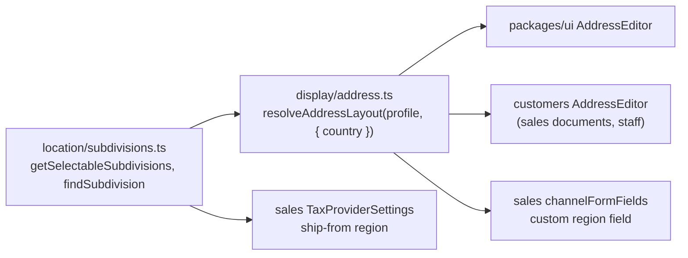

# US State Dropdown In Every Address Form

## TLDR

**Key Points:**
- When the country of an address is the United States, the "Region / State" field becomes a dropdown of the US states
  from the static subdivision table that `markets` already ships (`packages/shared/src/lib/location/subdivisions.ts`).
  For any other country the field stays the free-text input it is today.
- Today the dropdown exists but is keyed off the wrong thing: `resolveAddressLayout(profile)` lists the subdivisions of
  the **market profile's home country**, so a merchant with no market (or an EU market) never sees it, and a US-market
  merchant entering a Canadian address is shown US states. This spec keys the list off the **country selected in the
  form** instead.
- One shared decision in `packages/shared/src/lib/display/address.ts`, consumed by every address form that has both a
  country and a region field: the two `AddressEditor` twins (`packages/ui` and `customers`, which also serve sales
  documents and staff), the sales channel address, and the tax provider ship-from address.

**Scope:**
- A country-aware subdivision resolution in the shared display layer. The profile keeps deciding whether a subdivision
  is *required*, how the field is *labelled*, the postal code pattern and the default country.
- The dropdown lists the 50 states plus the District of Columbia and stores the USPS two-letter code. A legacy value
  holding the full state name preselects its state; an unknown value keeps the existing warning badge and stays saveable.
- No storage change: `region` stays the text column it is (market display spec, invariant 2 and D8). No migration, no
  API change, no new command.

**Concerns:**
- An organization on the `us` market that enters a Canadian or Mexican address today sees US states; after this change
  it sees a text input. That is the intended fix, and it is a visible behavior change for that one case.
- Existing records may hold `Texas` where new records hold `TX`. Both are displayed correctly; nothing is rewritten.

---

## Resolved assumptions

The skeleton's two Open Questions were resolved with the recommended defaults after the user asked for the work to
continue autonomously. Both are reversible before merge.

| # | Question | Chosen answer | Rationale |
|---|---|---|---|
| Q1 | Dropdown contents for `US`: the 50 states, 50 plus DC, or all 56 rows? | 50 states plus the District of Columbia. Territories stay out of the picker but remain valid values. | A DC address is a routine shipping destination and would be unreachable through a 50-entry list, while the brief's list is otherwise honored. Puerto Rico, Guam and the other territories have their own postal conventions and are not in the brief; a record that already holds `PR` still validates, because the validity check runs over the full table, not the picker list. |
| Q2 | Stored value when a state is picked: the two-letter code or the full name? | The two-letter code (`TX`). A legacy full name (`Texas`) is matched case-insensitively to its code when the record is opened so the dropdown preselects it. The stored value is not rewritten until the user picks from the list. | This is what the existing `<Select>` already stores, what the `us` address layout prints (`PLANO TX 75074`), and what every carrier and tax API expects. Storing the name would make the US print read `PLANO TEXAS 75074` unless the formatter also changed, which is a second spec. Not rewriting on open honors invariant 5 of the market display spec: a display rule must never silently mutate data that predates it. |

---

## Overview

The market display spec (`.ai/specs/2026-09-18-market-display-profile.md`) shipped a static US subdivision table, a read
only `GET /api/markets/subdivisions` route and a `<Select>` over `descriptor.subdivisions` in both address editors. It
keyed the list off the organization's market profile because the profile was the new thing being introduced. In use,
the list needs to follow the address, not the organization: a Polish merchant selling to a customer in Ohio wants the
Ohio dropdown, and a Texan merchant shipping to Ontario does not want one.

This spec is the small correction that makes the subdivision list a function of the selected country, and wires the two
address forms the parent spec left on free text.

> **Market Reference.** Four open source and open platform leaders were checked for how a state field behaves.
>
> **Magento 2.** The `region` field is a select when the country has rows in `directory_country_region`, a text input
> otherwise, and it switches live as the country changes. Adopted: the live switch and the "select when a list exists,
> text otherwise" rule. Rejected: Magento's dual storage (`region_id` plus `region` text). One text column holding the
> code is enough here, and the parent spec's D8 forbids a schema change for a display rule.
>
> **WooCommerce.** `WC()->countries->get_states($cc)` drives a select for countries with a state list and stores the
> state **code**; the US list is the 50 states plus DC plus the armed forces codes. Adopted: code storage and the "50
> plus DC" default. Rejected: the armed forces pseudo-states; they are not in the brief and not in the table.
>
> **Shopify.** `province_code` select driven by a per-country address format, storing the code and rendering the name.
> Adopted: display name, store code. Rejected: vendoring the worldwide dataset (also rejected by the parent spec, D11).
>
> **Odoo.** `res.country.state` is a many-to-one filtered by the selected country, empty for countries without states.
> Adopted: filtering by the selected country rather than by the company's country, which is exactly the defect this
> spec fixes.

## Problem Statement

`AddressEditor` (both twins), the sales channel form and the tax provider ship-from form each carry a `region` field.
The parent spec turned the two editors' field into a `<Select>` over `descriptor.subdivisions`, but `resolveAddressLayout`
(`packages/shared/src/lib/display/address.ts:81-96`) fills that list only when `profile.subdivisionRequired` is true and
only for `profile.defaultCountryCode`:

- An organization with no market profile, or with the `eu` template, never gets a dropdown for a US address. This is
  the case the brief describes.
- An organization with the `us` template gets US states for every country. Selecting Canada shows Alabama to Wyoming,
  and the warning badge fires on every valid Ontario address because the check runs against the selected country while
  the list does not.
- The sales channel form (`sales/components/channels/channelFormFields.ts:128-141`) builds a static `select` or `text`
  field at hook time from the same profile-keyed list, so it has the same defect and cannot react to the country typed
  into the form.
- The tax provider ship-from form (`sales/components/TaxProviderSettings.tsx:352-363`) renders six identical `<Input>`s
  and was never wired to the subdivision list.
- The shipment wizard's `AddressFields.tsx` has no region field at all, and the WMS warehouse has no address UI with a
  region field. Both are out of scope; nothing to switch.

## Proposed Solution

Make the subdivision list a function of the selected country, and leave the profile in charge of the things that are
genuinely market decisions.

- `resolveAddressLayout(profile, { country })` gains an optional second argument. When `country` is supplied and
  non-blank, `descriptor.subdivisions` is the selectable list for that country. When it is absent, the current
  profile-keyed behavior is kept, so the callers that render or validate without a form (the market profile preview,
  `formatAddress`, `validateAddressForProfile`) compile and behave unchanged.
- Two small accessors beside `getSubdivisions` in `location/subdivisions.ts` own the Q1 and Q2 rules, so the two
  editors, the channel form and the ship-from form cannot disagree about what "US states" means or how `Texas` maps to
  `TX`.
- Each of the four forms passes its current country. The select renders whenever the list is non-empty and the text
  input otherwise; switching the country switches the control live and never discards the typed value.

### Design Decisions

| Decision | Rationale |
|----------|-----------|
| D1. The list follows the address's country, not the profile's home country. | The address is the thing being described. The profile's home country is only a default for an empty country field, which the editors already seed. |
| D2. Picker shows states and DC; validity accepts the whole table. | Q1. A picker is a convenience; validity is a fact about the data. Excluding territories from the picker while keeping them valid means no existing `PR` row starts warning. |
| D3. Store the two-letter code; match legacy names on display; never rewrite on open. | Q2 and invariant 5 of the parent spec. |
| D4. The profile keeps label keys, `subdivisionRequired`, `postalCodePattern` and `defaultCountryCode`. | These are market conventions ("ZIP code", "State", a required state on a US envelope). The list of a country's subdivisions is not. |
| D5. One optional trailing argument, no new function for callers to migrate to. | Same convention as every helper in the display layer: an unmigrated call site compiles unchanged. |
| D6. The sales channel region becomes a CrudForm `custom` field. | CrudForm `fields` are memoized once per render of the hook and cannot change a field's `type` on a sibling value. A `custom` field receives the current form values (`CrudCustomFieldRenderProps.values`, passed by `packages/ui/src/backend/CrudForm.tsx:1863`) and can read `values.country` on every render. This is the sanctioned CrudForm mechanism for a field that depends on a sibling, and `custom` fields are already the norm in the customers form (`formConfig.tsx:283,449`). |
| D7. Scope is the four forms with a country and a region field. | The shipment wizard has no region; the WMS warehouse has no region UI. Adding a region field to either is a feature, not a control switch. |

### Alternatives Considered

| Alternative | Why rejected |
|-------------|--------------|
| Rewrite `Texas` to `TX` when a record is opened. | A hidden mutation on open makes "Save" change data the user did not touch, and the parent spec's invariant 5 forbids a display rule from altering legacy data. Matching on display gives the same UX without the write. |
| Add `region_code` beside `region` (Magento's dual storage). | Schema change on two encrypted entities and four snapshotting document entities for a display concern; forbidden by the parent spec's D8. |
| Fetch the list from `GET /api/markets/subdivisions` in the forms. | The table is a build-time constant already imported by both editors through `isValidSubdivision`; a request would add a loading state and a `markets.view` dependency to forms that do not need one. The route stays for external consumers. |
| Switch the label to "State" whenever `US` is selected, even without a US profile. | Labels are a market convention in the parent spec (D4 here). "Region / State" reads correctly above a state dropdown; changing labels per country is a separate decision. |

## User Stories / Use Cases

- **A Polish merchant** (no market picked) adds a customer in Ohio and wants to pick "Ohio" from a list so that the
  record cannot hold "OH", "Ohio" and "ohio" across three customers.
- **A US merchant** enters a supplier in Ontario and wants a plain text field, not a list of US states with a warning.
- **A sales rep** editing the shipping address on a quote wants the same state dropdown they get on the customer record.
- **An admin** configuring the sales channel address or the tax provider ship-from address wants the same behavior as
  everywhere else, because the ship-from state is exactly what a tax provider keys on.
- **A support engineer** opening a five-year-old record holding `Texas` wants it to show as Texas with no warning and no
  silent rewrite.

## Architecture

No new module, entity, route, command or event. The change lives in the shared display layer and in four existing
client components.



Takeaway: the country-to-list decision has exactly one home, and every form asks it with the country it currently holds.

### Module boundaries

- `packages/shared` owns the data and the rule. It already does; nothing domain-specific is added (the table is
  reference data, like `countries.ts`).
- `packages/ui` and `customers` consume the descriptor. No import direction changes.
- `sales` consumes the descriptor in the channel form and the accessor directly in the ship-from form. No cross-module
  import is introduced; `sales` already imports the display layer.
- No profile lookup is added. Forms that already read `useDisplayProfile()` keep doing so; the ship-from form does not
  need the profile at all, because the list depends only on the country.

### Commands and Events

None. `region` is written by the existing address commands (`customers.address.*`, `sales.document_address.*`, the
channel and tax provider settings writes) with the string the form hands them, exactly as today. Undo paths are
unchanged because the column and the write path are unchanged.

## Data Models

No entity or column changes. `region` remains `text` on `customer_addresses`, `staff_addresses`, the sales document
address snapshots and `sales_channels`, and remains covered by the existing `customers/encryption.ts` and
`sales/encryption.ts` maps where it is today. This spec adds no PII column, so no encryption map entry is added.

### Static reference data

`packages/shared/src/lib/location/subdivisions.ts` gains two accessors beside the three it has:

```ts
/** The rows an address picker offers: states and districts. Territories stay valid but are not offered. */
export function getSelectableSubdivisions(countryCode: string | null | undefined): readonly Subdivision[]

/**
 * The subdivision a stored `region` value denotes, matched by code or by name, case-insensitively and trimmed.
 * `null` when the country has no list or the value matches nothing.
 */
export function findSubdivision(
  countryCode: string | null | undefined,
  value: string | null | undefined,
): Subdivision | null
```

`getSelectableSubdivisions('US')` returns 51 rows in table order (the 50 states in the brief's alphabetical order,
then DC). `isValidSubdivision` is unchanged and keeps accepting all 56 codes.

## Shared display layer

```ts
// packages/shared/src/lib/display/address.ts
export type AddressLayoutOptions = {
  /** The address's own country. When set, `subdivisions` lists this country, not the profile's home country. */
  country?: string | null
}

export function resolveAddressLayout(
  profile?: DisplayProfile | null,
  options?: AddressLayoutOptions,
): AddressLayoutDescriptor
```

Resolution of `descriptor.subdivisions`:

1. `options.country` non-blank: `getSelectableSubdivisions(options.country)`.
2. Otherwise, today's rule with the picker filter applied: `profile.subdivisionRequired ?
   getSelectableSubdivisions(profile.defaultCountryCode) : []`.

Every other descriptor field is unchanged. `validateAddressForProfile` replaces its `isValidSubdivision` call with
`findSubdivision(country, region) === null`, so a legacy `Texas` under a US profile no longer reports
`invalid_subdivision`. The function's signature and return type are unchanged.

## API Contracts

None added or changed. `GET /api/markets/subdivisions` keeps returning all 56 rows for `US`; it documents the full
table, and the picker filter is a UI concern. Address write APIs keep accepting any string for `region` (their zod
schemas are unchanged), because the dropdown is a convenience and legacy values must keep saving.

## UI/UX

### Both `AddressEditor` twins

`packages/ui/src/backend/detail/AddressEditor.tsx` and `packages/core/src/modules/customers/components/AddressEditor.tsx`
change identically:

- `effectiveCountry` is computed before the descriptor, from the draft's country or the profile's default, and passed as
  `resolveAddressLayout(addressDisplayProfile(format, profile), { country: effectiveCountry })`. The memo depends on
  `effectiveCountry`.
- The region control is unchanged in shape: `<Select>` from `@open-mercato/ui/primitives/select` when
  `descriptor.subdivisions.length`, `<Input>` otherwise. The select's `value` becomes
  `findSubdivision(effectiveCountry, current.region)?.code`, so `Texas`, `texas` and `TX` all preselect Texas.
  `onValueChange` writes the code, as today.
- The warning badge condition becomes `descriptor.subdivisions.length > 0 && current.region.trim().length > 0 &&
  !findSubdivision(effectiveCountry, current.region)`. It keeps the existing `<StatusBadge variant="warning">` and the
  existing `markets.address.warning.subdivision` key.
- Switching the country from `US` to `PL` renders the text input with the current value (`TX`) intact. Switching to
  `US` with `Mazowieckie` in the field renders the select with the placeholder, keeps `Mazowieckie` in the draft, and
  shows the badge until the user picks a state. Nothing is cleared on the user's behalf.
- Labels, postal code pattern, building and flat number visibility and the country seed are untouched.

### Sales channel form

`channelFormFields.ts` replaces the hook-time `select` / `text` branch with one `custom` field:

```ts
{
  id: 'region',
  label: labels.region,
  type: 'custom',
  layout: 'half',
  component: (props: CrudCustomFieldRenderProps) => <ChannelRegionField {...props} />,
}
```

`ChannelRegionField` (same file, well under 100 lines) reads `props.values?.country`, resolves the descriptor with
`resolveAddressLayout(useDisplayProfile(), { country })`, and renders the same `<Select>` / `<Input>` pair as the
editors, with `aria-label={labels.region}` on the trigger and `aria-invalid` from `props.error`. It calls
`props.setValue(code)` on pick and `props.setValue(evt.target.value)` on type. The field keeps its `id`, `label` and
`layout`, so the form's group definition and any injected widget targeting `region` are unaffected.

### Tax provider ship-from address

`TaxProviderSettings.tsx` keeps the `SHIP_FROM_FIELDS.map(...)` loop and special-cases `region`: when
`getSelectableSubdivisions(shipFromAddress.country).length` is non-zero it renders the `<Select>` (trigger
`id="ship-from-region"` so the existing `<Label htmlFor>` keeps pointing at it, `aria-label` the field label), otherwise
the existing `<Input>`. The select's value is `findSubdivision(country, region)?.code`. No new state, no new request;
the form's `useGuardedMutation` save path is untouched.

### Design system

No new className, token or icon. The touched lines already use `border-destructive`, `text-destructive`, the Tailwind
text scale, `<Select>` and `<StatusBadge>`. No dialog is added. Boy Scout rule: the touched lines carry no hardcoded
status colors or arbitrary sizes to migrate.

## Internationalization

No new user-facing string. The warning reuses `markets.address.warning.subdivision`; labels reuse the existing keys of
each form. State names are rendered from the table's English `name` field, as the parent spec decided (the table is
reference data, not translated copy).

## Configuration

None.

## Frontend Architecture Contract

Required in the light form because the change touches four existing client components.

| Item | Answer |
|---|---|
| Server / client boundary | Unchanged. All four files are already client components (`"use client"` on `channelFormFields.ts:1` and `TaxProviderSettings.tsx:1`; both editors are client components rendered inside client hosts). No page root changes side. |
| `"use client"` ledger | No new file. `ChannelRegionField` is a component inside the already-client `channelFormFields.ts`. |
| Client blob guardrail | `channelFormFields.ts` is about 230 lines and gains fewer than 60. Both editors are already over 500 lines and gain about 10; their split is tracked by the parent spec's Phase 3 (collapse the twins), not here. No new heavy dependency. |
| Budgets | New unallowlisted page-root `"use client"`: 0. New heavy browser libraries: 0. |
| Hydration / interactivity tests | The RTL tests in Phase 1 and 2 plus `TC-MKT-004` / `TC-MKT-005` below. |
| Performance evidence | `yarn check:client-boundaries` before and after must report no new violation. The table is a module constant; no request is added to any form. |

## Implementation Plan

Each step leaves the application working and the tests green.

### Phase 1: shared rule and the two editors

1. Add `getSelectableSubdivisions` and `findSubdivision` to `packages/shared/src/lib/location/subdivisions.ts`. Unit
   tests in `packages/shared/src/lib/location/__tests__/subdivisions.test.ts` (new file): 51 selectable rows for `US`,
   DC present, `PR` absent from the picker but `isValidSubdivision('US','PR')` true, `findSubdivision` by code, by
   name, lowercase, padded, unknown value, unknown country, blank inputs.
2. Add `AddressLayoutOptions` and the second argument to `resolveAddressLayout`; switch `validateAddressForProfile` to
   `findSubdivision`. Extend `packages/shared/src/lib/display/__tests__/display.test.ts`: no profile plus `{ country:
   'US' }` yields 51 rows; `us` profile plus `{ country: 'CA' }` yields none; `us` profile with no options keeps today's
   list minus territories; `validateAddressForProfile` accepts `Texas` and still flags `Mazowieckie`.
3. Wire `packages/ui/src/backend/detail/AddressEditor.tsx` as described in UI/UX. Add
   `packages/ui/src/backend/detail/__tests__/AddressEditor.subdivisions.test.tsx` (RTL): no profile plus country `US`
   renders a combobox with 51 options; country `PL` renders a text input; `Texas` preselects Texas with no badge;
   `Mazowieckie` under `US` shows the badge and keeps the value; switching `US` to `PL` keeps `TX` in the input.
4. Wire `packages/core/src/modules/customers/components/AddressEditor.tsx` identically and add the same assertions to
   a new `customers/components/__tests__/AddressEditor.subdivisions.test.tsx`, following the existing
   `AddressEditor.contact.test.tsx` setup.
5. Run `yarn workspace @open-mercato/shared test`, `yarn workspace @open-mercato/ui test`, `yarn workspace
   @open-mercato/core test -- AddressEditor`, `yarn typecheck`.

### Phase 2: the two sales forms and integration coverage

6. Replace the channel region branch in `channelFormFields.ts` with the `custom` field and `ChannelRegionField`. Add
   `sales/components/__tests__/channelRegionField.test.tsx` (RTL): country `US` renders the select, `PL` the input,
   `setValue` receives the code.
7. Special-case `region` in `TaxProviderSettings.tsx`; extend the existing
   `sales/components/__tests__/TaxProviderSettings.test.tsx` with a case where the ship-from country is `US` and the
   region control is a combobox whose pick saves `TX` in the payload.
8. Integration test `TC-MKT-004` (`customers/__integration__/TC-MKT-004-us-state-dropdown.spec.ts`): create a person
   via the API, open its detail, add an address, set country to United States, assert the region control is a listbox
   with Texas present and Puerto Rico absent, pick Texas, save, read the address back via the API and assert
   `region === 'TX'`; reopen and assert Texas is preselected; set country to Poland and assert a text input; delete the
   person in `finally`.
9. Integration test `TC-MKT-005` (`sales/__integration__/TC-MKT-005-channel-us-state.spec.ts`): create a channel via
   the API, open its edit page, type `US` into country, assert the region control becomes a listbox, pick California,
   save, assert `region === 'CA'` through the API; clean up.
10. Run `yarn i18n:check`, `yarn check:client-boundaries`, `yarn lint`, `yarn build:packages`, and the two new
    integration specs.

### Files

| File | Action | Purpose |
|---|---|---|
| `packages/shared/src/lib/location/subdivisions.ts` | Modify | Two accessors |
| `packages/shared/src/lib/location/__tests__/subdivisions.test.ts` | Create | Accessor tests |
| `packages/shared/src/lib/display/address.ts` | Modify | `AddressLayoutOptions`, country-aware list, name-tolerant validation |
| `packages/shared/src/lib/display/__tests__/display.test.ts` | Modify | Descriptor and validation cases |
| `packages/ui/src/backend/detail/AddressEditor.tsx` | Modify | Country-driven list, name-tolerant preselect and badge |
| `packages/ui/src/backend/detail/__tests__/AddressEditor.subdivisions.test.tsx` | Create | RTL coverage |
| `packages/core/src/modules/customers/components/AddressEditor.tsx` | Modify | Same as the `ui` twin |
| `packages/core/src/modules/customers/components/__tests__/AddressEditor.subdivisions.test.tsx` | Create | RTL coverage |
| `packages/core/src/modules/sales/components/channels/channelFormFields.ts` | Modify | `custom` region field and `ChannelRegionField` |
| `packages/core/src/modules/sales/components/__tests__/channelRegionField.test.tsx` | Create | RTL coverage |
| `packages/core/src/modules/sales/components/TaxProviderSettings.tsx` | Modify | Ship-from region select |
| `packages/core/src/modules/sales/components/__tests__/TaxProviderSettings.test.tsx` | Modify | Ship-from case |
| `packages/core/src/modules/customers/__integration__/TC-MKT-004-us-state-dropdown.spec.ts` | Create | Customer address path |
| `packages/core/src/modules/sales/__integration__/TC-MKT-005-channel-us-state.spec.ts` | Create | Channel path |
| `.ai/specs/2026-09-18-market-display-profile.md` | Modify | Changelog entry pointing here |

## Testing Strategy

Unit tests cover the rule (steps 1 and 2) so that both editors and both sales forms are asserting against the same
behavior. RTL tests cover each of the four controls in isolation. The two integration tests cover the API paths a state
pick travels through (`POST/PUT /api/customers/addresses`, `PUT /api/sales/channels/:id`) and the key UI paths, are
self-contained (fixtures created through the API and deleted in `finally`) and depend on no seeded data. `TC-MKT-001`
to `-003` are reserved by the parent spec; this spec continues the sequence.

## Rules and Invariants

1. The region control is a select exactly when `getSelectableSubdivisions(address country)` is non-empty, and a text
   input otherwise, in every form that has both a country and a region field.
2. Picking from the select stores the two-letter code. Nothing else writes `region`.
3. Opening a record never changes `region`. A value that matches a state by code or name preselects it; any other
   value is kept, displayed through the warning badge, and saves.
4. `isValidSubdivision` accepts the full table; the picker offers states and DC. A territory code in an existing record
   is valid and raises no warning.
5. Changing the country never clears `region`.
6. `resolveAddressLayout(profile)` with no options is behavior-preserving except that territories leave the picker list.

## Migration and Compatibility

### Database

None.

### Contract surfaces touched (`BACKWARD_COMPATIBILITY.md`)

| Surface | Change | Classification | Bridge |
|---|---|---|---|
| `resolveAddressLayout` signature | Gains an optional trailing `options` argument | Additive | Every existing caller compiles and renders unchanged |
| `AddressLayoutDescriptor` type | Unchanged | Frozen, honored | The `subdivisions` doc comment is updated to say "for the address's country when supplied" |
| `packages/shared/src/lib/location/subdivisions` exports | Two functions added | Additive | Nothing to bridge |
| `validateAddressForProfile` | Same signature; accepts state names it previously flagged | Behavior, lenient direction | A caller relying on `Texas` being flagged does not exist in the repository |
| CrudForm field `region` on the sales channel form | `type` changes from `select`/`text` to `custom`; `id`, `label`, `layout` unchanged | Internal to the form | Injected widgets target the field by `id`, which is stable |
| `@open-mercato/core/modules/customers/components/AddressEditor` import path and props | Unchanged | Frozen, honored | — |

No `UPGRADE_NOTES.md` entry is needed: no third-party call site changes, and the only visible behavior changes are the
ones the brief asks for.

### Relationship to the parent spec

`.ai/specs/2026-09-18-market-display-profile.md` keeps invariants 2 and 5 intact and gains a changelog line pointing
here. Its Phase 3 item "collapse the address twins" is unaffected; this spec edits both twins identically so the
collapse has one behavior to keep.

## Risks and Impact Review

| # | Scenario | Severity | Affected area | Mitigation | Residual risk |
|---|---|---|---|---|---|
| R1 | A legacy record holds `Texas`; after this change the dropdown appears and the user assumes the record was changed. | Low | Customer, staff and document addresses | Display-match preselects Texas; nothing is written until a pick. Rule 3, tested in steps 3, 4 and 8. | A legacy `Tx.` or misspelling shows the badge and the placeholder; the value is still saved and visible in the badge context. |
| R2 | A `us`-market organization entering a Canadian address loses the US state list it had. | Low, intended | Same | This is the defect being fixed; the list was wrong for that address. Documented in TLDR Concerns. | None beyond the visible change. |
| R3 | The channel form's `custom` field renders its label or error differently from the `select` field it replaces. | Medium | Sales channel edit page | CrudForm renders `label` and `error` for `custom` fields the same way it does for built-ins; the RTL test in step 6 asserts the label, the error text and `aria-invalid`. | Minor spacing differences, caught in QA screenshots. |
| R4 | A tax provider receives `TX` where it previously received free text. | Low, positive | Tax provider ship-from | Providers key on the code. A merchant who typed `Texas` keeps it until they pick. | None. |
| R5 | The `us` address print shows `PLANO TEXAS 75074` for a legacy full-name record. | Low, pre-existing | Documents, PDFs | Unchanged by this spec; fewer such records will be created from now on. Formatting legacy names to codes is deferred and noted as future work. | Cosmetic, on legacy rows only. |
| R6 | Excel import (`sync_excel`) or the API writes a full name or a territory code. | Low | Address APIs | APIs keep accepting any string; territories stay valid; names preselect on open. | None. |

Blast radius: four client components and one shared helper; no server path changes. Detection: the RTL and integration
tests above, and a QA pass on the four screens with `US`, `PL` and `CA` selected.

## Future Work (deferred, not in scope)

- Offer the five US territories in the picker, or make the picker set a profile setting.
- Switch the region label to "State" when a US address is entered under a non-US market.
- Normalize legacy full state names to codes in a one-off data command with undo, so the US print reads `TX` on
  every row.
- Add a region field to the shipment wizard address and the WMS warehouse address, then wire them here.

## Final Compliance Report — 2026-09-19

### AGENTS.md Files Reviewed
- `AGENTS.md` (root)
- `packages/shared/AGENTS.md`
- `packages/core/AGENTS.md`
- `packages/ui/AGENTS.md`
- `.ai/specs/AGENTS.md`
- `.ai/qa/AGENTS.md` (integration test placement and self-containment)

### Compliance Matrix

| Rule Source | Rule | Status | Notes |
|---|---|---|---|
| root AGENTS.md | No direct ORM relationships between modules | N/A | No entity change |
| root AGENTS.md | Filter by `organization_id`; never expose cross-tenant data | N/A | No query added; the table is organization-independent reference data |
| root AGENTS.md | Preserve behavior unless a spec asks for a change | Compliant | The two behavior changes (dropdown by country, lenient name validation) are the brief and Q2 |
| root AGENTS.md | Zod validation for all API inputs | Compliant | Address schemas unchanged and still applied; the dropdown adds no new input path |
| root AGENTS.md | Never hard-code user-facing strings | Compliant | No new string; existing keys reused |
| root AGENTS.md (Design System) | Semantic tokens, text scale, shared primitives, no inline `<svg>` | Compliant | `<Select>`, `<StatusBadge>`, `border-destructive` only; no icon added |
| root AGENTS.md | Optimistic locking on edit forms | N/A | No new entity or form; host forms keep their existing lock handling |
| root AGENTS.md | Every new feature lists integration coverage for affected API and UI paths, shipped in the same change | Compliant | `TC-MKT-004`, `TC-MKT-005`, self-contained fixtures |
| `packages/shared/AGENTS.md` | No domain logic; no `@open-mercato/core` import; precise types; check for existing utilities first | Compliant | Reference data accessors beside `getSubdivisions`; `Subdivision` type reused |
| `packages/core/AGENTS.md` → Encryption | GDPR fields declared in `encryption.ts`, read via `findWithDecryption` | Compliant | No new column; `region` keeps its existing map entries |
| `packages/core/AGENTS.md` → API Routes | Routes export `openApi`, `metadata` | N/A | No route change |
| `packages/core/AGENTS.md` → Command Side Effects | Writes go through commands with undo | N/A | No new write path; existing commands unchanged |
| `packages/ui/AGENTS.md` | Use `CrudForm`; non-`CrudForm` writes through `useGuardedMutation`; `apiCall` only | Compliant | Channel form stays `CrudForm`; `TaxProviderSettings` already uses `useGuardedMutation` and `apiCall`; no write added |
| `packages/ui/AGENTS.md` | Use existing primitives; `type="button"`; `aria-label` on icon-only controls | Compliant | `<Select>` reused; `aria-label` on each select trigger |
| `packages/ui/AGENTS.md` | Keep field/group ids stable for injection | Compliant | Channel `region` field keeps its `id` and `layout` |
| `.ai/specs/AGENTS.md` | Filename `{date}-{title}.md`, OSS scope in `.ai/specs/` | Compliant | This file |
| `.ai/qa/AGENTS.md` | Integration specs under `<module>/__integration__/TC-<CAT>-<XXX>.spec.ts`, self-contained, cleaned up | Compliant | Steps 8 and 9 |

### Internal Consistency Check

| Check | Status | Notes |
|---|---|---|
| Data models match API contracts | Pass | Neither changes |
| API contracts match UI/UX section | Pass | The UI writes the same `region` string the APIs already accept |
| Risks cover all write operations | Pass | R1, R4, R6 cover the three write paths that can carry a state |
| Commands defined for all mutations | Pass | No new mutation; existing commands named |
| Cache strategy covers all read APIs | N/A | No read API touched; the table is a module constant |
| Rules and Invariants match the implementation steps | Pass | Rules 1 to 6 each map to a test in steps 1 to 9 |

### Non-Compliant Items

None.

### Verdict
- **Fully compliant**: Approved — ready for implementation.

## Changelog

- **2026-09-19**: Skeleton with two Open Questions (picker contents, stored value).
- **2026-09-19**: Questions resolved with the recommended defaults (50 states plus DC; store the code, match legacy
  names on display). Full design, four-form scope, implementation plan, tests, risks and compliance report written.

### Review — 2026-09-19
- **Reviewer**: Agent. The checklist's section 1 scope-cohesion item was run by a fresh-context reader given only this
  file: verdict COHESIVE, on the ground that the four forms are consumers of one corrected rule and none delivers the
  fix without the shared helper change; the shipment wizard and WMS exclusions were read as boundary scoping, not as
  independently deployable parts. No split proposed.
- **Security**: Passed. No new input path, no new query, no new PII column; address zod schemas unchanged.
- **Performance**: Passed. Module-constant lookups of at most 56 rows; no request added to any form.
- **Cache**: Passed (N/A). No read API touched.
- **Commands**: Passed (N/A). No new mutation; existing address commands and their undo paths unchanged.
- **Risks**: Passed. R1 to R6 each carry a mitigation and a residual risk.
- **Verdict**: Approved.
